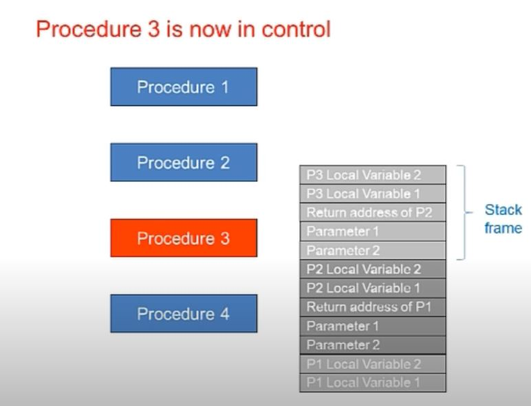

### STACK FRAME
* Also known as the activation record
  * Section of the stack containing a procedure's components. 

Add components to stack in the following order: 
1. Passed params 
   * `PUSH` before proc call
2. Return address
   * By the proc `CALL`
3. Old value of base pointer
   * By `Push EBP` or assembler utility
4. Local Variables
   * By directly decrementing `ESP` or by assembler utility `LOCAL`
5. Saved Registers
   * Individually by `PUSH` , as a group by `PUSHAD` , or by assembler utility `USES`

**Base Pointer** - `EBP` Frame pointer. Points to static (within the proc) location in the stack frame. 
  * Preserve (PUSH) EBP then copy ESP into it. 

**Base+offset addressing** - A base pointer is used to establish a known location in memory, and a constant offset form that mem location is used to access info.
  * [reg] - [] Dereferences an address to get value at the stored address. 