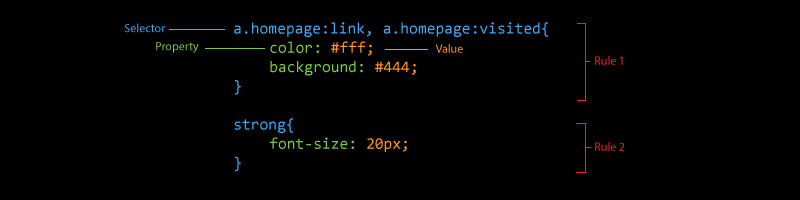
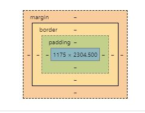

<small>[Return Home](../../README.md)</small> | <small>[Return to CS 290](index.md)</small> | <small>[Return to Week 2](week2.md)</small>

# Week 2 CSS

- CSS is a alyout tool used for specifying how a web site looks.

### CSS Properties

- Majority of CSS is about specifying properties and giving those peroperties values.
- e.g. `color: purple`

### CSS Selectors

- Selectors allow us to set rules for which elements styles apply to. `*` applies to everything. Example: `section.data-display tr:nth-of-type(odd)`

## Common CSS Properties

| Peroperty | Definition                |
| --------- | ------------------------- |
| `color`     | Font color of an element.  |
| `border-color` | color of the border of an element|
| `background-color` | background color of an element |
| `position: static` | Default positioning. Broswer decides. Cannot use position `top right bottom left` |
| `position: relative` | Placed where they normally would be (its static position), then the change in location is measured from that spot `top` value for example |
| `position: absolute` | Position based on parent element. |
| `position: fixed` | Fixes position with respect ot the document window. A fixed element will scroll wit the page. 

#### Colors
* Can be in hex form `#RRGGBB`, `R` gives more red, `G` green and `B` blue. `#FF0000` is pure red. `#FFFFFF` is white. 

#### Measurements
* `px`
  * An absolute measurement in pixels. More or less equal to one pixel on a display (not entirely true).
* `em`
  * A relative measure based on the font size of a page. Scales with how a user changes their default font size. 
* `%`
  * Measurement of the parent. 

#### Spacing

* Inside is the content of the element. 
* How far one box is from antoehr is the `margin`
* How much space there is between the edge of a box and its content is `padding`
* `top left right bottom` are used to move the element. 