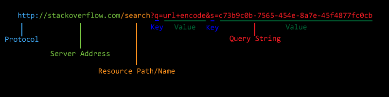

<small>[Return Home](../../README.md)</small> | <small>[Return to CS 290](index.md)</small> | <small>[Return to Week 2](week2.md)</small>

<h1>Week 2 HTML</h1>

<h2>HyperText Markup Language and Cascading Style Sheets</h2>

HTML

- Is the language most commonly associated with the web.
- Organizes the content of a web page
- A language to organize data, not to change the way it looks (that is what `CSS` is for)
- `HypterText` refers to document that link to one another
- One defining attribute of HTML is that it can navigate from one document to another
- `Markup language` means that is is basically a language to add meta-data to existing data.
  - Different from a programming language which allows for use of logic and control structures

#### Purpose

> Organize, describe and give meaning to data.

- Not how it looks

HTML Tags

- HTML structures documents by using elements, these can either be alone or be nested in other elements.
- Not all HTML requires a closing tag (but most does)
- Tags can include attributes

```html
<section class="example">Hello World!</section>
```

- Not all attributes need a name, e.g. check-box is 'checked' and checked has no value.

| Tag                         | Definition                                                                                                                                                                                        |
| --------------------------- | ------------------------------------------------------------------------------------------------------------------------------------------------------------------------------------------------- |
| `Headers(h1-h6)`            | Change font size and sometimes weight. Block level elements. Should be used for titles (although tables can use `<caption>`). Not good for styling purposes only.                                 |
| `Block level elements`      | Get their section of the page. If a page break does not exist before or after it one will be created to ensure it is on its own line.                                                             |
| `Div`                       | Used to divide content. Used as a last resort when no other element makes sense. Just generally divides content.                                                                                  |
| `Section`                   | Thematic grouping of content. Headers are almost always the first element in a section. Group of content that is related but doesn't stand on its own. Should only be used if content is related. |
| `Article`                   | Stricter requirements than section. Content needs to be related but also should uslaly stand on its own as a composition. The page as a whole could be an article.                                |
| `Anchors`                   | `<a href=""></a>` is how one page links to another.                                                                                                                                               |
| `Images`                    | ``. Src is where image is located                                                                                                                        |
| `<strong></strong>`         | Bolds tags. Signifies important text.                                                                                                                                                             |
| `<b></b>`                   | Makes text stylistically different from other text. Does not give additional meaning to text.                                                                                                     |
| `<em></em>`                 | Adds emphasis to a word, making it <em>italic</em>. `<i></i>` can also be used but doesn't give any additional meaning.                                                                           |
| `<ul></ul>` Unordered list  | Starts an ends unordered lists. Contains `<li></li>` items as children.                                                                                                                           |
| `<ol></ol>` Ordered list    | Numbered list                                                                                                                                                                                     |
| `<dl></dl>` Definition list | Has pairs of terms (`<dt></dt>`) and definitions (`<dd></dd>`)                                                                                                                                    |

Definition list:

<dl>
    <dt>Name</dt>    
    <dd>Godzilla</dd>
    <dt>Born</dt>
    <dd>1952</dd>
    <dt>Birthplace</dt>
    <dd>Japan</dd>
    <dt>Color</dt>
    <dd>Green</dd>
</dl>

#### The Table

```html
<table>
 <caption>Characteristics with positive and negative sides</caption>
 <thead>
  <tr>
   <th> Characteristic
   <th> Negative
   <th> Positive
 <tbody>
  <tr>
   <th> Mood
   <td> Sad
   <td> Happy
  <tr>
   <th> Grade
   <td> Failing
   <td> Passing
</table>
```

<table>
 <caption>Characteristics with positive and negative sides</caption>
 <thead>
  <tr>
   <th> Characteristic
   <th> Negative
   <th> Positive
 <tbody>
  <tr>
   <th> Mood
   <td> Sad
   <td> Happy
  <tr>
   <th> Grade
   <td> Failing
   <td> Passing
</table>

- `<table></table>` - Opens and closes the table. Tables really should only be used when you have tabular data to display, not just for creating a layout of the page.
- `<caption></caption>` - Title and description of the table
- `<thead>` - Table header. Can contain rows that represent the header of the table, with `<th>` elements. Not actual data, but the data labels
- `<tbody>` - Contains rows that actually have data in them. Typically `<td>` elements
- `<tr>` Row of the table. Contains `td` or `th` elements
- `<td>` Data cell. It should contain table data. A single cell can span multiple columsn with `colspan` attribute.
- `<th>` Header cell. Should signify what is in the column below it or row beside it.

#### Sample skeleton

```html
<!DOCTYPE html>
<html>
  <head>
    <meta charset="UTF-8" />
    <title>title</title>
    <link rel="stylesheet" href="stylesheet.css" type="text/css" />
  </head>
  <body></body>
</html>
```

- Content in the head is `metadata`. Helps browsers and robots understand what is on the page. The `link` tag is where we can clink to a file that contains CSS rules to style the page. The actual content a user sees goes in the `body` of the page.

#### HTML FORMS

- Any time you are submitting data you are using a form.

<form action="http://www.example.com/review.php" method="get">
    <fieldset>
        <legend>Your Details:</legend>
        <label>Name:
            <input type="text" name="name" size="30" maxlength="100">
        </label>
        <br />
        <label>Email:
            <input type="email" name="email" size="30" maxlength="100">
        </label>
        <br />
    </fieldset>
    <br />
    <fieldset>
        <legend>Your Review:</legend>
        <p>
            <label for="hear-about">How did you hear about us?</label>
            <select name="referrer" id="hear-about">
                <option value="google">Google</option>
                <option value="friend">Friend</option>
                <option value="advert">Advert</option>
                <option value="other">Other</option>
            </select>
        </p>
        <p>Would you visit again?
            <br />
            <label>
                <input type="radio" name="rating" value="yes" />Yes</label>
            <label>
                <input type="radio" name="rating" value="no" />No</label>
            <label>
                <input type="radio" name="rating" value="maybe" />Maybe</label>
        </p>
        <p>
            <label for="comments">Comments:</label>
            <br />
            <textarea rows="4" cols="40" id="comments"></textarea>
        </p>
        <label>
            <input type="checkbox" name="subscribe" checked="checked" />Sign me up for email updates</label>
        <br />
        <input type="submit" value="Submit review" />
    </fieldset>
</form>

<h4>The Form Tag</h4>

- Must always have an opening and closing tag.
- Any content can show up inside a `form` tag except other forms.
- Almost always include `input` elements (`textarea` is similar)
- Form Attributes
  - `action` specifies where the form should be sent (like an address)
  - `method` specifies how the data will be sent. The primary methods are a `get` and a `post`

<h4>Inputs</h4>

Links: [Mozilla's input reference](https://developer.mozilla.org/en-US/docs/Web/HTML/Element/input)

- Most commonly used to gather data within a form.
- `type` attribute changes how it is used and displayed
- `name` attribute is how the server will know which part of the data it is associated with (the `key` in a key/value pair)
- Radio and check boxes.
  - Will only send data if it is checked or selected.
  - Radio buttons within the same group have the same `name` attribute

<h4>GET and POST</h4>

- Primary way for browser to send data. Usually sent in the headers to a server.
- Send key value pairs e.g. `username=alice`

<h5>GET</h5>



- Sends the key value pairs as part of the URL.
- `?` indicates the start of the query string.

<h5>POST</h5>

- Sends the same kinds of data as a GET. Instead of sending the key/value pairs as part of the URL it sends it as part of the request body. It still arrives to the server as part of a query string in the same format as GET query string.
