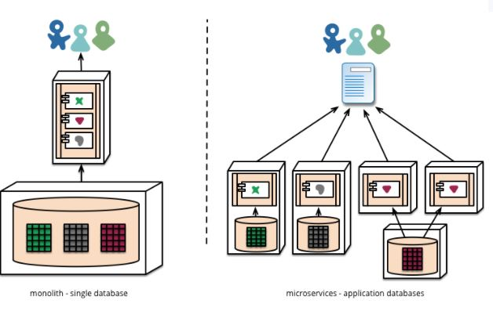
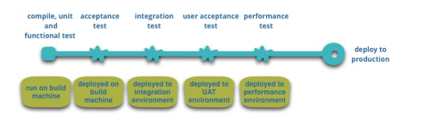

<small>[Return Home](../../README.md)</small> | <small>[Return to CS 361](index.md)</small>

| Keyword                            | Definition                                                                                                                                                                                |
| ---------------------------------- | ----------------------------------------------------------------------------------------------------------------------------------------------------------------------------------------- |
| `Microservice architectural style` | Is an approach to developing a single application as a suite of small services, each running in its own process and communicating with lightweight mechanisms, often an HTTP resource API |
| `Component`                        | A unit of software that is independently replaceable and upgradeable                                                                                                                      |
| `Libraries`                        | Components that are linked into a program and called using in-memory function calls                                                                                                       |
| `Services`                         | Out-of-process components who communicate with a mechanism such as a web service request, or remote procedure call.                                                                       |
| `Encapsulation`                    | Hide the internal representation, or state of an object from the outside. Bundling of data and methods that work on that data within one unit (class)                                     |

### Why to use services as components vs libraries:

- Independently deployable
- Reduces coupling between components.

### Organization of Microservices

- Split services organized around business capability.
- Cross functional teams that will need to design UI, database and project management
- This is in contrast with splitting based on tech layer (database team, UI team, business logic team)

### Producs not projects

- You build it you run it, rather than building it and passing it off to another team to run.

### Smart endpoints and dumb pipes

- Decoupled and cohesive as possible.
- Receive request, apply logic, and send response.

### Decentralized Governance

- Microservices can use different tech stacks for each microservice, depending on the use case.
- Teams are in charge of their service 24/7. This can lead to a better focus on the quality of the code (since they have to deal with the fallout of bad code).

### Decentralized Data Management

- Each service dmanages its own database.
  

* Transactionless coordination between services.

### Infrastructure Automation

- Build pipeline
  
- Lots of automated tests.

### Design for failure

- Apps need to be designed so they can tolerate the failure of services.
- Monitoring and logging of each service to know when there are issues.
- Avoid synchronous calls between services because the downtime of one service can affect another.

### Evolutionary Design

- Independent replacement and upgradeability.
  - Replace rather than improve
- Parts of a system that rarely change should be in a different service than those that change a lot.
- If you are repeatedly changing two services together, that's a sign they should be merged.
