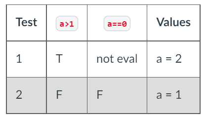
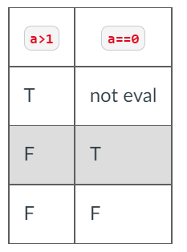
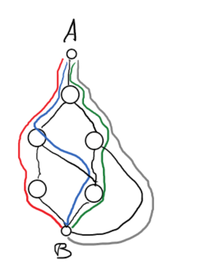

## WHITE BOX TESTING

| Keyword                 | Definition                                                                                                   |
| ----------------------- | ------------------------------------------------------------------------------------------------------------ |
| `Code coverage`         | The extent to which a given test site executes the source code of the software                               |
| `Statement of coverage` | Way of measuring the quality of testing suite based on the amount of statements used to execute the program. |

- Can peer inside of the box to see the inner workings
- Testing is based on the code, not the spec
- Job of the tester to make sure all aspsects of the code is tested or covered

### Advantages

- Based on code so the quality of the tests can be measured objectively
- Can be used to compare test suites by measuring their quality
- Can directly test coded behavior

### Disadvantages

- Cannot discover errors due to missing paths (unimplemented spec)
- Large software makes it difficult to test all parts of the code
- Tests must be written by devs

* Because white box testing doesn't care about the spec, it's possible to still not catch bugs even if there is 100% code coverage (where every written line is ran in a test), using black box testing in addition to white box testing ensure the test suite is more complete.

## BRANCH COVERAGE

- Think in terms of branches
  - If statements have two branches `True` and `False`
    - To have full branch coverage you must take both paths of the branch
    - Branch coverage only means you have a test for each side of the if statement, not every condition in the conditional.
- 100% branch coverage guarantees 100% statement coverage.
  - Branch coverage _subsumes_ statement coverage

```python
def mystery_func2(a):
  b = 0
  if a>1 or a==0:
    b = 10
  return 100/b
```



## CONDITION COVERAGE

- Condition coverage requires that we have tests that evaluate each individual condition as both True/False

```python
def mystery_func2(a):
  b = 0
  if a>1 or a==0:
    b = 10
  return 100/b
```



- Condition coverage only requires that each condition is evaluated as True/False at least once.
  - Because of this 100% condition coverage doesn't mean there is 100% branch coverage. An when 1 condition is false and other true the overall conditional will still evaluate to true.

## BRANCH AND CONDITION COVERAGE

- Sometimes known as decision/condition coverage.
- Attempts to have 100% branch and 100% condition coverage.
  - This can result in a large number of tests
  - A modified version is known as `Modified Condition/Decision Coverage MC/DC`

## PATH COVERAGE

- Tests strive to test every path through the code.
  - A path is a unique series of branches.
    - This will likley require you to traverse each branch multiple times.



- Need to cover all paths between functions and then the paths within functions.
- Path coverage is not often accomplished to high percentage rates.
