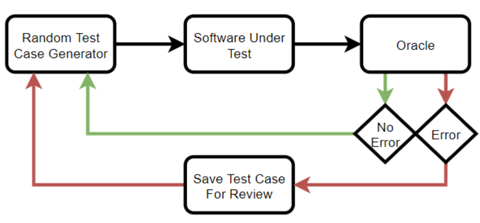

## RANDOM TESTING

| Keyword                   | Definition                                                                                                             |
| ------------------------- | ---------------------------------------------------------------------------------------------------------------------- |
| `Input Domain`            | The pool of all possible inputs that a unit/program can take                                                           |
| `System Tests`            | Tests which attempt to verify that the entire piece of software functions as a unit. Random testing is frequently used |
| `Unguided Random Testing` | Inputs are generated relatively evenly throughout the input domain.                                                    |
| `Guided Random Testing`   | Inputs are generated following a heuristic that informs "smarter" input choices.                                       |
| `Heuristic`               | Cognitive tool to help make decisions                                                                                  |

- Part of the black box testing family.
  - The hardest part of black box testing is covering the `input domain`
  - If we can't test the entire input domain we can use random testing to help

### WHEN TO USE RANDOM TESTING

- Done outside the normal test suite
- Many implementations of random testing are run over night and results are inspected in the morning
- To benefit from random testing, you have to have a lot of test cases generated to cover more of the input domain.
- Frequently used during system tests, which attempts to verify that the entire piece of software functions as a unit.
- We often will not identify the expected output for randomly generated inputs

### WHAT IS NEEDED

- Random test case generator
  - E.g. if our software needs to verify credit card numbers, we know the inputs need to be 16 digit numbers
- Software to test
  - Where the random inputs are sent to. Software should have error reporting to allow testers to see which ranodm inputs triggered errors in the code
- Something to monitor for errors (oracle)
  - Oracle's job is to watch for error states and save inputs that generated those states for random inspection. An oracle can simply display the error of the input to the screen.



```python
# Test function that takes in an 8 digit integer
# Tests 1000 random 8 digit inputs
for i in range(0,1000):
    val = random.randint(10000000,99999999)
    mystery_func(val)
```

- Since this is random it won't generate the error the same way every time. If we want to repeat a test we would need to seed the random number generator.

### UNGUIDED RANDOM TESTING

- Inputs are generated relatively evenly throughout the input domain.
- Most disadvantages of random testing are associated with unguided approach
  - Can't take advantage of testing boundary values and error guessing
  - Low numbers of tests may not have a good chance to trip an error. The more random tests, the higher the odds

### GUIDED RANDOM TESTING

- Inputs are generated following a heuristic that informs "smarter" input choices.
  - A heuristic is a cognitive tool to help make decisions.
  - A tester's knowledge of the input domain can help make better test case generation

```python
# We are increasing the chances of generating a test that tests an edge case
edge_cases = [7,8,9,19,20,21]
odds = random.randint(0,1)
if odds == 1:
    length = random.choice(edge_cases)
else:
    length = random.randint(0,30)
```

## DYNAMICALLY ADDING TESTS

- In random testing we didn't use asserts, this is because the input is generated randomly, so we don't know what the expected output will be.
