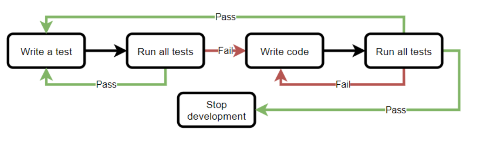

## Test Driven Development (TDD)

| Keyword                   | Definition                                                                                                                                                                               |
| ------------------------- | ---------------------------------------------------------------------------------------------------------------------------------------------------------------------------------------- |
| `Test Driven Development` | The approach where one only writes new code if there exists at least one failing unit test.                                                                                              |
| `Technical Debt`          | A concept in programming that reflects the extra development work that arises when code that is easy to implement in the short run is used instead of applying the best overall solution |

- Write tests before code
- Not a primarily verification process. It is a way to approach implementation.
- Type of black box testing (since code is unknown)

### REASONS FOR TDD

- Forces you to think about the requirements
  - Assists with Agile development because it forces devs to think about specs and expected behavior for each feature.
  - Dev has to think about _user stories_ and _use cases_
- Sets a good indicator of 'Done'
  - Unit tests are written to verify code meets the specs
  - Helps not waste time
  - Reduces `technical debt`
- Reduces duplicate code
  - Not done before _any_ code is written.
  - Tests are written for new feature/functionality
  - Code is only written if new tests fail, otherwise the functionality already exists

### TDD STEPS

1. Write a test
2. Run all currently written tests
   - If the tests all pass, return to Step 1
   - If a test fails, proceed to Step 3
3. Write the bare minimum of code to make the test pass
4. Run all the currently written tests
   - If tests all pass, return to Step 1
   - If the failing test is still failing, return to Step 3
5. Occasionally evaluate if the code can be refactored to reduce duplication or eliminate no longer used parts of the code
6. Eventually stop development after adding "enough" tests without triggering a new failure

