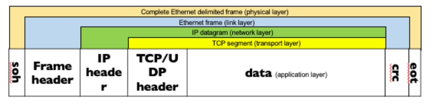
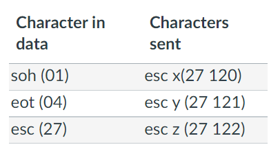
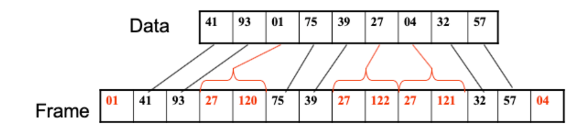
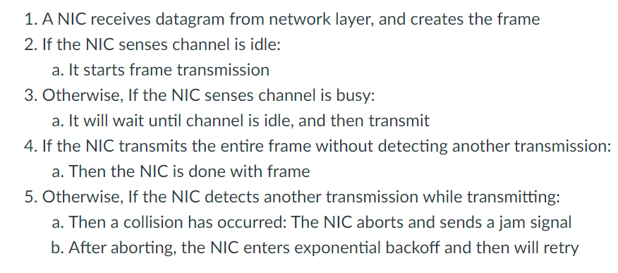
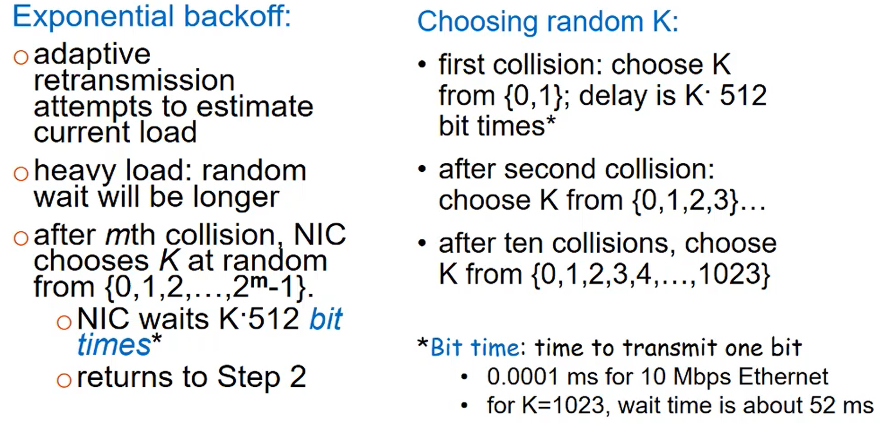
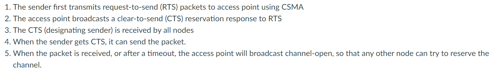
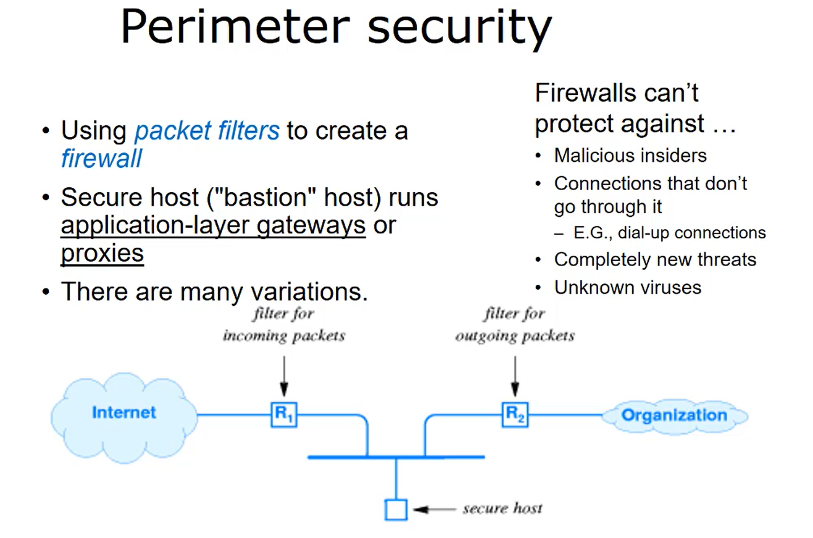
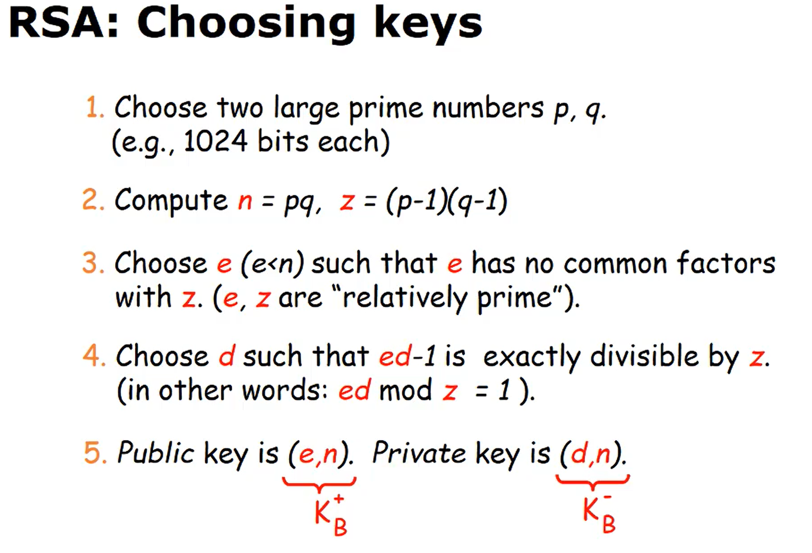
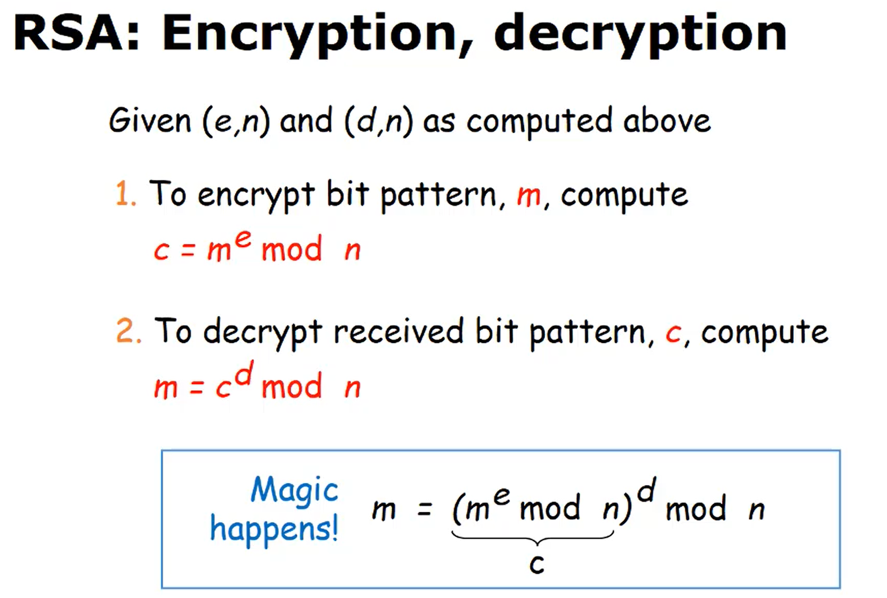
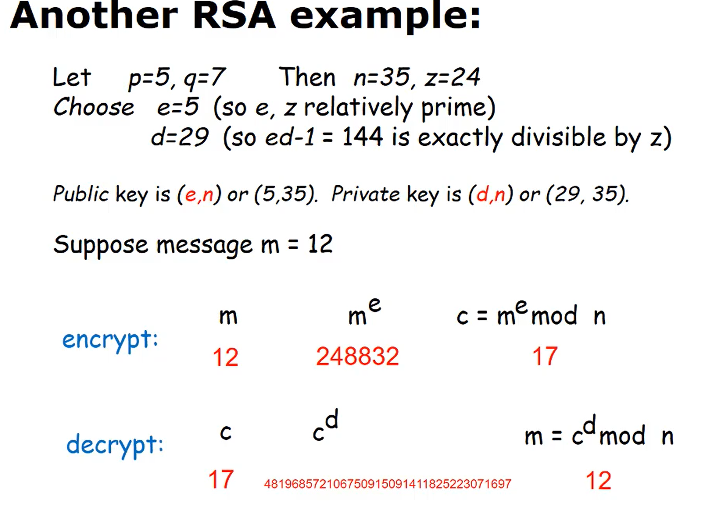

# Ethernet Frame and Multiple Access



- Special byte send at beginning and ending of ethernet frame to specify start and stop
- Characters chosen are unused values that don't appear in the frame itself (0-31 ASCII values are non-printable codes)
- `Start-of-Header (soh)`: Ascii character #1
- `End-of-transmission (eot)`: Ascii character #4
- Soh and eot characters are encoded for unambiguous fram transmission
  - The sender will notify the receiver of the specific character encoding in the frame preamble.

### Byte Stuffing

- Handles encoding special frame characters





- Only 1 and only 1 eot and soh character will ever be sent

### MA Protocol

- Ethernet uses CSMA/CD



- Exponential backoff is an adaptive retransmission algorithm
  - E.g. if it senses many collisions the sender can infer a heavier network load, and so the random wait time can be longer.



# Wireless Networking Introduction

- 802.11 access protocol (CSMA/CA)
- `Wireless`: communication over wireless link
- `Mobility`: Changing the wireless link as the wireless device moves from one area to another

### 802.11

- No collision detection because it is difficult to sense, impossible to sense all collisions, and a collision will cause garbled messages
- Uses CSMA/CA (collision avoiodance)



- RTS's can still collide with each other
- New node may join after the CTS signal and will send an RTS
- If a collision happens, both senders with use an ethernet style random backoff and retry

# Mobile networking introduction

- Changing wireless network points
- A high degree of mobility involves passing through multiple access points while maintaining connectivity (transparent to user)

`Home network`- Permanent 'home' of mobile device

`Home agent`-Entity that will perform mobility functions on behalf of mobile when mobile is remote

`Permanent address`- Address in home network, can always be used to reach the mobile device

- Remains Contstant

`Visited network`- Network in which mobile device currently resides

`Care-of address`- Address in visited network

`Foreign agent`- Entity in visited network that performs mobility functions on behalf of mobile device

`Correspondent`- Device that wants to communicate with the mobile device

### Indirect routing

- Mobile has two addresses: Permanent one on home network and temporary one `care-of` address.
  - The home agent back in the home network receives datagrams and forwards them to the care-of address
- When a mobile device moves to a new network
  - User's mobile registers with a new foreign agent
  - New agent registers with the user's home agent
  - Home agent updates the care-of address for the mobile device
  - Correspondent's packets continue to be forwarded to the mobile device but with a new care-of address

### Direct Routing

- Also uses two addresses but only one at a time.
- The correspondent goes to the permanent address and the home agent has the care-of address and return that to the correspondent to be used directy

- When a mobile device moves to a new network
  - New foriegn agent gets the user's home agent from the former foreign agent
  - New foriegn agent assigns a new care-of address for the device
  - New foreign agent notifies correspondent and user's home agent of the new care-of address
  - User's home agent updates the care-of address for the mobile
  - Correspondent continues direct communication with the mobile device but with the new care-of address.

# Network Security

- Main components of data security include
  - Data integrity
  - Data availability
  - Data confidentiality
  - Privacy



# Public and private key cryptography

- `Encryption` is the process of encoding data between a sender and a receiver so that if the data is intercepted it cannot be decoded or used in any way.

## Private Key Encryption (symmetric encryption)

- Only the sender and receiver have the key. The encryption/decryption algorithm might be public, the selection of the algorithm will not be publicized.

```
(sender) For message M, with key K, the encrypted message E is
    - E = encrypt (K, M)
(receiver) For encrypted message E, the original message is produced by the inverse of encrypt
    - M = decrypt (K, E)
```

- Difficult to ensure confidentiality of the key

* Commonly used to enable third-party services in apps and websites
  - Payment gateway using credit card processing

## Public Key Encryption (asymmetric encryption)

- Two keys: one public and one private (key-pairs)

```
(sender) For message M, with the destination user's public key (Kpublic), the encrypted message E is
    - E = encrypt (Kpublic, M)
(receiver) For a message E (encrypted with the destination user's public key) the original message can be produced only by the destination user's private key (Kprivate)
    -M = decrypt (Kprivate, E)
```

- Private key is never distributed.

## RSA (Rivest, Shamir, Adleman algorithm)

- Kpublic = <3, 187>
  - Kprivate = <107, 187>
- Message = 25
- E = encrypt(Kpublic, Message)
  - = Message^3 mod 187
  - = 25^3 mod 187 = 104
- M = decrypt(Kprivate, E)

  - = E107 mod 187
  - = 104^107 mod 187 = 25 = Message

- Public and private key have two components, second component of each will match (e.g. 187)






