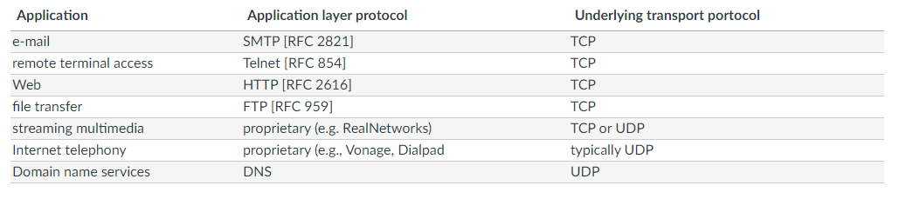
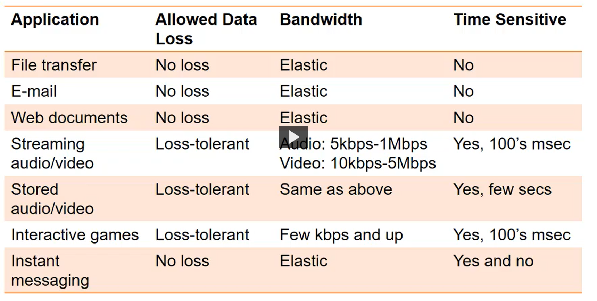

<small>[Return Home](../../README.md)</small> | <small>[Return to CS 372](index.md)</small>

| Keyword                            | Definition                                                                                                                                                      |
| ---------------------------------- | --------------------------------------------------------------------------------------------------------------------------------------------------------------- |
| `Multiplexing with physical media` | Merging multiple communication streams onto the same medium                                                                                                     |
| `ISO`                              | Multinational dedicated to the agreement of standards worldwide                                                                                                 |
| `OSI`                              | Model which purpose is to show how to facilitate communication between different systems without requiring changes to logic of underlying hardware and software |

| Problem                                       | Link                                               |
| --------------------------------------------- | -------------------------------------------------- |
| Find All Possible Recipes from Given Supplies |  |

### Access Networks

#### Home

- Router
  - Can contain
    - NAT
    - Firewall
- WAP (wireless access point)
- Modem

#### LAN - Local Area Network

- Likely multiple switches and routers
- Servers

#### Wireless

- Wireless LAN

  - Within building (100ft)
  - 802.11 b/g WiFi: 11 or 54 Mbps transmission rate

- Wide-are wireless access
  - Phone company
    - 10-30 km
  - 1 to 10 Mbps transmission rate
  - 3G, 4G, LTE

### Physical media

- Guided media
  - Solid, wireless
  - Twisted pair copper wire
    - CAT 6 1Gbps, 10 Gbps Ethernet
    - Still used for high-speed LAN
    - Connectors
      - RJ-45
      - If connector is same on both ends then used with hub/switches
  - Coaxial cable
    - Two concentric copper conductors
    - Broadband
      - HFC (hybrid fiber-coax cable)
    - Baseband
      - Single channel on cable
      - Uses small part of spectrum
    - Less interference than twisted pair due to shielding
- Unguided
  - Wireless

#### Frequency division multiplexing (FDM)

- Achieves multiplexing by using different carrier frequencies

#### Guided media: Fiber optic cable

- Glass fiber carrying light pulses
- High-speed, up to 100's Gbps
- Low error rate
  - Immune to electromagnetic noise and other interference
- Wave-length division multiplexing
  - Receiver separates frequencies using a prism (red, orange, ect)

### Unguided Media

- Wireless
- Terrestrial microwave
- Wifi
- Wide-area (WAN)
  - Cellular
- Satellite

## Protocols and Layering

- The layered model allows us to have plug in modules that are designed to solve specific problems at different system levels

#### Layers

- Each layer implements a service
  - Own internal-layer actions
  - Relies on services provided by layers above/below

`Internet protocol stack`

- Application layer
  - FTP, SMTP, HTTP
- Transport layer
  - process-process data transfer
  - TCP, UDP
- Network layer
  - Routing of datagrams from source to destination
  - IP, routing protocols
- Link Layer
  - node to data transfer
  - PPP, Ethernet
- Physical layer
  - Carries actual signal between devices
  - Cable, wireless

- Each layer at the source adds a new header
- Switch may do some error checking at the link layer
- Router
  - Looks at IP address of the message in the header and sends it to destination
- At destination moves it up the layers

### Constraints

1. Software for each layer depends only on the services of the software provided by the neighboring layer (`well-defined interfaces`)
2. The software at leayer `n` at the destination receives exactly the same protocol messager sent by layer `n` at the sender (`consistency`)

- These constraints mean the protocls within a protocol stack can be
  - Test independently
  - Modified/replaced independently

### ISO/OSI reference model

- Application layer
- Presentation layer
  - Allows apps to interpret meaning of data, e.g. encryption, compression
- Session layer
  - Synchronization checkpointing, recovery of data exchange
- Transport layer
- Network layer
- Link layer
- Physical layer

The internet stack 'missing' these layers (presentation, session layer)

- These services, if needed, must be implemented in the application layer of the internet protocol stack
- An example is a browser keeping a session cookie

## <u>Network Security</u>

`Worm`- Attacks network core. Installs itself, replicates and sends itself around the internet

`Malware`- Virus/worm that will try to corrupt or replace running code on the computer

`Botnet`- Group of virus-infected computers acting in concert to achieve a task (DDoS, spam)

`Destributed Denial of Service`- Botnet or other large group of hosts carrying out a Denial of Service attack

`Spyware`- Type of malware that infects your comptuer and attempts to capture data, e.g. passwords/keystrokes, and sends them back to the attacker

`Packet-sniffing`- Snoops packets on the internet

`IP Spoofing`- Sends packet with false source address

- Field of network security is about:
  - How networks can be attacked intentionally and unintentionally
  - How to defend networks
  - How to design architectures that are immune to attacks

## Network Applications and Architectures Intro

- Network apps: Client-server, peer-to-peer (P2P) and a hybrid

`Client-server`: Client contacts a server to download or upload data. Server is listening for incoming requests, e.g. the Web.

- server:
  - Always on
  - Fixed/known IPs
  - Multithreading (server multiple clients simultaneously)

`Peer-to-Peer` - No central server. End-user machines find other end-user machines through IP addresses, e.g. bit-torrent

- No always on server
- Pros: scalable and distributive
- Cons: Difficult to manage and not secure
  <small>[Return Home](../../README.md)</small> | <small>[Return to CS 372](index.md)</small>

`Hybrid` - Central server exchanges a connection info with clients and the clients make contact directly which each other, e.g. Skype video conferencing.

- Voice-over-IP P2P app
- Instant messaging

`Process` - A program running within a host

- To receive messages, the process must have an identifier
- receiving host device has a unique IP but this isn't sufficient
- An identifier consists of IP address (host) and port number (process)

`Socket Connection` - Connection between two processes that uniquely identifies the two endpoints, Client IP, client port, server IP, server port.

- A connection is a socket pair

## Application layer protocols and serices

- The Transport Layer, just below the application layer provides two key services `User Datagram Protocol (UDP)` and `Transmission Control Protocol (TCP)`

  - ## UDP is faster but less reliable
  - TCP provices connection-oriented reliable byt stream transport but is slower.
    - flow control
    - congestion control
    - does not provide timing or minimum bandwitdth guarentees

  

  
