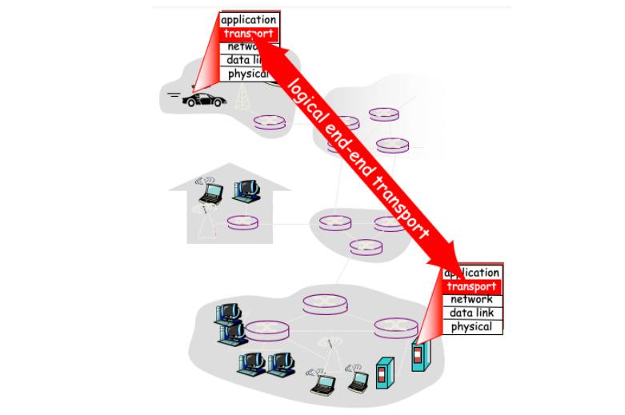
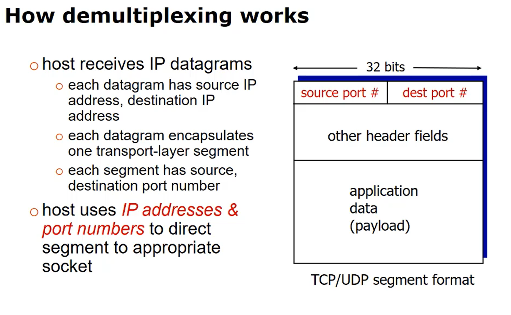
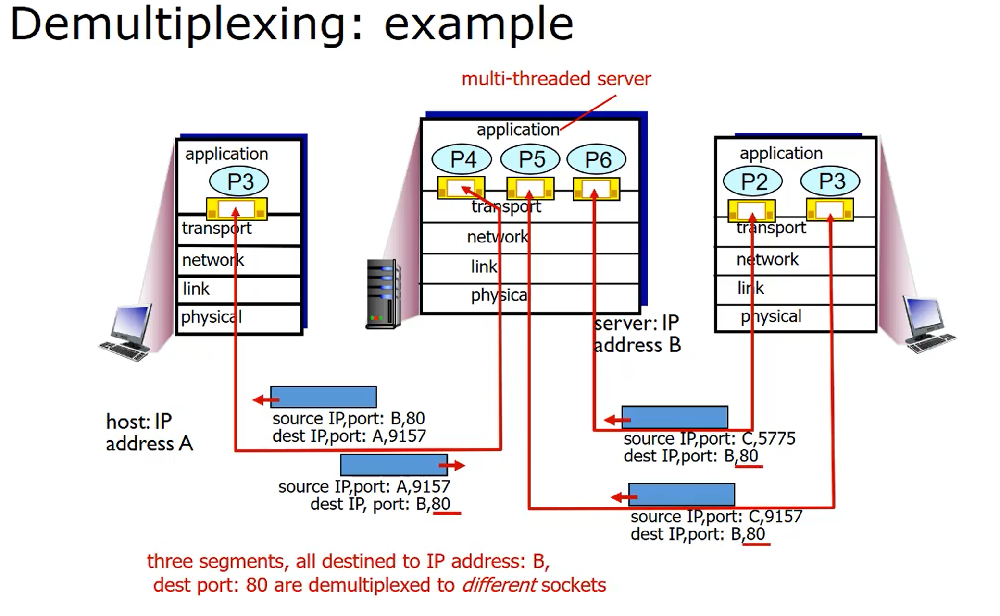
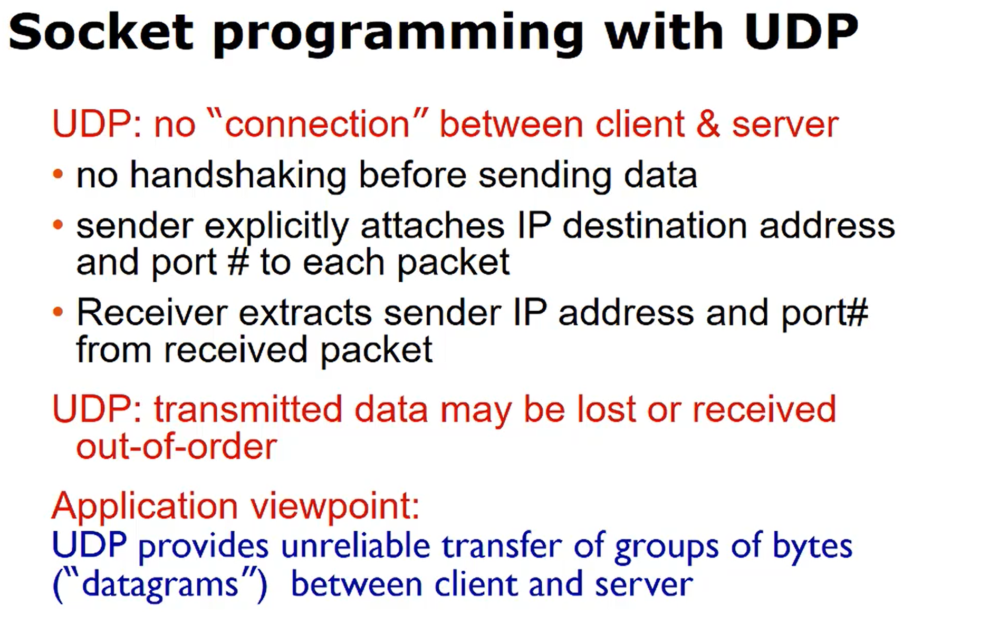
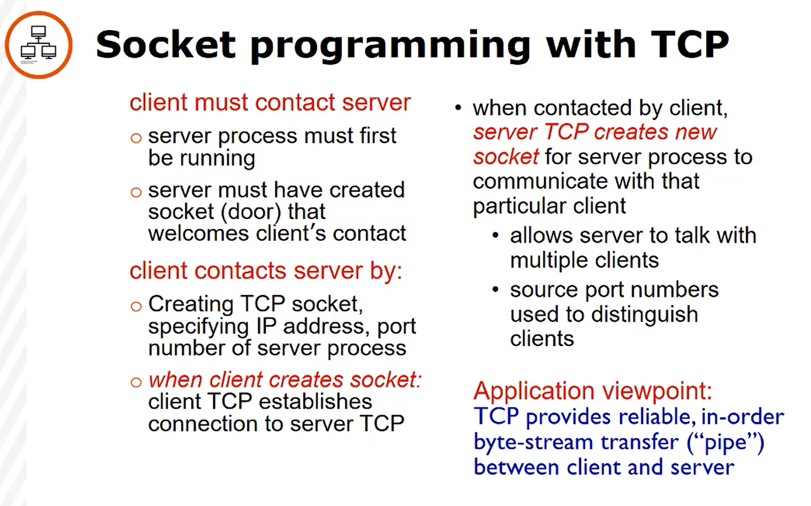
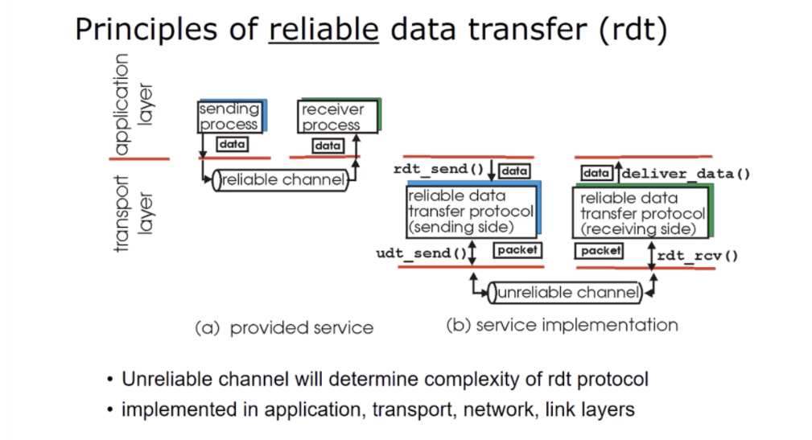

## The Transport Layer

- Process to process communication

NOTE: `Transport layer` layer provides logical communication between _processes_, `Network layer` provides logical communication between _hosts_

- Connectionless (UDP), Connection (TCP)

  

How the transport layer protocol works:

1. Message (data) is sent from the Application layer
2. Transport layer appends a header that contains source and destination port numbers that correspond to source/destination processes.
3. The blocks are encapsulated into segements. Segments and their IP addresses are passed to Network layer.
4. This process is reveresed at the destination host, where the destination port is used to find the correct process.

- There may be multiple processes running on the source or destination host. This requires that the Transport layer segments are multiplexed, or mixed together for transport to the destination host. Upon arrival, the segments must be demultiplexed, or separated, and then delivered to the correct process.

Sender protocol:

- Accepts messages from application socket
- Breaks messages into data blocks
- Encapsulates blocks/ports into `segements`
- passes segments/addressses to network layer

Receiver protocol:

- Accepts segements from network layer
- Re-assembles data blocks into messages
- Passes messages to sockets at application layer

### Multiplexing/demultiplexing

```
Multiplexing at sending hosts:
* Gathering data from multiple sockets, creating segments, encapsulating segments with header

Demultiplexing at receiving host:
* Delivering received segments to correct socket
```

  

### Connectionless demultiplexing

- UDP socket identified by destination (IP address/port)
- When it receives the segment it checks port number and sends it to socket with that port
- Many-to-1 relationship (Many source IP addresses/ports may be directed to same socket)

### Connection-oriented demultiplexing

- TCP socket identified by
  - Source IP
  - Source port
  - Destination IP
  - Destination port
- 1-1 relationship (1 source IP/port, 1 destination IP/port)
- Web servers have different sockets for each connecting client.
  - Non-persistent HTTP will have different socket for each request



<br />
<br />
<br />
<br />
<br />

## SOCKET PROGRAMMING

`Socket`

- OS-controlled interface (door)
- A logical port (implemented in software)
- Created by and associated with an application process running on the host.
- An application process uses a socket to send/receive messages to/from another application process





<br />
<br />
<br />
<br />
<br />

## Reliable Data Transfer (RDT)

- Implemented in the application, transport and internet layers.


