<small>[Return Home](../../README.md)</small> | <small>[Return to CS 372](index.md)</small>

## The Transport Layer

- Process to process communication

NOTE: `Transport layer` layer provides logical communication between _processes_, `Network layer` provides logical communication between _hosts_

| Keyword                    | Definition                                                                                                                     |
| -------------------------- | ------------------------------------------------------------------------------------------------------------------------------ |
| `Reliable data transfer`   | The ability to guarantee that a transmitted message was received, and it was received as it was sent (without errors).         |
| `RDT Two-Generals problem` | If there is any possibility of error in the communications channel, it is impossible to guarantee 100% reliable data transfer. |

- Connectionless (UDP), Connection (TCP)

  

How the transport layer protocol works:

1. Message (data) is sent from the Application layer
2. Transport layer appends a header that contains source and destination port numbers that correspond to source/destination processes.
3. The blocks are encapsulated into segements. Segments and their IP addresses are passed to Network layer.
4. This process is reveresed at the destination host, where the destination port is used to find the correct process.

- There may be multiple processes running on the source or destination host. This requires that the Transport layer segments are multiplexed, or mixed together for transport to the destination host. Upon arrival, the segments must be demultiplexed, or separated, and then delivered to the correct process.

Sender protocol:

- Accepts messages from application socket
- Breaks messages into data blocks
- Encapsulates blocks/ports into `segements`
- passes segments/addressses to network layer

Receiver protocol:

- Accepts segements from network layer
- Re-assembles data blocks into messages
- Passes messages to sockets at application layer

### Multiplexing/demultiplexing

```
Multiplexing at sending hosts:
* Gathering data from multiple sockets, creating segments, encapsulating segments with header

Demultiplexing at receiving host:
* Delivering received segments to correct socket
```

  

### Connectionless demultiplexing

- UDP socket identified by destination (IP address/port)
- When it receives the segment it checks port number and sends it to socket with that port
- Many-to-1 relationship (Many source IP addresses/ports may be directed to same socket)

### Connection-oriented demultiplexing

- TCP socket identified by
  - Source IP
  - Source port
  - Destination IP
  - Destination port
- 1-1 relationship (1 source IP/port, 1 destination IP/port)
- Web servers have different sockets for each connecting client.
  - Non-persistent HTTP will have different socket for each request


<br />
<br />
<br />
<br />
<br />

## SOCKET PROGRAMMING

`Socket`

- OS-controlled interface (door)
- A logical port (implemented in software)
- Created by and associated with an application process running on the host.
- An application process uses a socket to send/receive messages to/from another application process


<br />
<br />
<br />
<br />
<br />

## Reliable Data Transfer (RDT)

- Implemented in the application, transport and internet layers.


- Two generals problem

  - Cannot guarantee that the message will be received or have errors

- How can we mitigate physical layer unreliablility?
  - Error detection
  - Receipt acknowledgement
  - Timing message sequencing
  - Timing
  - Retransmission
  - Fairness

### Error detection

- Can detect if there was corruption
- Note: The maximum UDP header size is 8 bytes (2 bytes for each section: source port, destination port, segment length, checksum)

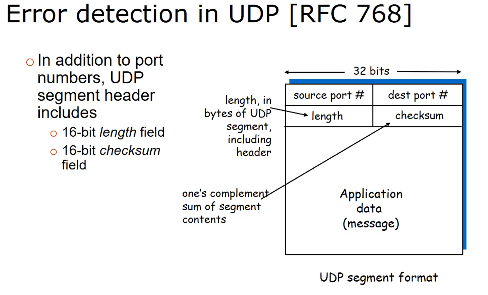

- UDP checksum
  - Detect errors in flipped or lost bits

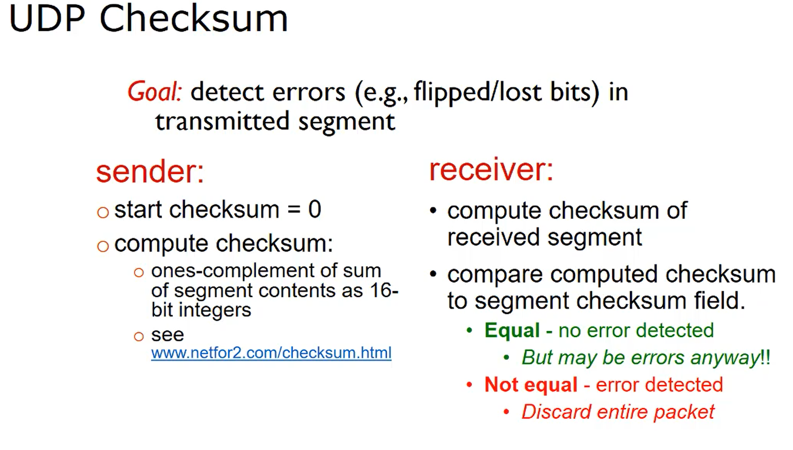

- Ones compliment error check

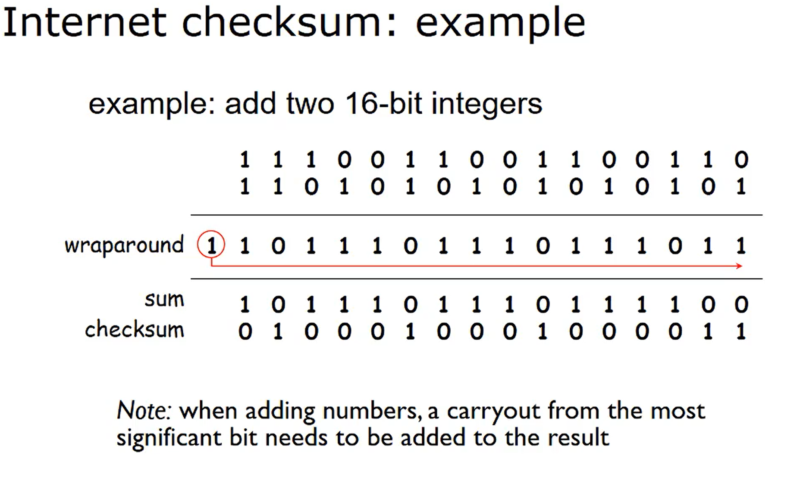

## Reliable data transfer with TCP

Characteristics of TCP include:

- Full-duplex operation (bi-directional data flow in the same connection at the same time)
- In-order byte stream service (received data same as sent data)
- Acknowledgment of bytes received
- Retransmission of packets if necessary
- Pipelining for efficiency (multiple packets sent at once)
- Hurry-up-and-wait (burst of packets sent, then wait for acknowledgment)
- Flow-controlled for reliability (sender will not overwhelm receiver)
- MSS: Data will be broken up into segments, then reassembled at the receiver

TCP segment:

- Minimum size of a TCP header is 20 bytes due to the five 4 byte rows. (Header size of 5)
- Maximum size is 60 bytes (Header size of 15)

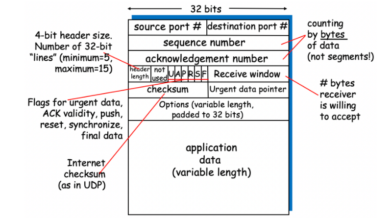

- TCP uses `acknowledgement` and `retransmission` for error handling

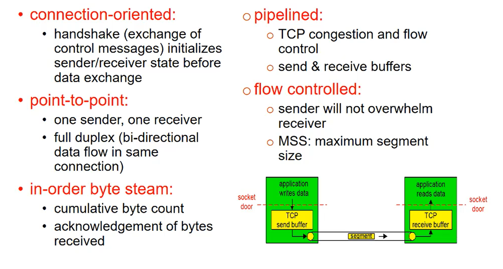

- Receiver acknowledges all correct segments received.
- Header for the acknowledgement segment (ACK) is the same as for other segments
  - aknowledgement number field contains the **number of the next byte expected**

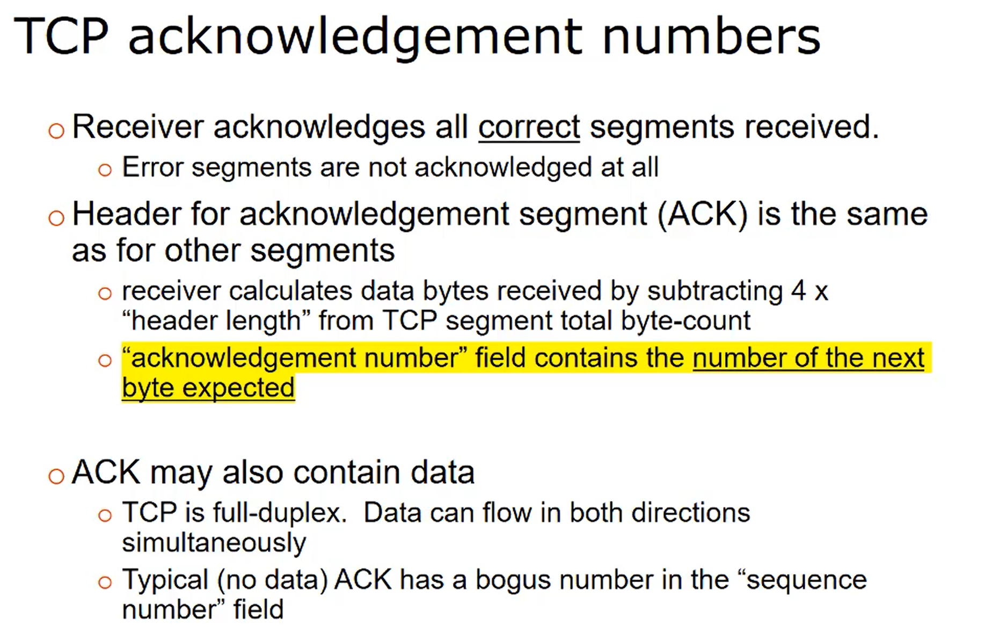

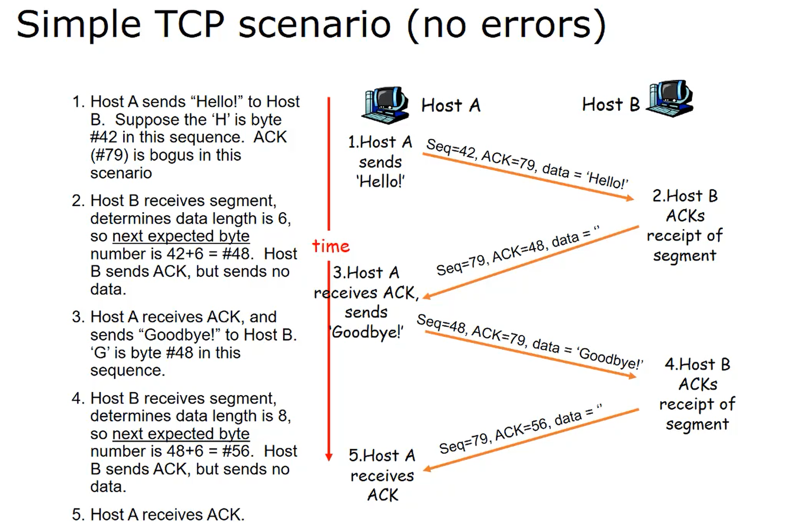

- Sender sets a count-down timer for each segment sent.

  - If timer expires before ACK received.. resend
  - if segement error, ACK will never arrive

- Receiver can detect and discard duplicates
  - If ACK is delayed (arrives after re-send)
  - If ACK is lost

| TCP Service           | Implementation                                                                                  |
| --------------------- | ----------------------------------------------------------------------------------------------- |
| `Connection-oriented` | 3-way handshake at start of connection.                                                         |
| `Full Duplex`         | Ex. Telnet echoes every character sent                                                          |
| `In order delivery`   | Via sequence numbers in TCP header information                                                  |
| `Pipelining`          | Note: Pipeline is limited by congestion and flow control                                        |
| `Flow control`        | receiver advertises a window size, and sender limits output accordingly.                        |
| `Congestion control`  | Implemented by restricting pipeline size based on receipt of acknowledgements (or lack thereof) |
| `Reliable Delivery`   | Acknowledgement for delivery of packets                                                         |

## Internet Control Message Protocol (ICMP)

| Question                                                                                                                                      | Answer                                                                                                                                                                                                                                                                                                                                                                                                                                       |
| --------------------------------------------------------------------------------------------------------------------------------------------- | -------------------------------------------------------------------------------------------------------------------------------------------------------------------------------------------------------------------------------------------------------------------------------------------------------------------------------------------------------------------------------------------------------------------------------------------- |
| `How is an ICMP message carried`                                                                                                              | The ICMP message is in the payload of the IP datagram. The format of the information in the payload depends on the type of ICMP message being sent.                                                                                                                                                                                                                                                                                          |
| `If an IPv4 datagram had to traverse 15 routers to reach its destination host, and I set the IPv4 header TTL field to 10, what would happen?` | The datagram would be dropped by the 10th router in the path, and that router would send an ICMP Type 11 (Time Exceeded), Code 0 (TTL expired in transit) message back to the sending host.                                                                                                                                                                                                                                                  |
| `What are some common usages of ICMP?`                                                                                                        | PING requests use ICMP messages with echo requested. Traceroute (tracert) uses a series of ICMP messages, each with an incrementing TTL, to trace the path from source to destination. Destination Network Unreachable is extremely common if your internet goes down somewhere. Destination Port Unreachable is common if a web server goes down. Internet Core Routing Algorithms use ICMP to establish paths and active router listings.. |
| `If an IPv4 datagram had to traverse 15 routers to reach its destination host, and I set the IPv4 header TTL field to 10, what would happen?` | The datagram would be dropped by the 10th router in the path, and that router would send an ICMP Type 11 (Time Exceeded), Code 0 (TTL expired in transit) message back to the sending host.                                                                                                                                                                                                                                                  |

- Routers can communicate with each other, and with sender hosts using ICMP messages.

* Allows info to be carried between
  - Source host to destination host
  - Router to soruce host
  - Destination host to source host
  - Router to router

- IP provides a best-effor delivery service. Can detect a variety of errors including:
  - checksum
  - TTL expires
  - No route to destination network
- If an error occurs, IP will discard the datagram. ICMP provides for error-reporting mechanisms. To report the error, the router sends an ICMP control message back to the source.

- An ICMP message is encapsulated in a standard IP datagram.
  - The message type is 8-bit `[0-40](41..255 reserved)`. There is also 8 bit code for the message sub-type.

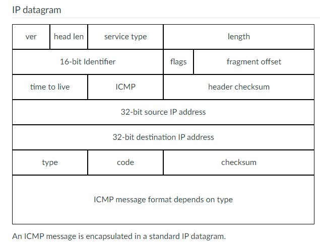

- Two classes of ICMP messages: Error and informational

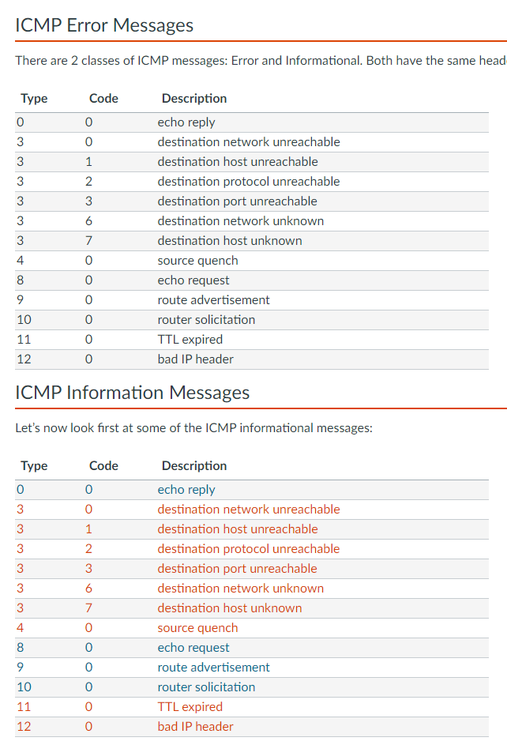
<small>[Return Home](../../README.md)</small> | <small>[Return to CS 372](index.md)</small>
s
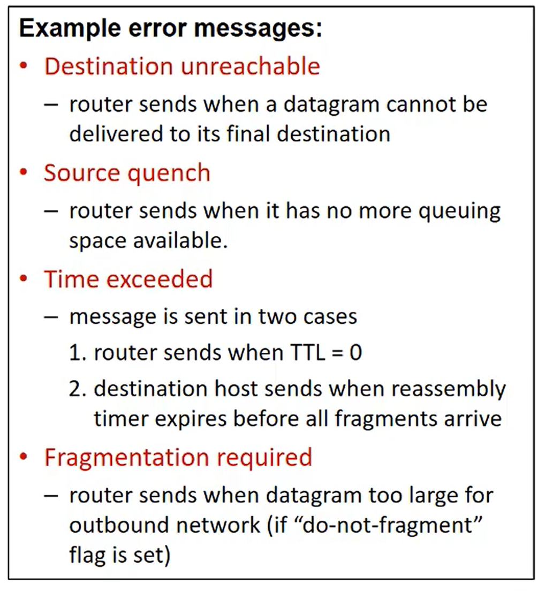

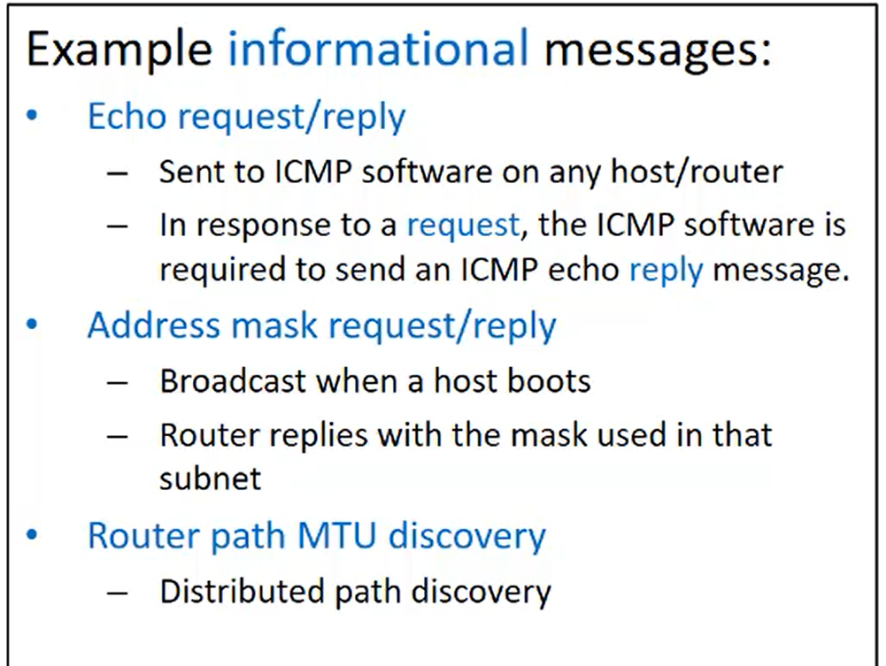

- The type and sub-type of an ICMP message are used by the host to match messages to the appropriate process, which are running on an ICMP application implemented in the network layer (the GUI of these apps will run in the application layer of the host)
  - E.g. `ping, echo, traceroute`

| Keyword    | Definition                                                               |
| ---------- | ------------------------------------------------------------------------ |
| `MTU`      | Maximum Transmission Unit. Largest data size permitted on the connection |
| `Path MTU` | The maximum MTU size on the network path between source and destination  |

### Router-to-router communication

- When a new router is added to the core, the router must signal it's availability to participate in routing
  - To do this it can broadcast a request for 'router solicitation (type: 10, code: 0) to auto configure a default route
- The router can also broadcast "router advertisement" (type: 9, code: 0) to let other know of its existence when first connected.

```
Fragmentation causes a lot of overhead to be added to communications so it should be avoided if at all possible. A source can determine path MTU (smallest MTU on the full path from source to dest) by using ICMP error messages. The source will probe the path using datagrams with the do-not-fragment flag set. If the datagram reaches a router in the path and the next hop has a smaller MTU than the datagram, then that router will discard the datagram and send an ICMP error message back to the source with the “fragmentation required” code.

In this way the source can probe the full path with smaller and smaller datagrams until the destination is reached and the smallest MTU is known.

```

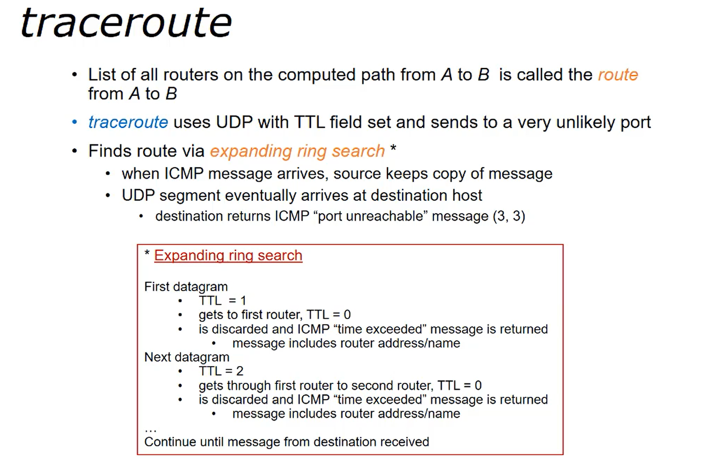
