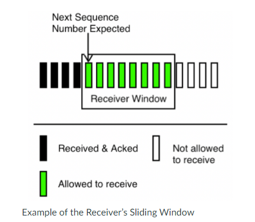
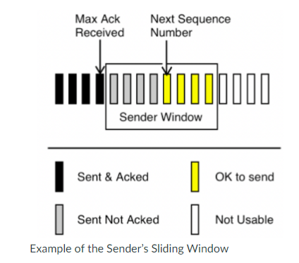
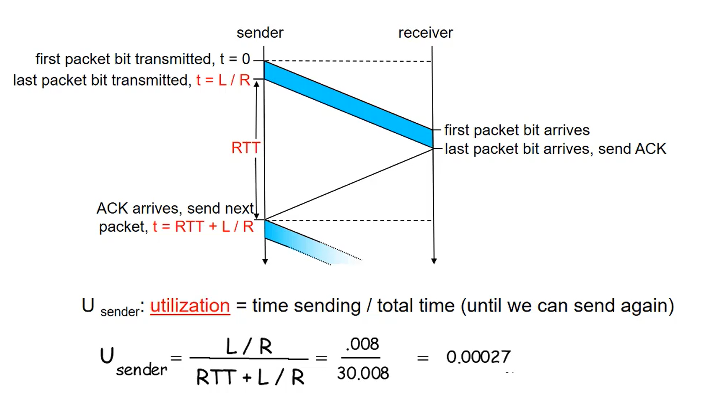
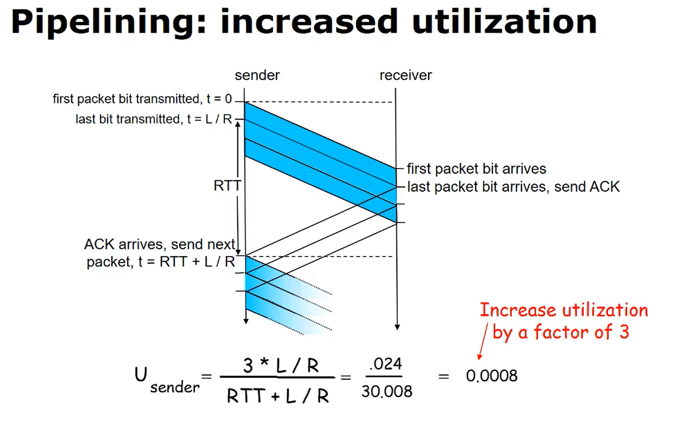
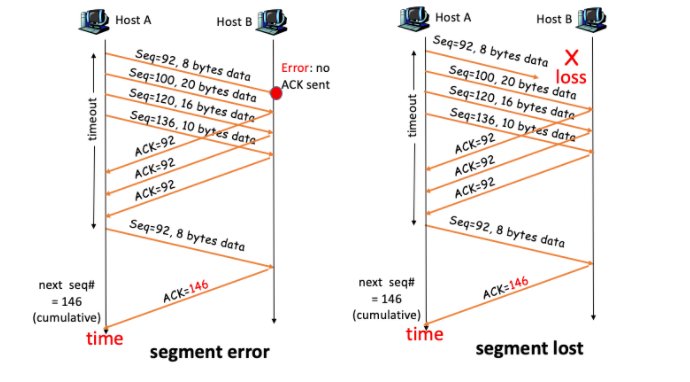
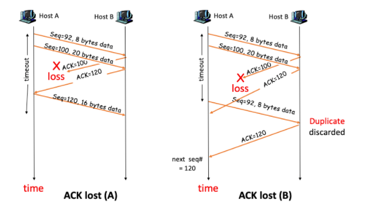
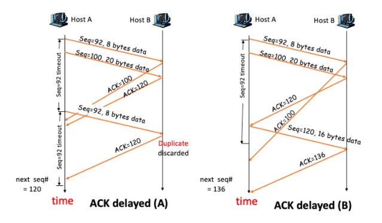
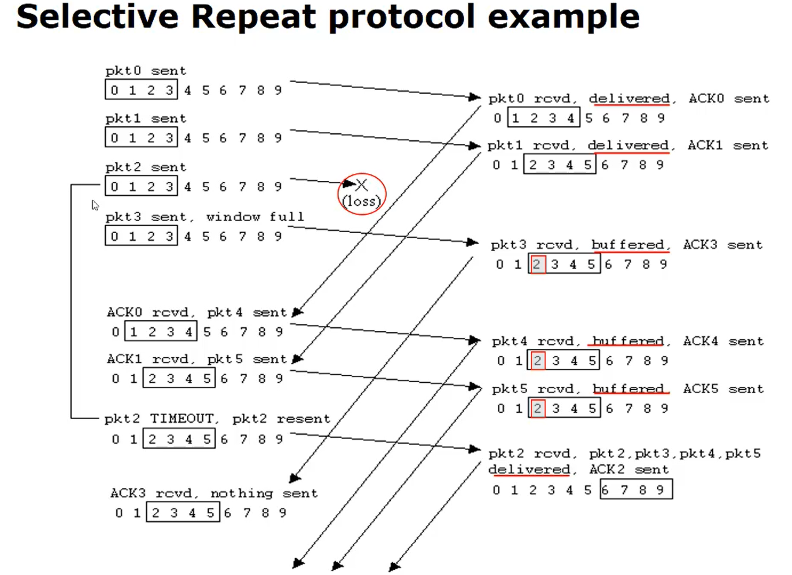
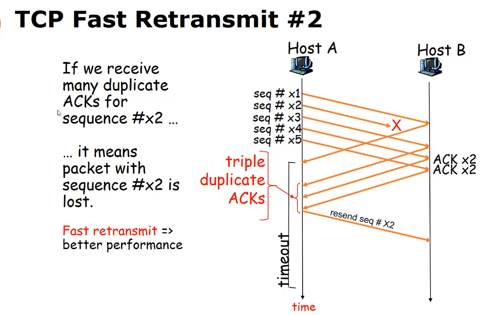
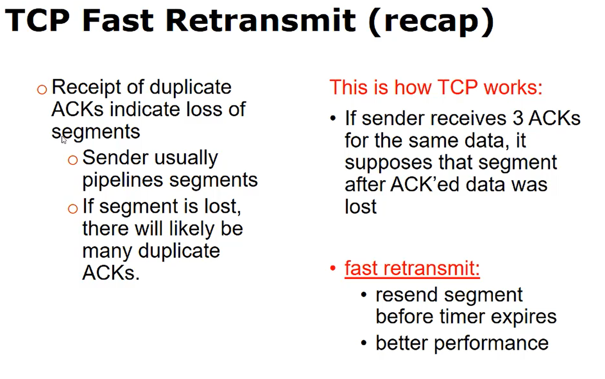

## RDT with TCP - Stop & Wait, Pipelining, and the Sliding Window

| Keyword                   | Definition                                                                                                                                                                                                                          |
| ------------------------- | ----------------------------------------------------------------------------------------------------------------------------------------------------------------------------------------------------------------------------------- |
| `Pipelining`              | TCP sends out a number of packets, one right after another, and then waits for an acknowledgment (rather than sending 1 at a time waiting for the ACK).                                                                             |
| `Sliding window protocol` | The receiver will advertise the size of its sliding window in the header of all acknowledgement packets (receive window field). This specifies how many packets it will allow a client to send before receiving an acknowledgement. |

- TCP is a stop and wait protocol with poor network utilization.
- TCP can use pipelining to improve network utilization
- Pipelining can overwhelm a receiver, TCP solves the problem with a sliding window for flow control.

https://multimedia.oregonstate.education/cs372/network/main.html

  
  

Performance of stop and wait without pipelining:

  

With pipelining:

  

## RDT with TCP - Stop & Wait, Retransmission

TCP Sender events:

- Data received from Application layer
- Create segments with sequence numbers
  - sequence # is byte-stream number of first data byte in segment (or based on that number)
- Start countdown timer (f not aready running for a previous segment)
- Send segments
- Wait for Ack or timeout

**If countdown timer expires**

- Retransmit segment that caused timeout
- Restart timer

**If ACK received**

- Check to see if ACK includes previously unACK'ed segments
- Update what is known to be ACK'ed
- restart timer if there are outstanding segments

NOTE: ACK's are cumulative. The ACK # is always the next epected byte number. This implies that all previous bytes have bene accounted for.

Segment Error/Loss:

TCP starts a timer for every segment. If the segment is not acknowledged before the timer expires, the segment will be resent. In the scenario below, a segment is lost, or arrives with errors. Host B acknowledgments indicate that it has yet to successfully receive the segment with Seq=92. Once the timer expires, this segment is resent.

  

Ack lost:

In this scenario, the ack for the first segment (seq=92) is lost in transit. In scenario A, the sender receives the ack for the next segment (seq=100). Since TCP acknowledgements are cumulative, the sender knows that the first segment was received and will not retransmit.

In scenario B, the segment timer expires before any acknowledgment is received, and the first segment is retransmitted.

  

Ack delay:

These two scenarios are similar to ack loss. If the acks arrive before segment timeout, then retransmission does not occur. If the acks arrive after timeout, then retransmission does occur.

  

**Selective repeate protocol:**

- Sender can have up to 'window size' un-ACK'ed packets in pipeline
- Receiver ACKs individual packets
- Sender mantains timer for each un-ACK'ed packet

  - When timer expires, retransmit only the un-ACK'ed packet

  

**Fast retransmit protocol**

