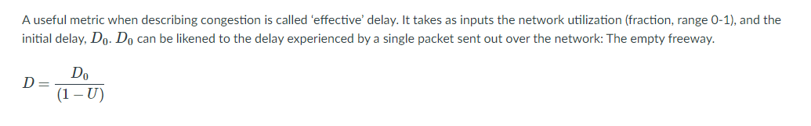
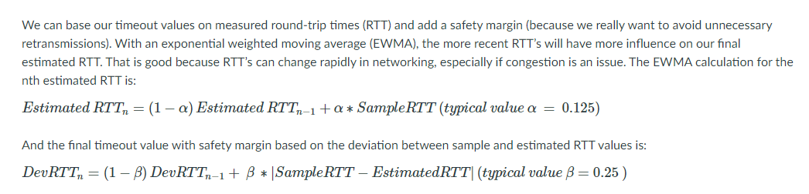
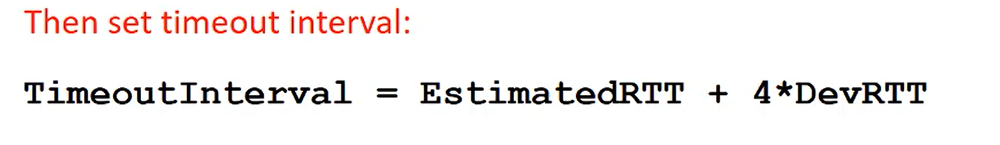
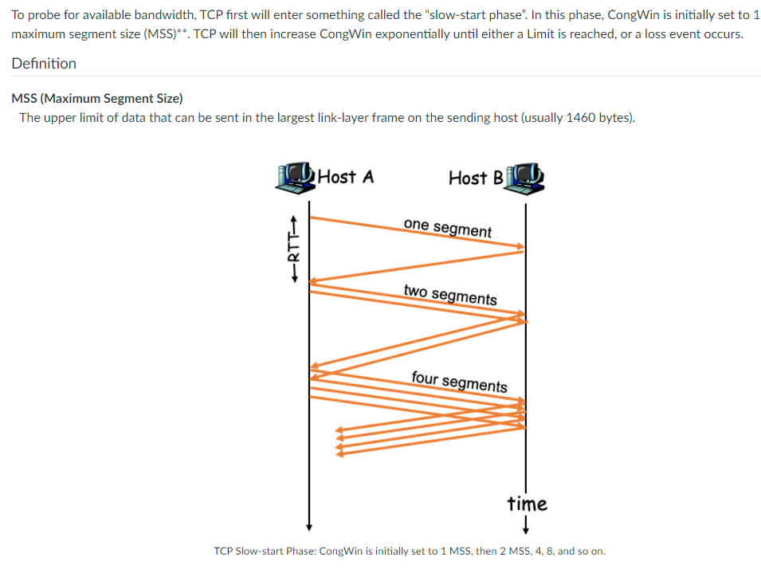
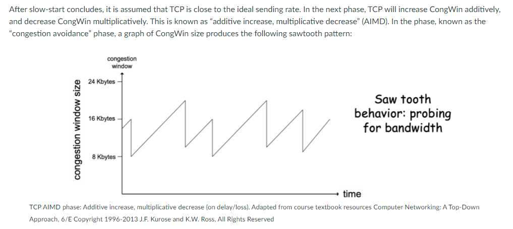
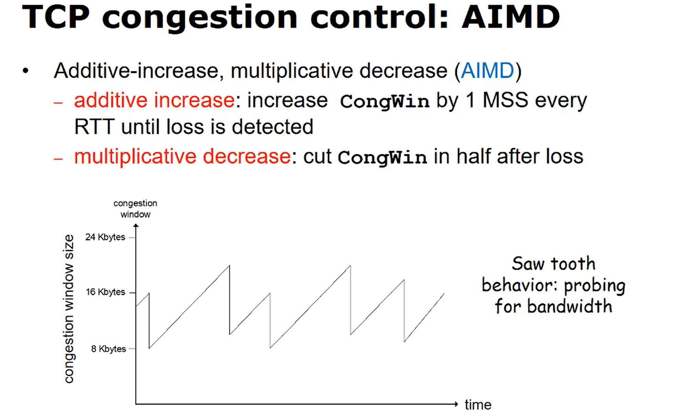
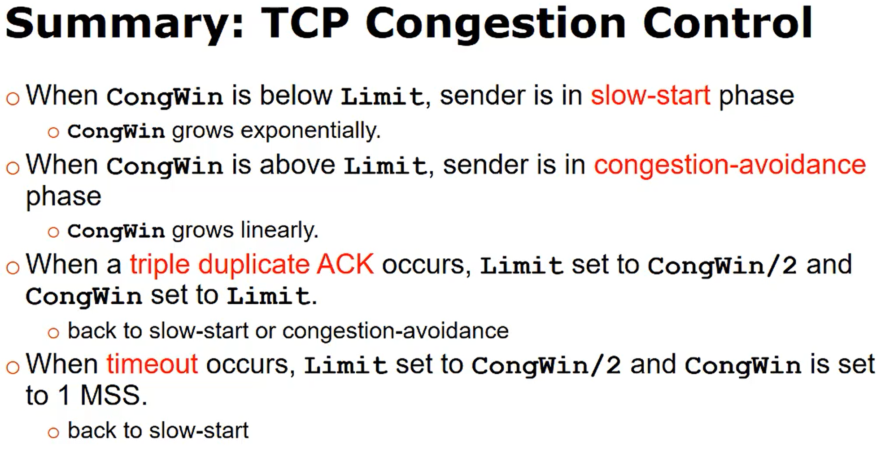
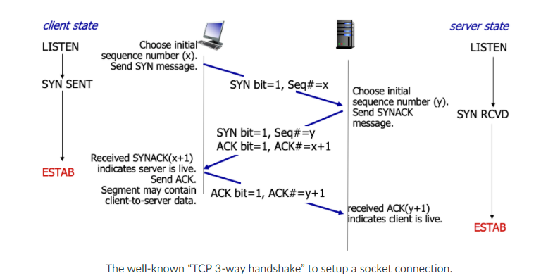
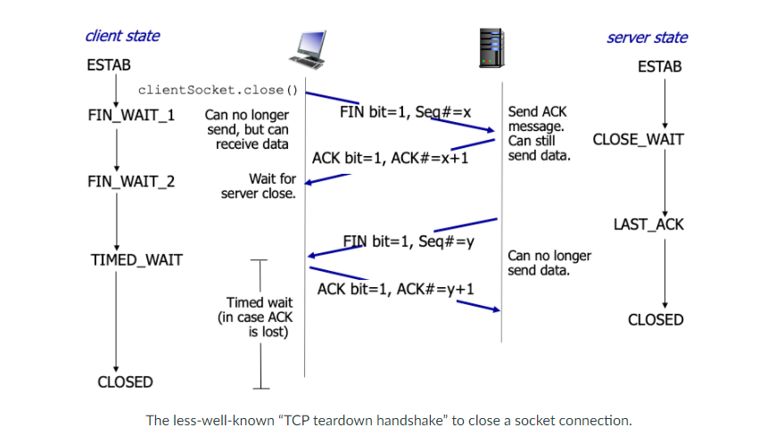

## Network Congestion and TCP

| Keyword       | Definition                                                                                            |
| ------------- | ----------------------------------------------------------------------------------------------------- |
| `Congestion`  | Excessive network traffic. End systems are sending too much data for network/routers (core) to handle |
| `Full Duplex` | Ex. Telnet echoes every character sent                                                                |

D- effective delay (expected delay)

U- Network utilization [0..1],  
D0 is the delay when the network has no other traffic (max throughput)

### Costs

- Long delays, dropped packets, timeouts, buffer overflow at routers

  

### Optimization

- Smarter timeouts
- better sliding-window size management
- More efficient Acks

### Smarter segment timeouts

- RTT
  - can only be estimated
  - varies from one packet to another
  - Need to take a moving average of the RTTs
    - `SampleRTT` measured from end of segment transmission until receipt of ACK
      - Ignores retransmissions
    - To get a smoother estimated RTT we can average several recent measurements, not just the current `SampleRTT`

`Exponential weighted moving average (EWMA)`

- DevRTT adds a `Safety margin` to EstimatedRTT (deviation) \* Large variations in EstimatedRTT -> larger safety margin

| Question                                                                                    | Answer                                                                                                                                                                                                                                                                                                                         |
| ------------------------------------------------------------------------------------------- | ------------------------------------------------------------------------------------------------------------------------------------------------------------------------------------------------------------------------------------------------------------------------------------------------------------------------------ |
| `How is congestion control accomplished?`                                                   | This is accomplished by attempting to detect and avoid congestion, and if congestion is un-avoidable, the sender should reduce their data output.                                                                                                                                                                              |
| `What are some consequences of a congested network?`                                        | Packets are dropped, delayed, or routed through a non-optimal path. Because of this, sending hosts will attempt to retransmit (if using TCP), which causes an increase in network congestion. If this were to continue, there would be a congestion collapse (essentially a network super-slow-down).                          |
| `What is the TCP DevRTT and how is it calculated?`                                          | DevRTT is a factor which increases when the most recent sampled round trip time is different from the most recent estimated round trip time. It is another exponential weighted moving average, strongly weighted toward the most recent deviation value. DevRTT*n = (1-β)DevRTT*(n-1) + β(SampleRTT*new - EstimatedRTT*(n-1)) |
| `What is the TCP EstimatedRTT and how is it calculated?`                                    | EstimatedRTT is a exponential weighted moving average based on recent and past sampled round trip time values. EstimatedRTT*n = (1-α)EstimatedRTT*(n-1) + (α)SampleRTT_new                                                                                                                                                     |
| `What is network congestion? What causes it?`                                               | In the simplest terms, network congestion is the increase in end-to-end delay due to high bandwidth utilization at some point in the network. It is caused by end systems sending data faster than the network is capable of handling (those darned routers!).                                                                 |
| `What is the goal of congestion control?`                                                   | For optimizing network utilization, such that a high throughput is ensured, with the restriction that the utilization is not pushed so high that delay and packetloss become major factors.                                                                                                                                    |
| `How does the network core help with congestion control?`                                   | Network core assistance: The network core senses when congestion is an issue – directly – and sends messages (either to the destination host, which bounces it back to the source host, or directly back to the source host) indicating congestion in the core, and possibly advising on a course of action.                   |
| `How does the source host help with congestion control?`                                    | Host inference: A source host attempts to infer congestion in the network core based on observables (e.g. round trip time, dropped packets)                                                                                                                                                                                    |
| `In basic terms, how is congestion control implemented in TCP? What is this method called?` | When no congestion is perceived, the sliding window size gradually increases (additive increase). When there is perceived congestion, the sliding window size is drastically reduced (multiplicative decrease). Together this makes up an additive-increase multiplicative-decrease (AIMD) scheme.                             |

## TCP Connection Control

Goals

- Reliably detect network congestion
- Avoid congestion (when possible)
- React to lessen the problem (when necessary)

### Detecting congestion

TCP infers network congestion by monitoring segment behavior in the Transport layer.

- Uses smarter timeouts
- Smarter sliding window protocols
  - A receiver can delay sending an ACK after it receives a segment if the receive buffer is getting full
    - Receiver will wait for a prescribed amount of time before sending an ACK to clear up some of the receive buffer
- Network core assistance
  - Routers provide feedback to senders
  - Involves ICMP (Internet control messaging protocol)

### How TCP reacts to congestion

- TCP will try to match its send rate to network conditions
  - Defines a congestion window (`CongWin`) to limit the send rate
    - CongWin is the sender's window size
  - Continually probe for available bandwidth and update `CongWin`
  - react to segment delay/loss and update `CongWin`
  - TCP uses additive-increase, multiplicative-decrease (AIMD)

- When the connection is made a single MSS segment is sent, increasing the sending rate exponentially until the first packet loss is detected, once loss is detected, the CongWin will only increase linearly in the AIMD phase.
  - Defines a limit to exponential growth

### Inferring loss

- 3 dup ACKs
  - CongWin is cut in half
  - Window grows linerally afterwards
- Segment timeout (bigger issue since segments aren't getting accross)
  - CongWin is set to 1 MSS
  - Window grows expoentially to a Limit and then grows linearly

### Summary

## TCP Connections and Network Fairness

Socket connection setup:

TCP connection teardown:

- TCP tries to let each TCP connection receive the same bandwidth (has same average bandwidth rate) but not fair to each process or host (a process or host can open multiple TCP connections)
