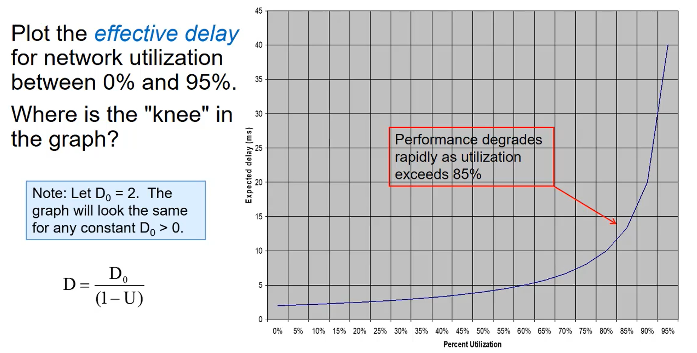

## Network Congestion and TCP

| Keyword       | Definition                                                                                            |
| ------------- | ----------------------------------------------------------------------------------------------------- |
| `Congestion`  | Excessive network traffic. End systems are sending too much data for network/routers (core) to handle |
| `Full Duplex` | Ex. Telnet echoes every character sent                                                                |

D- effective delay (expected delay)

U- Network utilization [0..1],  
D0 is the delay when the network has no other traffic (max throughput)

### Costs

- Long delays, dropped packets, timeouts, buffer overflow at routers

  

### Optimization

- Smarter timeouts
- better sliding-window size management
- More efficient Acks

### Smarter segment timeouts

- RTT
  - can only be estimated
  - varies from one packet to another
  - Need to take a moving average of the RTTs
    - `SampleRTT` measured from end of segment transmission until receipt of ACK
      - Ignores retransmissions
    - To get a smoother estimated RTT we can average several recent measurements, not just the current `SampleRTT`

`Exponential weighted moving average (EWMA)`

- DevRTT adds a `Safety margin` to EstimatedRTT (deviation) \* Large variations in EstimatedRTT -> larger safety margin

| Question                                                 | Answer                                                                                                                                                                                                                                                                                                                         |
| -------------------------------------------------------- | ------------------------------------------------------------------------------------------------------------------------------------------------------------------------------------------------------------------------------------------------------------------------------------------------------------------------------ |
| `How is congestion control accomplished?`                | This is accomplished by attempting to detect and avoid congestion, and if congestion is un-avoidable, the sender should reduce their data output.                                                                                                                                                                              |
| `What are some consequences of a congested network?`     | Packets are dropped, delayed, or routed through a non-optimal path. Because of this, sending hosts will attempt to retransmit (if using TCP), which causes an increase in network congestion. If this were to continue, there would be a congestion collapse (essentially a network super-slow-down).                          |
| `What is the TCP DevRTT and how is it calculated?`       | DevRTT is a factor which increases when the most recent sampled round trip time is different from the most recent estimated round trip time. It is another exponential weighted moving average, strongly weighted toward the most recent deviation value. DevRTT*n = (1-β)DevRTT*(n-1) + β(SampleRTT*new - EstimatedRTT*(n-1)) |
| `What is the TCP EstimatedRTT and how is it calculated?` | EstimatedRTT is a exponential weighted moving average based on recent and past sampled round trip time values. EstimatedRTT*n = (1-α)EstimatedRTT*(n-1) + (α)SampleRTT_new                                                                                                                                                     |
| `What is network congestion? What causes it?`            | In the simplest terms, network congestion is the increase in end-to-end delay due to high bandwidth utilization at some point in the network. It is caused by end systems sending data faster than the network is capable of handling (those darned routers!).                                                                 |
| `What is the goal of congestion control?`                | For optimizing network utilization, such that a high throughput is ensured, with the restriction that the utilization is not pushed so high that delay and packetloss become major factors.                                                                                                                                    |
