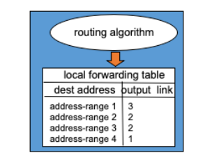
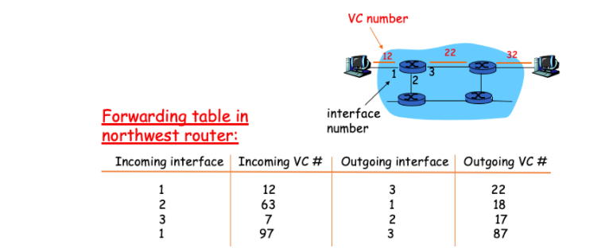
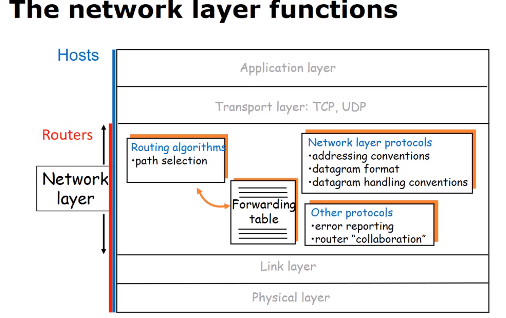
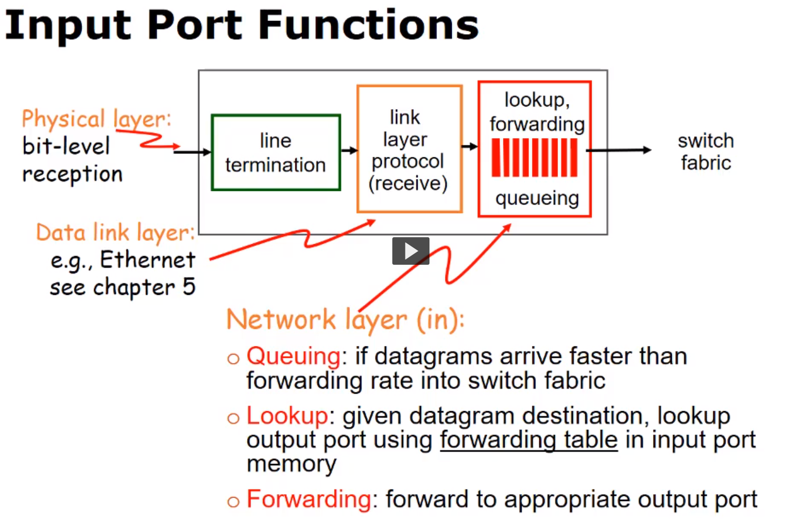
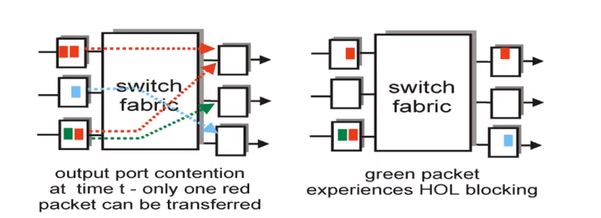
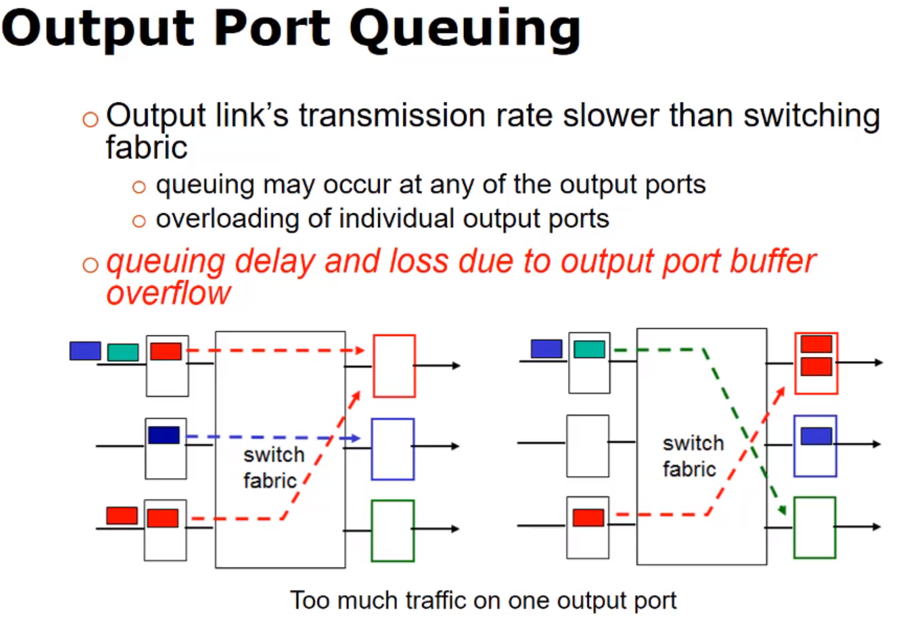
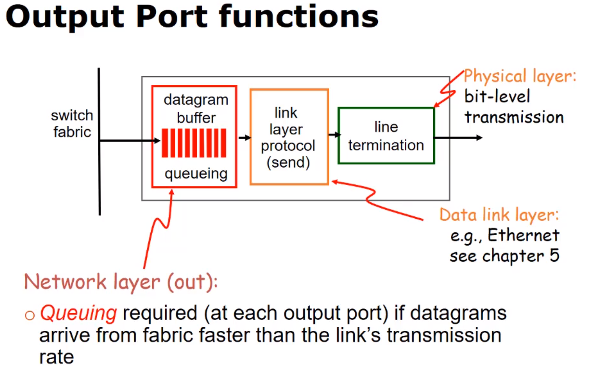
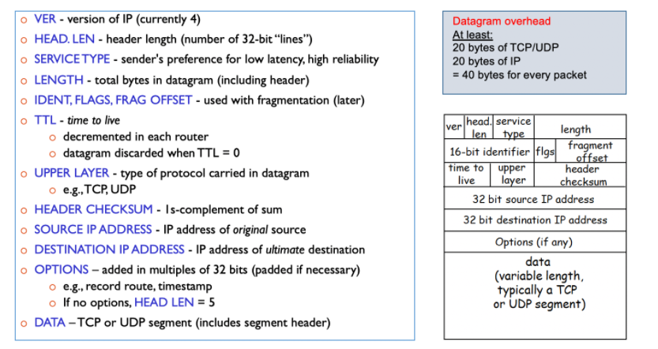
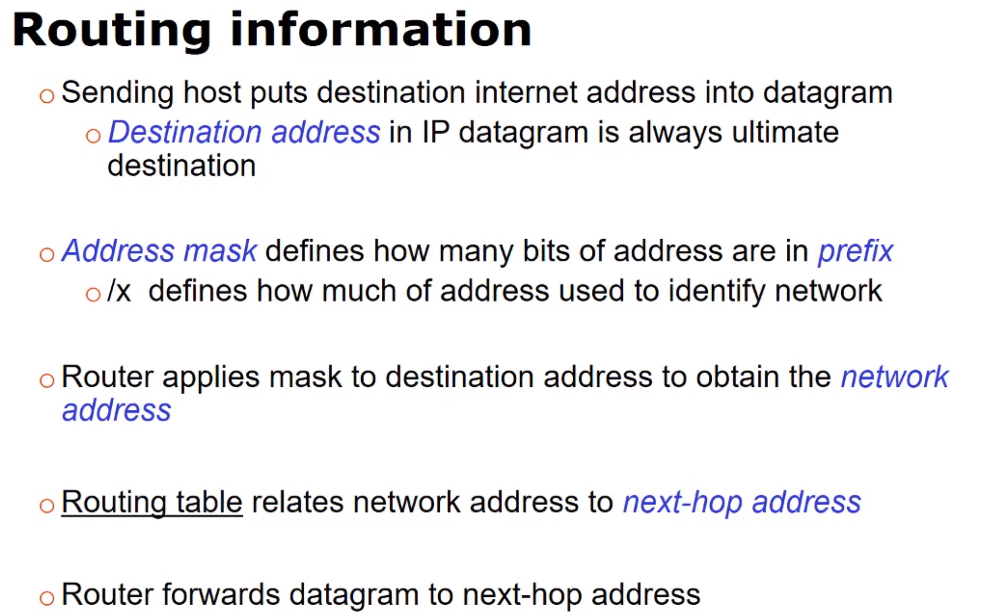
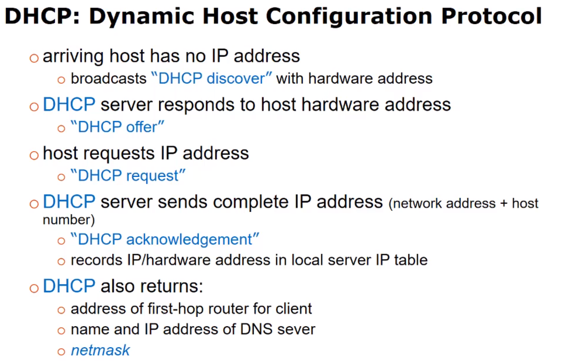

# The Network Layer

- Network layer protocols run at the edge and at the core

| Keyword                           | Definition                                                                                                                                                                                                                                                                                                                     |
| --------------------------------- | ------------------------------------------------------------------------------------------------------------------------------------------------------------------------------------------------------------------------------------------------------------------------------------------------------------------------------ |
| `Routing`                         | Determines route taken by packets from source to destination (using routing algorithms)                                                                                                                                                                                                                                        |
| `Forwarding`                      | Move packets from router's input to appropriate router output                                                                                                                                                                                                                                                                  |
| `Purpose of the network Layer`    | At a very high level, the purpose is to ensure logical communication from host to host. In a more nuts-and-bolts view, the purpose is to determine a path from source to destination that a datagram can take, and to move it on that path (within the network layer).                                                         |
| `Benefits of VC network`          | Some primary benefits of VC networks are guaranteed bandwidth and timing (jitter), which makes them ideal for streaming audio/video.                                                                                                                                                                                           |
| `Benefits of Datagram networks`   | Far less overhead (network doesn't need to maintain state)                                                                                                                                                                                                                                                                     |
| `Queuing`                         | If datagrams arrive fatster than forward rate into switch fabric                                                                                                                                                                                                                                                               |
| `Lookup`                          | Given datagram destination, lookup output port using forwarding table in input port memory                                                                                                                                                                                                                                     |
| `Head-of-the-line (HOL) blocking` | Queued datagram at front of queue prevents others in queue from moving forward                                                                                                                                                                                                                                                 |
| `Switching fabric`                | The hardware switching circuitry used, within routers, to switch datagrams from an input port to an output port (or queue) without any collisions occurring. This is controlled by the routing processor, which utilizes the stored routing table. The IP address of incoming datagrams are used to determine the output port. |
| `Subnet`                          | Most generally, a subnet is a part of a network which shares a common address prefix component. More specifically, it is often a discrete portion of a network, separated by a router from all other portions of the network.                                                                                                  |
| `Next-hop router`                 | Once a prefix match is made within a routing table, a packet is forwarded to its appropriate output link. The router at the other end of that link is the next-hop router.                                                                                                                                                     |

## Network types

- Routing and forwarding network data through the network core
- Logical communication between hosts (datagram)
  - Transport layer is logical comminication between processes (segment)
- Runs on end sytems and routers

### Datagram networks

- Connectionless service
- No bandwidth, packet loss, or ordering guarentees
- Packet switching

- Forwarding table for a datagram is a simple mapping of IP address range to output ports

### VC (virtual-circuit) networks

- Connected service
- Constant bit rate (CBR) and Available bit rate (ABR)
  - Vary in ability for bandwidth guarantee
- Can receive feedback from internet core regarding congestion
- Every router in the path must participate in the network and must be setup in advance

- Fowarding tables contain incoming and outgoing VC ID to port mappings

## ROUTERS

- Route and forward datagrams
- Routing algorithms produce forwarding tables
- Longest prefix matching determins what address is mapped to an output link

### Queuing

- Queuing operations in forwarding
  - If input rate is greater than the switching rate or switching rate is greater than the transmission rate then packet loss is probable.

## IP Header and address format

* Max header 
* IP addresses have a hierarchy, Every ISP network in the internet is assigned a network address that is unique within the internet. This address includes an indicator for the number of bits used for network identification. In the address 128.193.35.0 / 24, the /24 indicates that 24 bits of the address will identify the ISP network. 
    * /24 is known as the network prefix
    * The host address is a number unique within the network (e.g. 0.0.0.123)
    * The host's IP address is combination of the network address and host address 
        * E.g. 128.193.35.123 / 24

- IPv4 - 32 bit number (2^32 possible addresses)
  - E.g. 128.253.40.28
  - Range 0.0.0.0 to 255.255.255.255

## IP CIDR Addressing and subnets

- `Subnet` - Network interfaces with the same IP address prefix. Can communicate wihtout using a router.

- `CIDR Classes inter-domain routing` -

## DHCP and Assigning IP Addresses

- DHCP is an application layer protocol.

* Hosts can dynamically 'lease' IP addresses from a server when joining the network.

* System admin can hard-code IP addresses for each host.

* DHCP Dynamic host configuration protocol.

