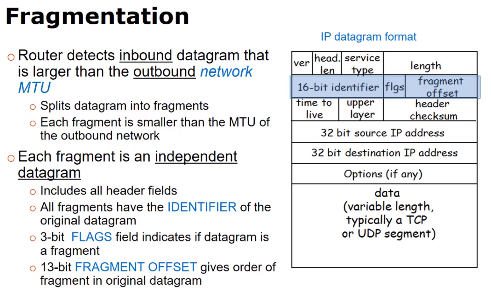

<small>[Return Home](../../README.md)</small> | <small>[Return to CS 372](index.md)</small>

# Routing and Dijkstra's algorithm

- Shortest path algoirthm
- Router's store info as the 'next-hop' in the path. No router contains full path info, only next hop.

- Modeled after a weighted undirected graph

- Nodes are the routers
- Edges are the direct connection between routers
- Weights represent the costs
  - Speed, distance, additional hardware, traffice, bottlenecks, ect.

### Shortest path

- Path with lowest weight (sum of weights of all edges in the path)
  - Not necessarily fewest edges

## IP Datagram Fragmentation

- Frame Encapsulation

  - Datagrams are encapsulated in a frame appropriate to the network it transits
  - Each router from source to destination un-encapsulates the datagram from the frame (`link layer`), determines next hop (`network layer`), then re-encpsulates datagram (`link layer`) in a frame appropriate for the next-hop network into an MTU (Maximum transmission unit) smaller than the max size for destination.

- IPv4 fragments datagrams

  - Each fragment is an independent datagram
  - Each include the IP header fields
    - Identifier of original datagram
    - 3 bit flags that indicate if it's a fragment
    - 13 bit fragment offset gives order of fragment in the original datagram
    - If either 'more fragments' flag is set or the offset is non-zero then the datagram is a fragment.
  - If a TCP segment is fragmented, the TCP header is in the first 20 bytes of the payload in the first fragmented IP datagram.

- Datagrams are always reassembled at the destination host even if the next link has a larger MTU

- Fragment loss
  - IP does not guarentee datagram delivery, so fragments may be lost
  - Desitination sets timer with first fragment - If timer expires before all fragments arrive then the destination drops the entire datagram.
    <small>[Return Home](../../README.md)</small> | <small>[Return to CS 372](index.md)</small>

## Network address translation (NAT)

- Allows multiple computers at one site to share a single global IP address (external IP address)
- With NAT
  - An entire local network uses just one external IP address
    - Supports up to 65,000 hosts
    - Internal addresses managed locally and easily changed
  - Devices inside the local network cannot be explicitly addressed by external hosts (good for security)
- All traffic entering or leaving the network must go through the NAT device
- 10.0.x.x addresses reserved for internal use

### Network address and port translation (NAPT)

- Implementation of NAT
- Uses unique outgoing port numbers mapped to IP/port pairs in the LAN

