# IPv6

- Address space increased
  - 128 bits
  - Zero compression: FF0C:0:0:0:0:0:0:B1 → FF0C::B1
    - :: represents a series of 0's
  - IPv4 addresses in IPv6: An IPv6 address with bits 1-80 set to 0, and bits 81-96 to 1, indicate that the remaining 32 bits contain an IPv4 address should be interpreted as an IPv4 address.
- Better support for video/audio
  - Flow labels allow AV apps to establish appropriate connections
- Fragmentation no longer allowed at router (packet is dropped if too big)
- Checksum was removed (redundant since it exists at the transport and link layer)
- Options are aded by adding new headers vs in IPv4 options are added by increasing the header length
- New ICMP version

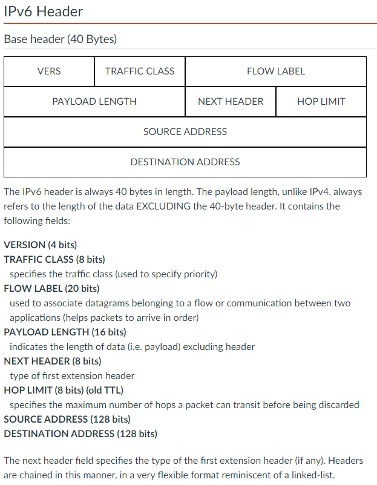

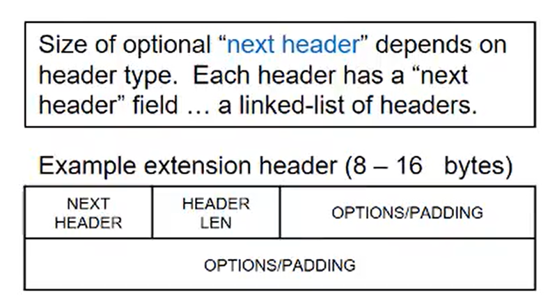

## IPv6 fragmentation

- In IPv6 the source (not intermediate routers) is responsible for fragmentation.
  - Fragmentation information is in a fragmentation extension header
- The source determines the path MTU by sending probe messages of various sizes, and receiving return ICMP messages until the destination is reached. This information enables the source to construct datagrams that can fit within the path MTU.
- Routers will simply drop datagrams larger than path MTU. If a datagram is dropped, an ICMP message will be sent to the source, and the source can update its MTU appropriately for the path.

## Tunneling

- Allows IPv6 to run on IPv4 routers.
- IPv6 datagrams are carried in IPv4 routers as a payload in an IPv4 datagram.

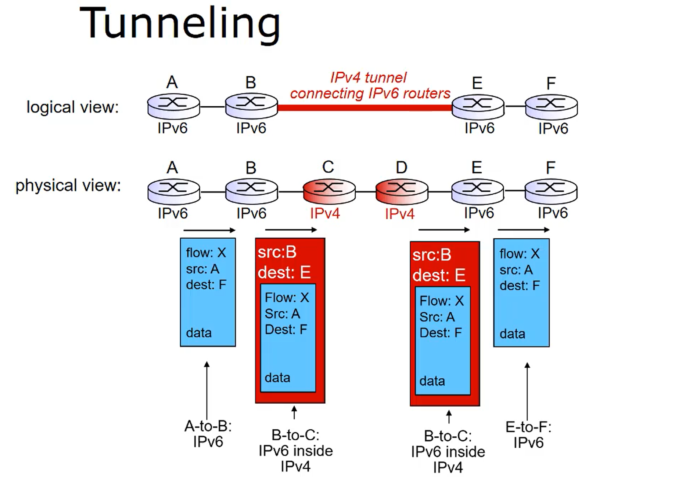

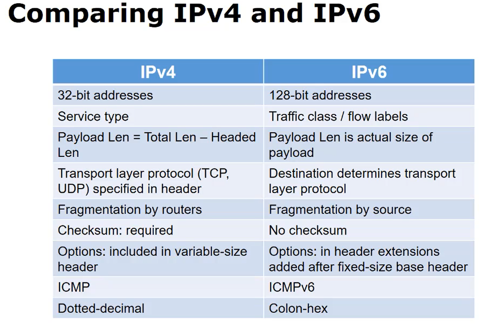

# Data Link Layer

- Implemented in every host in the network, router, and addressable hardware device on the internet.

  - Nodes: Hosts/Routers
  - Links: Communication channels that connect nodes

- Logical communication between adjacent nodes
  - Relies on and enhances the physical layer services
  - Unit in link layer is called a `frame`

### Responsibilities

- Provide hardware addresses used in fram headers
  - Different from IP address
- Encapsulates IP datagram into a frame
  - Addes header/traider
- Get access to shared medium
- Control flow between adjacent sending and receiving nodes
  - Detect/avoid collision
- Detect/correct bit errors

### Link Layer protocols

- Standards depend on actual link, which is where the hardware meets the software.
  - Ethernet, 802.11
- Provide services depending on the link.
  - May or may not provide reliable data transfer.
    - RDT rarely used on low bit error links (fiber, twisted pair) but often on wireless links due to high error rates

### Hardware and NIC card

- Link layer is required on every host, implements the interface to the physical media.
- Implemented mostly in hardware and resides on the `Network Interface Controller (NIC)` card.
  - Capable of doing checksum processing as far up as the transport layer
  - Sub-computer that connects host computer to the physical layer of the internet

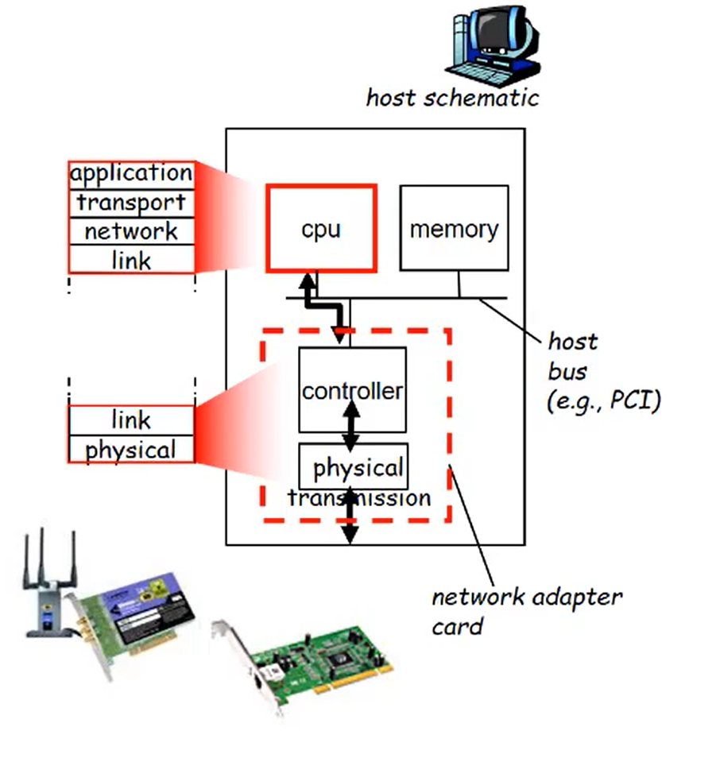

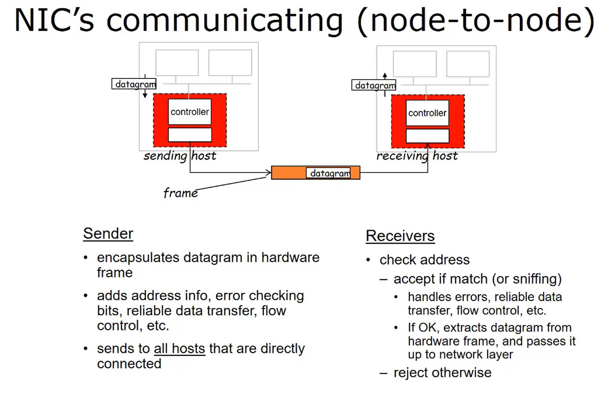

### Error detection/correction and parity checks

- Parity checks of 1/2 dimensional, checksums, cyclic redundancy checsk (CRC), and Hamming codes
- Parity check count the number of 1 bits in the data bytes or words.
  - Even bit parity (0), odd bit parity (1)

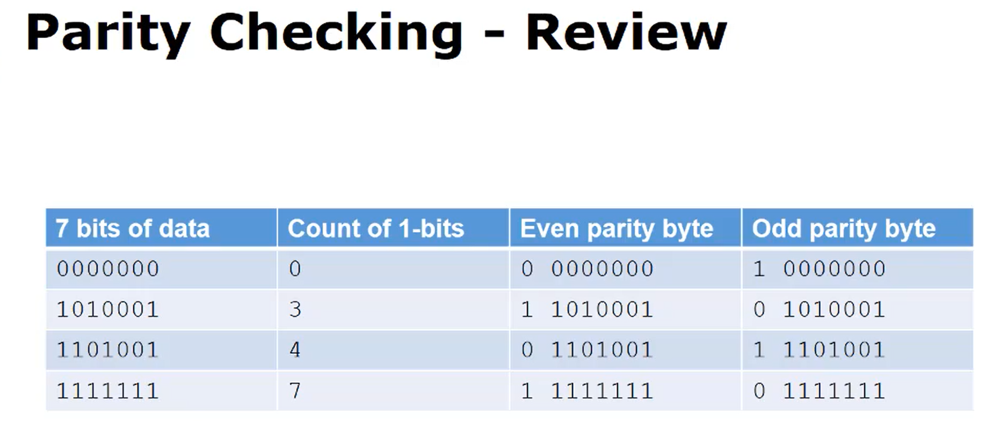

- Detects single bit errors, but cannot correct

### 2-Dimensional parity

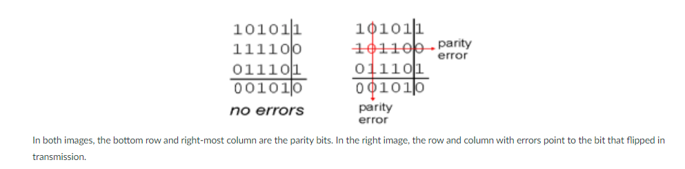

- Can correct and detect single bit errors

# Link Layer Multiple Access

- Point-to-point
  - Data transfer without interference
- Broadcast link
  - Shared medium. Interference/collisions occur when two computers send data at the same time.
  - Multiple access protocol is required to allow communication on shared medium
- `Multiple Access (MA) Protocol`: Determins who adjacent nodes can share a channel

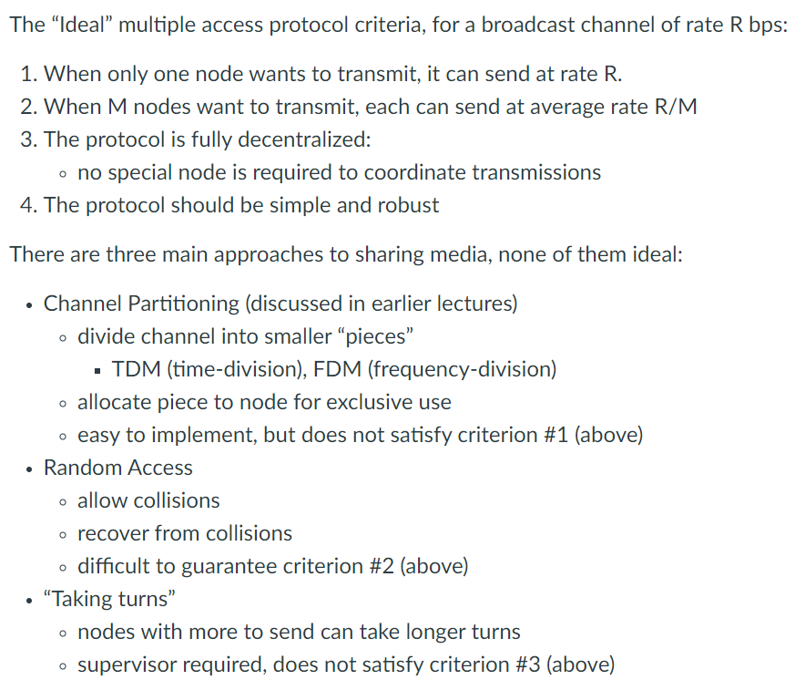

### Random access

- If a node has a packet to send, it will transmit at full channel data rate R. No supervised coordination between two nodes, so multiple nodes transmitting simultaneously will cause a collision.
  - MA protocol specifies
    - How to detect collisions
    - How to recover from collisions

### CSMA (Carrier sense multiple access)

- Type of random access protocol. CSMA listens before transmitting, if the channel is idle, the entire frame is transmitted. If it is busy, the transmission is deferred.
  - Propogation delay can still cause collisions to occur (nodes don't sense each other's transmission)

### CSMA/CD (CSMA with collision detection)

- Improvement over CSMA to reduce wasted transmission time.
- When a collision is detected, colliding transmissions can be aborted. Senders can back off and try later
- Easy to implement in wired LANs but hrader in wireless LANs

### CSMA/CA (CSMA with collision avoidance)

- Used by wireless LANs
- Sending computer sends short reservation messages to the reeiver. If receiver reponds with slot message reserving a broadcast slot for the sender.
  - Response is broadcast to all potential senders in range, so all are notified of reservation.

### Taking-turns protocols

- Polling
  - A master computer invites secondary nodes to transmit in turn
  - Single point of failure (master computer)
- Token passing
  - Token message is passed from one node to the next in sequence
  - If token is lossed this protocol runs into problems
- Usually used by legacy networking systems

# MAC addresses and the address resolution protocol

- IP addresses (virtual address) are used to get a datagram to the destination subnet and then the subnet is responsible for moving the datagram to the destination host
- MAC address is a physical network address in the same network as the sender, used to communicate to the next node in the path. Every NIC card in the world must have a unique MAC address.
  - A MAC address is 48 bits long and burned into ROM on the NIC card by the manufacturer.
  - A portion of the MAC address space is allocated by the IEEE to each card manufacturer.

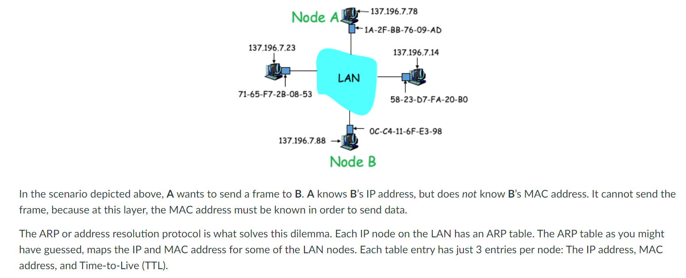

- TTL is a time (usually in minutes) after which the table entry will be removed. Keeps only most frequently visited nodes in the table.
- If the MAC address is not on the table a node can run a DNS query to find out.

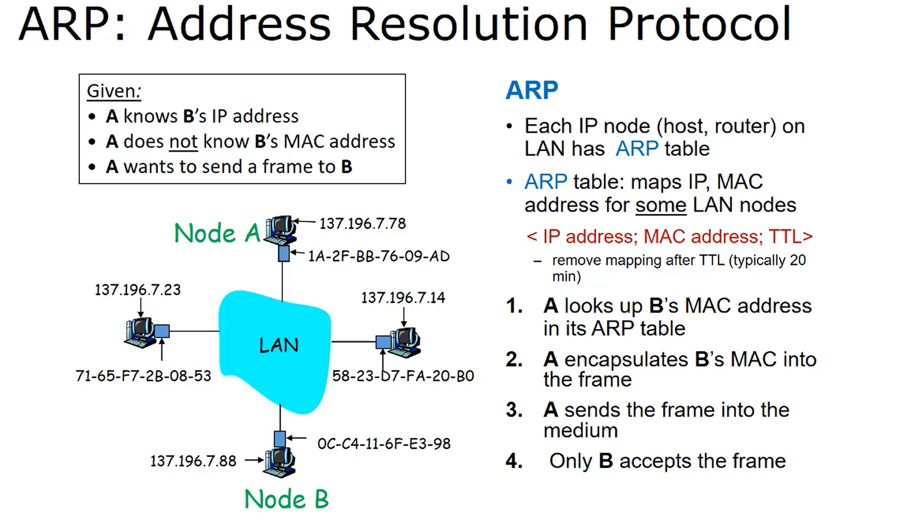

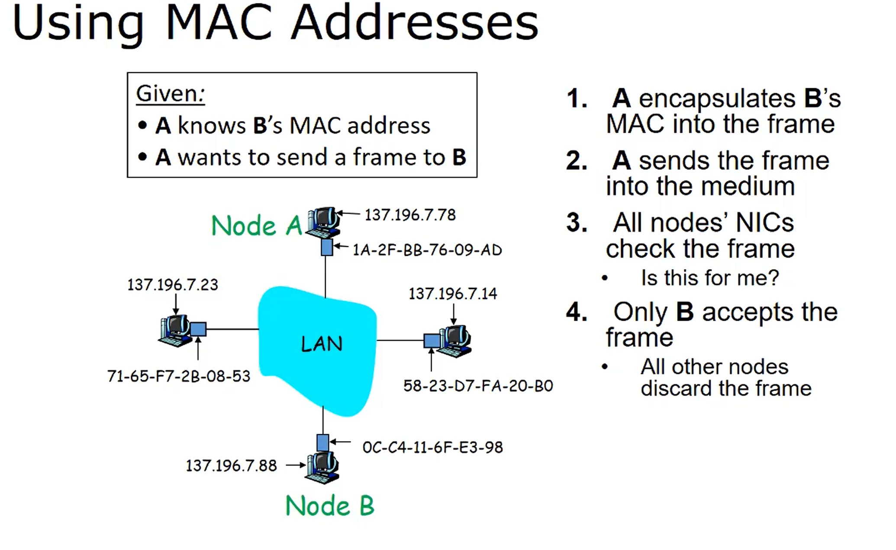

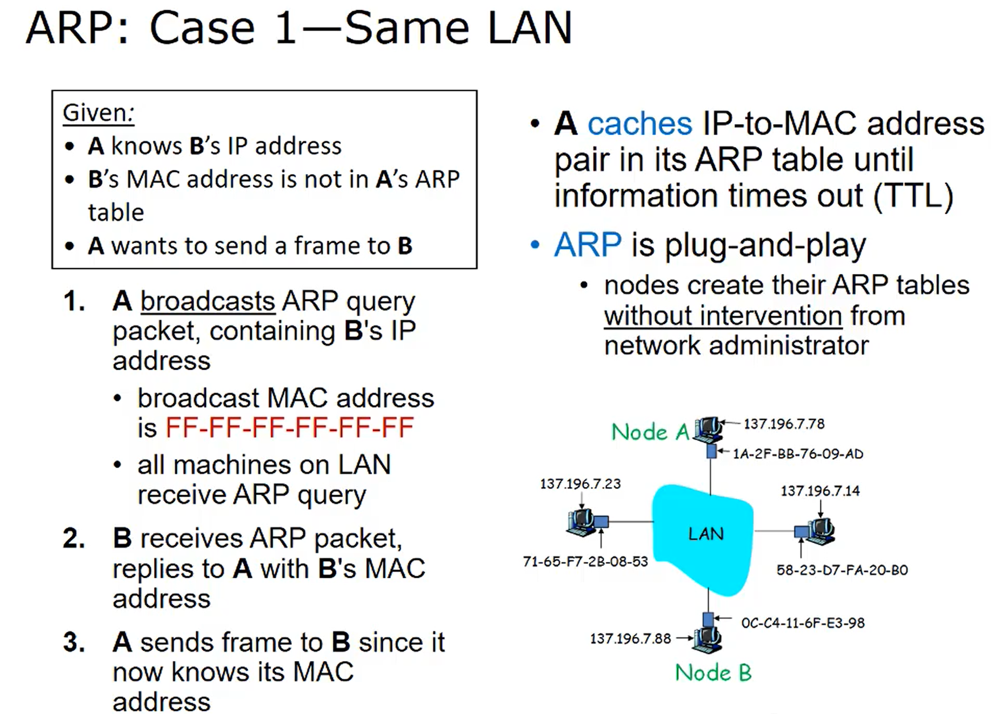

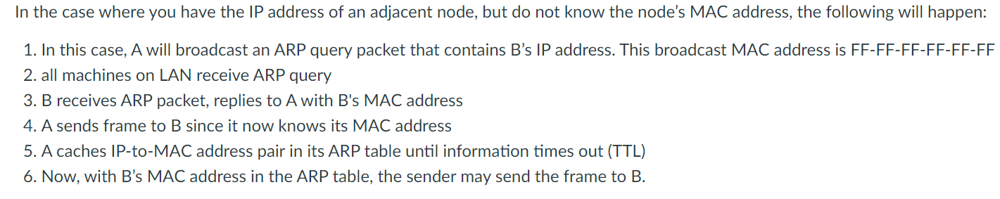

- ARP is plug-n-play. Nodes create their ARP tables without a network admin.
