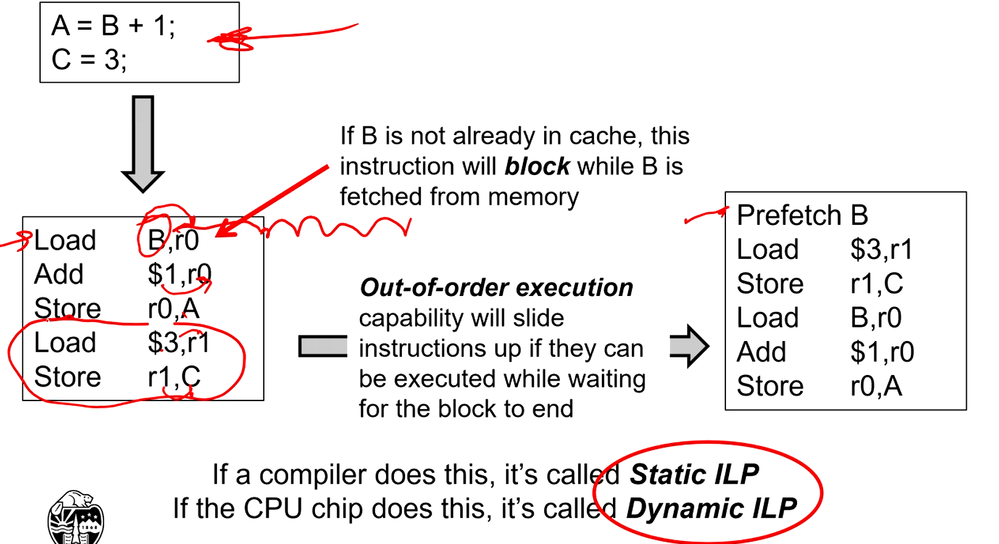
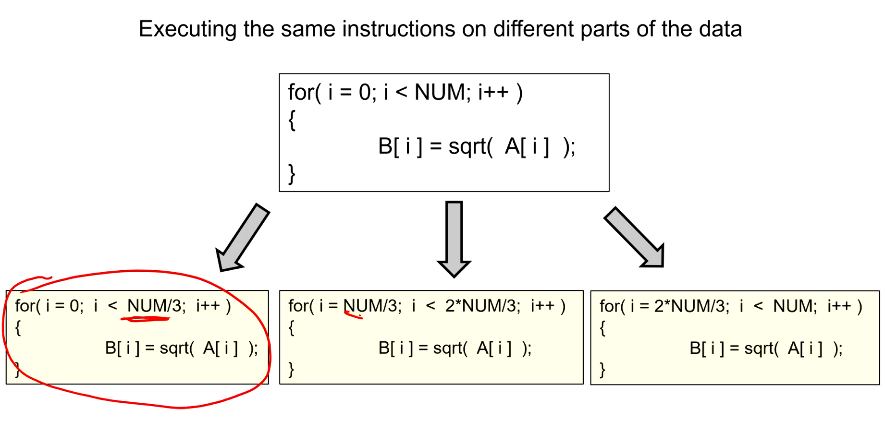
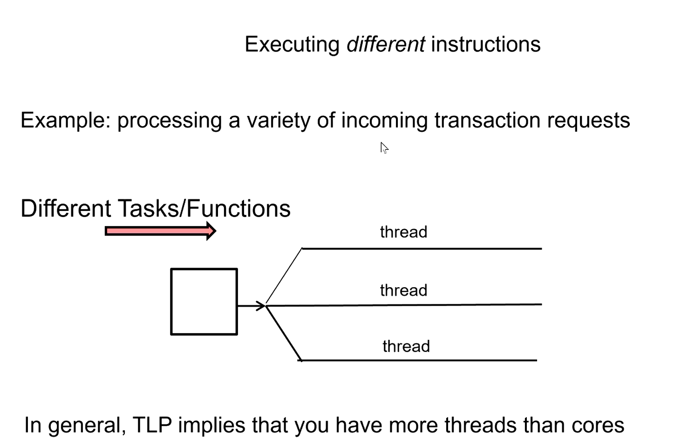
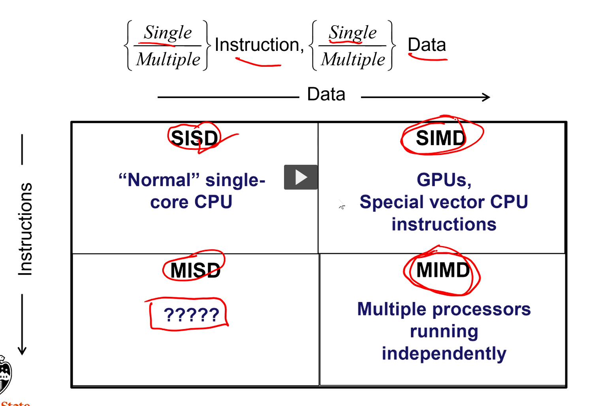
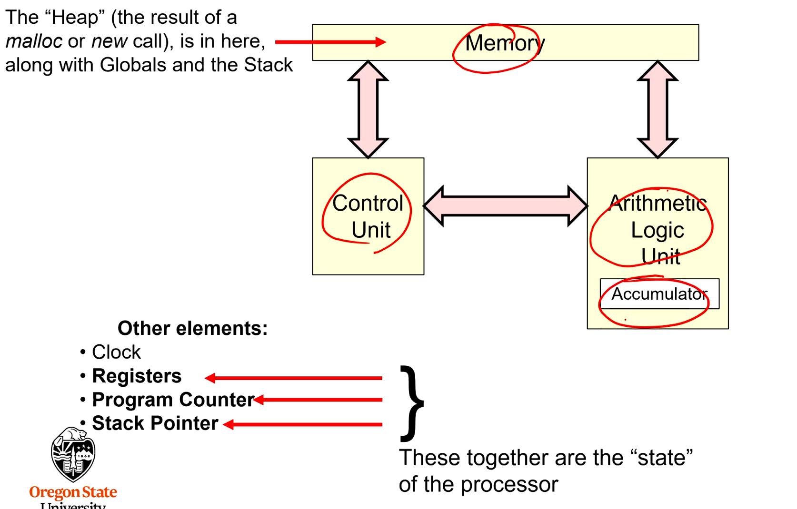
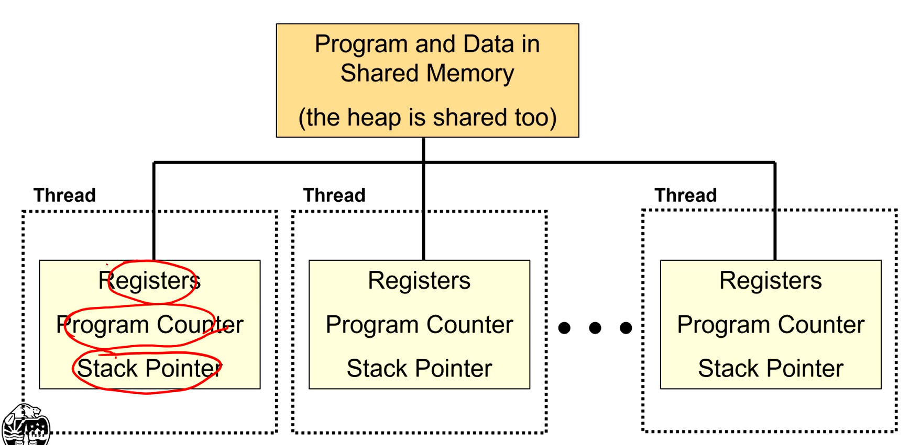
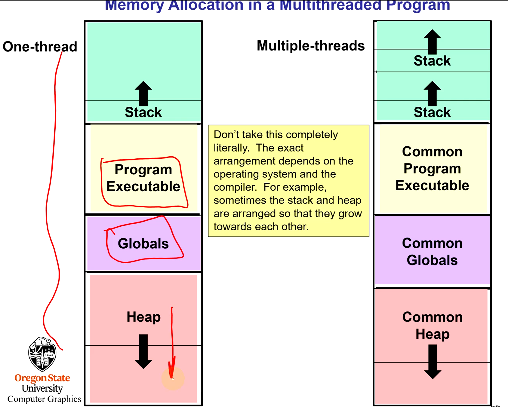
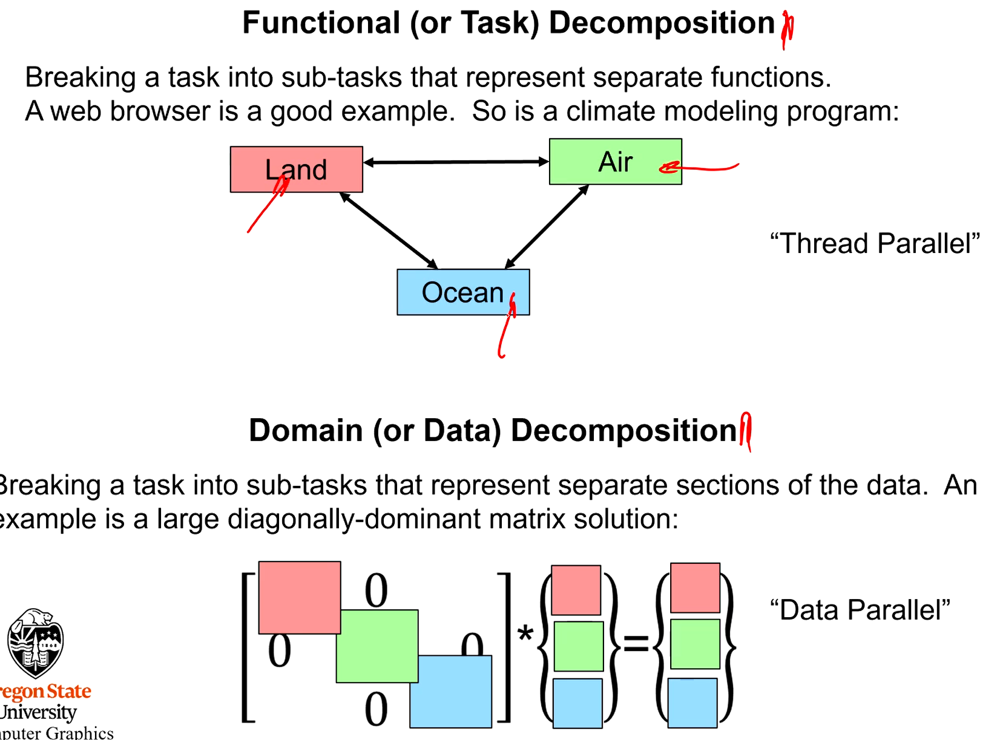
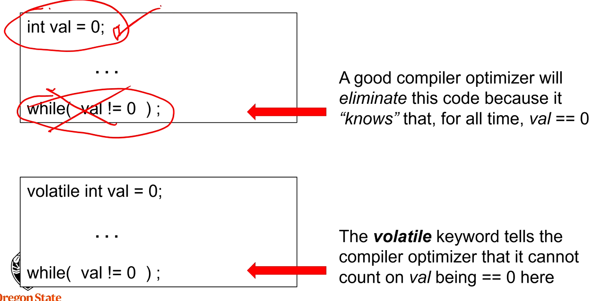

| Keyword                      | Definition                                                                                                                                                                                   |
| ---------------------------- | -------------------------------------------------------------------------------------------------------------------------------------------------------------------------------------------- |
| `Atomic`                     | An operation that takes place to completion with no chance of being interrupted by another thread                                                                                            |
| `Barrier`                    | A point in the program where all threads must reach before any of them are allowed to proceed                                                                                                |
| `Coarse-grained parallelism` | Break a task up into a small number of large tasks                                                                                                                                           |
| `Deterministic`              | The same set of inputs always gives the same outputs                                                                                                                                         |
| `Dynamic scheduling`         | Dividing the total number of tasks T up so that each of N available threads has less than T/N sub-tasks to do, and then doing out remaining tasks to threads as they become available.       |
| `Fine-grained paralellism`   | Breaking a task up into lots of small tasks                                                                                                                                                  |
| `Fork-join`                  | An operation where multiple threads are created from a main thread. All of those forked threads are expected to eventually finish and thus 'join back up' with the main thread.              |
| `Private-variable`           | After a fork operation, a variable which has a private copy within each thread                                                                                                               |
| `Reduction`                  | Combining the results from multiple threads into a single sum or product, continuing to use multithreading. Typiclaly this is performed so that it takes O(log2N) time instead of O(N) time. |
| `Shared varaible`            | After a fork operation, a variable which is shared among threads, i.e. has a single value                                                                                                    |
| `Speed-up(N)`                | T1/Tn (Time of running 1 thread / Time of running N threads)                                                                                                                                 |
| `Speed-up Efficiency`        | Speed-up(N)/N                                                                                                                                                                                |
| `Static Scheduling`          | Dividing the total number of tasks T up so that each of N available threads has T/N sub-tasks to do                                                                                          |

- `OpenMP` - Open Multi-Processing

- A `thread` is an independent path through your executable and you can have more than one of them.

Why parallel computing?

1. Do more work in the same amount of time
2. Take less time to do the same amount of work
3. Make some programming tasks more convenient to implement (web pages)

## Types of Parallelism

1. Instruction level parallelism (ILP)

- A program might consist of continuous stream of assembly instructions but it not necessarily executed continuously. It often pauses (e.g. grabbing data from stored memory, causing the instruction to block), which must wait till it's ready (block) before it can proceed.

- We don't have much control over this.

2. Data level Parallelism

- In this example three different threads handle different parts of the data in a for loop
- Same equation but different data

3. Thread level parallelism

## Flynn's taxonomy

- SISD - Single core CPU
- MISD - Multiple instruction, single data
- SIMD - Single instruction, multiple data
- MIMD - Multiple instruction, multiple data

## Von Neumann Architecture

- Each core and thread maintains its own state

## Process

- `Processes` execute a program in memory. Processes keep a state (program counter, registers, stack).

## Threads

- `Threads` are separate independent processes, all executing a common program and sharing memory. Each thread has its own state.

- The main difference for threads is they maintain their own stacks
- A thread is an independent path through the code. Has own program counter, registers, and stak pointer.

### When is it good to use multithreading

- Operations become blocked, waiting for something to happen
- Operations are CPU intensive
- Operations must respond to async I/O including UI
- Operations have higher or lower priority than other operations
- Manage independent behaviors in interactive simulations (games)
  - Multiple AI, ect.
- When you want to accelerate a single program on multicore CPU chips

## Two ways to decompose your problem into parallelizable pieces

## Parallel programing tips

1. Do not keep internal state

- If you do keep internal state between calls, there is a chance that a second thread will hop in and change it, then the first thread will use that state thinking it has not been changed.

- strtok_r vs strtok
  - 'r' stands for re-entrant, which allows multiple threads to keep re-enter the state.

2. Avoid deadlock

- `Deadlock` is when two threads are waiting for each other to do something. The way these problems occur is not always deterministic (which thread finishes first).

3. Avoid race conditions

- A `race condition` is where it matters which thread gets to a particular piece of code first.
- This often comes when one thread is modifying a variable when the other thread is in the midst of using it.

Race conditions can be fixed through use of Mutual exclusion locks (Mutextes)

4. Sending a message to the optimizer (compiler). The volatile keyword.

- The `volatile` keyword is used to let the compiler know that another thread might be changing a variable "in the background" so don't make any assumptions about what can be optimized away.

5. Sending a message to the compiler optimer: The `restrict` keyword

- Reading and writing to the same memory location at the same time with two different variables
- `Pink-promise` that two variables will never point at the same memory location

6. Beware of false sharing caching issues

- Performance looks like it goes down with multiple threads.
