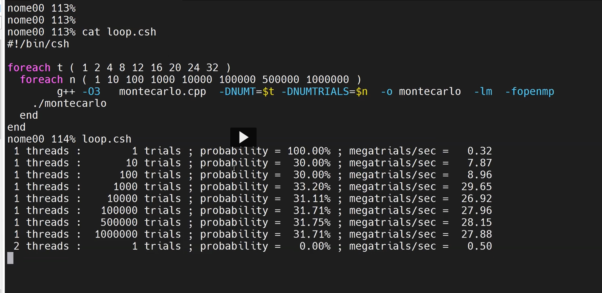

## Week 1 Monday Lecture

- Two tests

  - On canvas, open notes

- mjb@cs.oregonstate.edu

  - Responds to a lot of emails

- Check if flip is overloaded use `uptime` command
  - If the numbers are above 3 you probably should run the program at a different time
- Keep max performance from many tests

- Always plot performance (up is faster)

- Divert program output to a file

```shell
./proj1 > file
```

- Try to use print outputs that are in a csv format

e.g.

```
printf("%d, %8d, %6.2fl\n", NUMT, NUMTRIALS, maxPerformance);
```

Then

```
./proj1 > output.csv
```

Use scripting to run your benchmarks

CSHELL

```shell
#!/bin/csh

#number of threads:
foreach t (1 2 4 6 8)
    echo NUMT = $t
    foreach s(2 4 8 16 32 )
        # number of subdivisions
        echo NUMS = $s
        g++ -DNUMS=$s -DNUMT=$t prog.cpp o prog lm -fopenmp
        ./prog
    end
end
```

- use .csh for a cshell script

BASH

```bash
#!/bin/csh

#number of threads:
for t in 1 2 4 6 8
do
    echo NUMT = $t
    for s in 2 4 8 16 32
    do
        # number of subdivisions
        echo NUMS = $s
        g++ -DNUMS=$s -DNUMT=$t prog.cpp o prog lm -fopenmp
        ./prog
    done
done
```

PYTHON

```python
for t in [1,2,4,6,8]:
    print "NUMT = %d" % t
    for s in [2, 4, 8, 16, 32]:
        print "NUMT = %d" % s
        cmd = "g++ -DNUMS=%d -DNUMT=%d prog.cpp o prog lm -fopenmp" % (s, t)
        os.system(cmd)
        cmd = "./proj"
        os.system(cmd)
```

- 2, 4, 8, 16, 32 is array size

* 1, 2, 4, 5, 8 is number of threads, setting that falue to NUMT
  - DNUMT is a defined constant (Defined NUMT)
* Might only work in linux

* NUMS/NUMS do it float instead of int (32 bit) (float)NUMS/(float)NUMS
  - Prevent overflow issues

## OPEN MP

- OpenMP is built into the compiler

```
#pragma omp directive [clause]
```

```
g++ -o proj proj.cpp -lm -fopenmp
```

- -fopenmp turns on the openmp isms

```c
#ifndef _OPENMP
    fprintf(stderr, "OpenMP is not supported - sorry!\n");
    exit(0);
#endif
```

- Checks if openMP is turned on

  - Checks to see if that variable has been defined (it should be if it's turned on)

- Check `uptime` of the server (3 or less is usually good)

  - Going to be good results

- NUM tries should be around ~100

- Performance = (what you did) / (time you took)
- MegaMults = million multiplies per second

- Use peak performance NOT average
  - Avg performance is mostly used to determine how much variance there is, if there is a lot of variance it might not be that accurate

```c
int main(int argc, char *argv[])
```

- ls -l
  - argv[0] = "ls"
  - argv[1] = "-l"

```c
if(argc >=2)
  NUMT = atoi(argv[i]);
```

- this is alternative fo Windows

Powershell Script

```powershell
foreach ($t in 1, 2, 4)
{
  foreach( $n in 1024, 2048, 4096)
  {
    ./MonteCarlo.exe $t $n
  }
}
```

.ps1 file (powershell file)

- Save to a .ps1 file and then run the ps1 script
- Will need to use argv to inject the variables

* The OS makes the link between threads and cores

  - If you specify you should use 4 threads, the OS will try to run each on a different core (if you have 4+ cores)

* Multithreading isn't deterministic
  - Same set of inputs = same set of outputs
  - The scheduling of thread is non deterministic

TIPS

1. Keep External state instead

- strtok_r
  - \_r means it's re-entrant and thread safe

2. Avoid deadlock

- Two threads are waiting on each other to do stuff

3. Avoid race conditions

- Matters when one thread gets to a piece of code first
- Mutex locks can help with this
  - Mutual exclusion

4. Send message to optimizer using `volatile`

- Lets compiler know that another thread might be changing a variable in the background.
- Prevent compiler from eliminating code it thinks might be useless

```c
volatile int test = 0;
if (test != 0)
```

5. restrict keyword

- Promise not to to make two pointers point to the same place
- Allows optimizer to pull code up

```c
int * restrict p;
int * restrict q;

p = &B;
q = &C;
A = *p +1;
*q = 3.;
```

6. Beware of false sharing caching issues

- Performance drops when using more threads

## PROJECT 1

- Monte Carlo Simulation
- Way to deal with uncertainty
- Probability distribution

- When all threads are adding in same variable, there is a collision
  - Total doesn't get added properly (known as a reduction)

```c
#pragma omp parallel for shared(dx);reduction(+:sum)
```

- Letting open mp know what operation you're doing (adding '+') and what variable you want to add into (sum)



- These won't be the same values as you will get in the project (probability is different)
