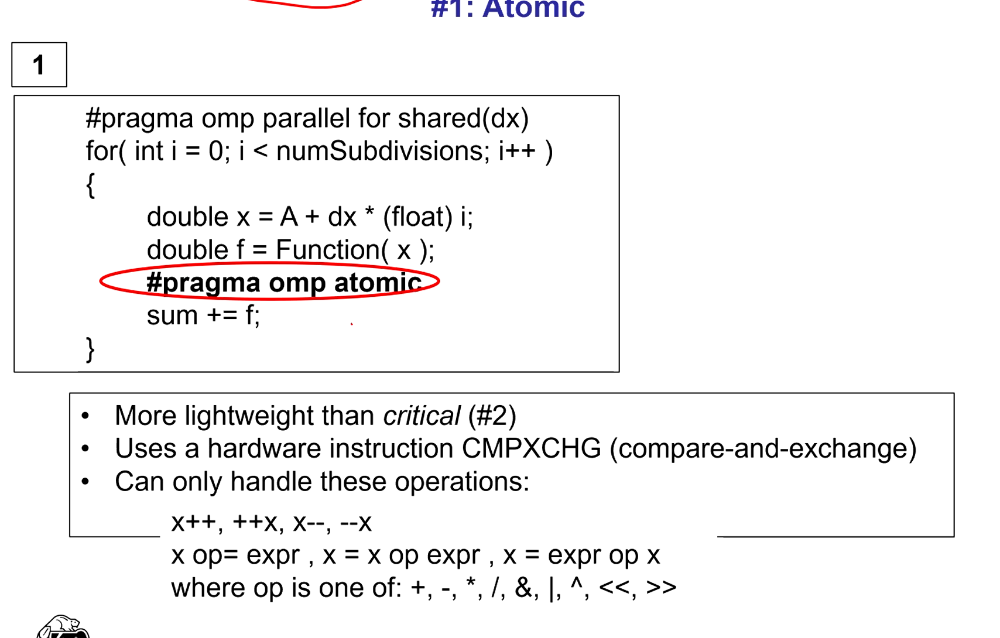
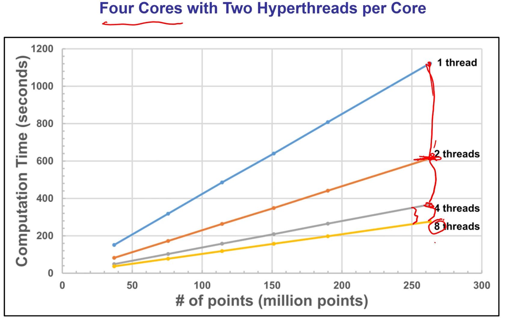

## OPEN MP

- Open multi-processing
- Fork-join model

### What OpenMP isn't

- Doesn't check for data dependencies, data conflicts, deadlocks or race conditions.
- Doesn't guarantee identical behavior across vendors, hardware or even between runs
- Doesn't guarantee **order** which a thread executes.
- Not overhead-free
- Does not prevent you from writing code with cache issues

```c
num = omp_get_num_procs()
```

- returns number of hyperthreads available

```c
#pragma omp parallel for default(none)
```

- parallel makes up the thread team
- `for` specifies it's for the 'for' loop
- implied barrier at end of loop where each thread waits until are threads are done then code continues in a single thread
- `default(none)` forces you to explicitly declare all variables declared outside of the parallel region to be private or shrared while they are in the parallel region. Variables declared in the for-loop are auto private

### for-Loop rules

- Index must be _int_ or _pointer_
- _start_ and _terminate_ conditions must be compatible types
- _start_ and _terminate_ conditions CANNOT be changed during the execution of the loop
- _index_ cannot be changed inside the loop itself
- Cannot use _break_ or _goto_ to leave the loop
- Can be no inter-loop data dependencies such as

```
a[i] = a[i-1] + 1.;
```

- OpenMP will allow this but it will not give good data

- Index <, <=, >, >=

### Variables before loop starts

```
#pragma omp parallel for default(none), private(x)
```

- **private(x)** means each thread gets its own version of the variable
- **shared(x)** means each thread will share a common version of the variable
- **default(none)** means you must explicitly flag all your externally-declared variables as shared or private

### For-loop fission

- break things out of loops that is and is not parallizable

### For-loop collapsing

```
#pragma omp parallel for collapse(2)
```

- Allows you to handle nested forloops
- 2 specifies how many nested for loops you want to handle

### Single program multiple data (SPMD) in open mp

```c++
#pragma omp parallel default(none),private(me), shraed(total)
{
    me = omp_get_thread_num();
    DoWOrk(me, total);
}

void DoWork(int me, int total)
{
    int first = NUM * me /total;
    int last = NUM * (me + 1)/total - 1;
    for (int i = first; i <= last; i++)
    {
        C[i] = A[i]*B[i];
    }
}
```

- Allows you to specify which thread you want to do work on the data

### Allocation of work to threads

- Static threads
  - All work is allocated and assigned at runtime
- Dynamic threads
  - Pool is statically assigned some work at runtime, but not all of it
  - When thread from pool becomes idle, it gets a new assignment
  - "round-robin assignments"

```c
#pragma omp parallel for default(none), schedule(static, chunksize)
#pragma omp parallel for default(none), schedule(dynamic chunksize)
```

- If you know all the work will take the same amount of time just use static (which is the default)
- Chunksize defaults to 1


### Arithmetic operations among threads

```c++
#pragma omp parallel default(none),private(myPartialSum), shared(sum))
{
    float myPartialSum = ...;
    sum = sum + myPartialSum;
}
```

- No guarantee when each thread will execute the sum = sum + line
- This is non-deterministic, so don't do this

### Synchronization


### Crating secions of openMP code


- Must know the number of sections beforehand

### Trapezoid integration example

- Reduction case study
  - Combining results from multiple threads



- Hardware insruction 'atomic' - compare and exchange
- Can only handle certain operations


- Similar to mutex


- Reduction is a lot faster than the other two


## SPEEDUPS AND AMDAHL'S LAW

speedup(n) = T(1) / T(N)

speedup(n) should be > 1

Efficiency = Speedup(n)/n

- Could be as high as 1 but almost certainly will be lower


Speedup(n) = 1 / (F(parrallel) /n


- Speed up efficiency goes down as you increase the # of processors


### Gustafson-Baris Observation

- When you get more cores you tend to attack larger and larger versions of the problem
- If you increase the size of your data, you increase you F(parallel) siginificantly


## MOORE'S LAW

- Transistor density doubles every 1.5 years


- PowerConsumption is proporptional to ClockSpeed^2
- Clock speed has hit a plateu largely because of heat dissipation
- Used the extra transistors instead for adding multiple processors on the same chip

- Multicore is a hardware thing (multiple processors on a cheap)
- Multithreading is a software thing (allows your program to process multiple things at a time)


- No longer had to swap out states when you switch between threads



- Not as big an advantage as having 8 cores

- Whenever you have more states than cores that is hyperthreading
- If one thread of execution block, then the other thread can resume execution with its state (don't have to wait to fetch the state)


- If a program keeps the CPU really busy (in the .80 + range) then hyperthreading helps a lot less
