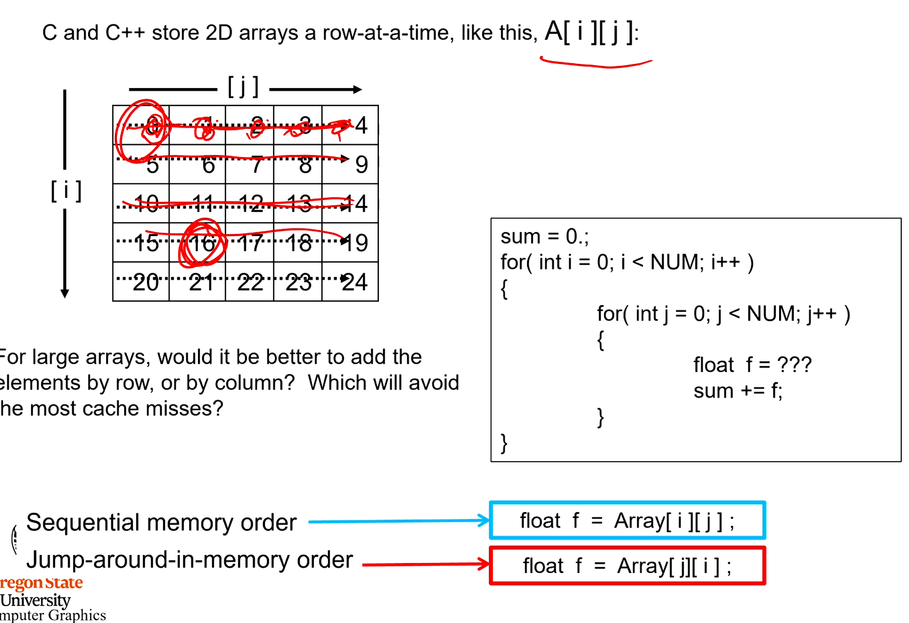
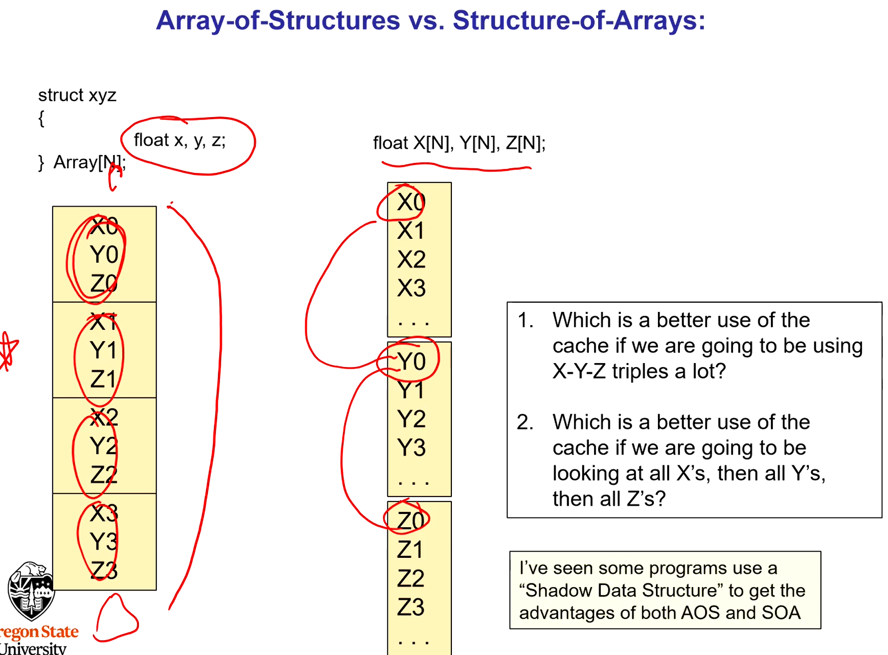
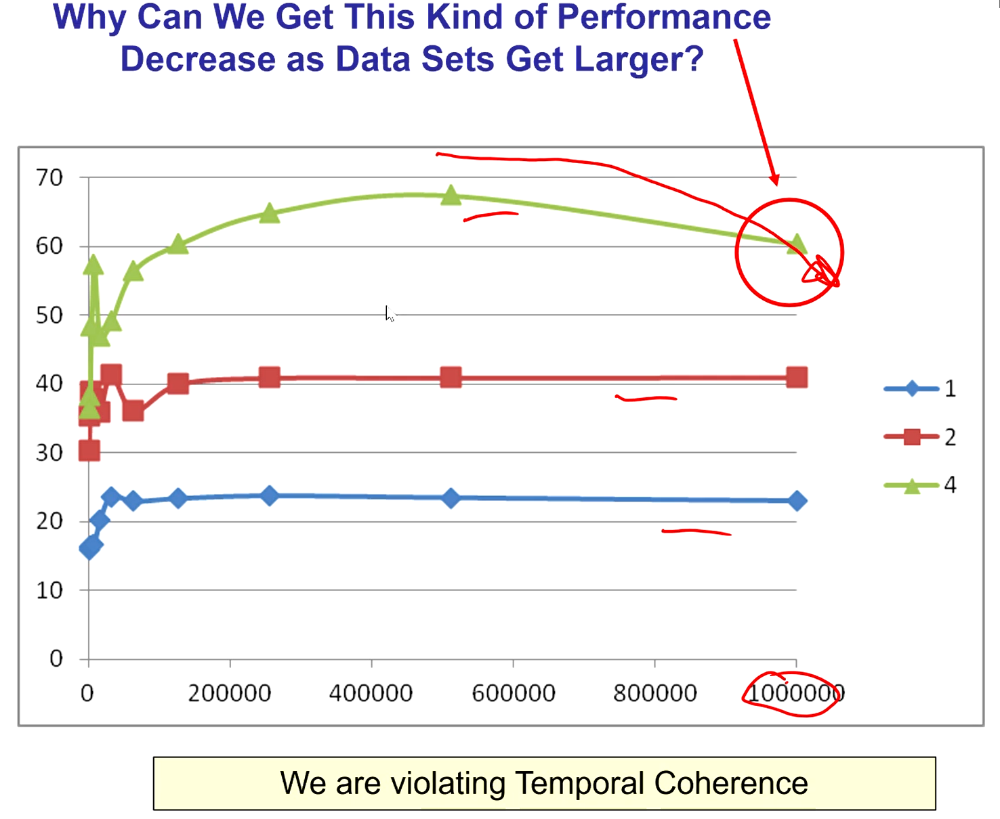
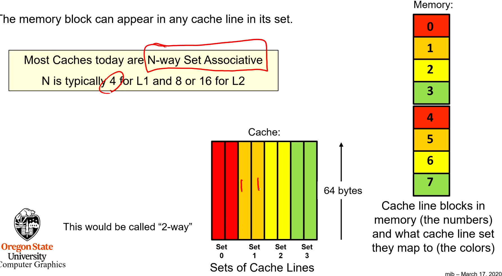
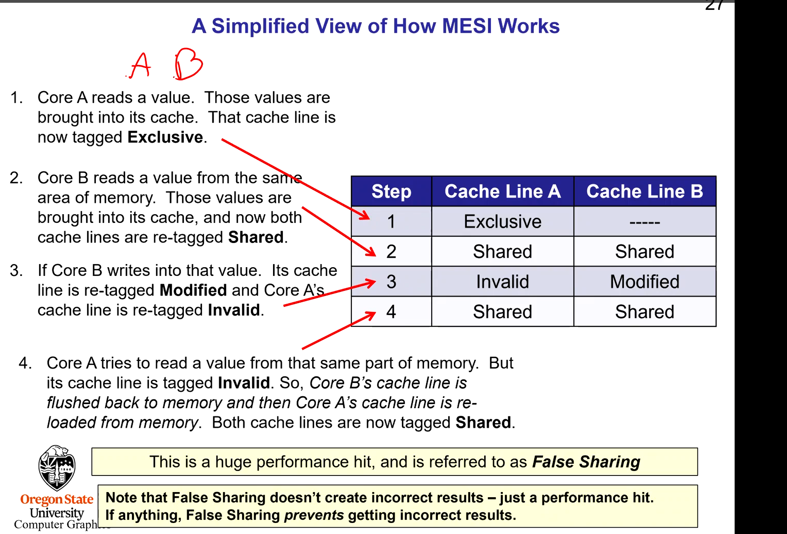
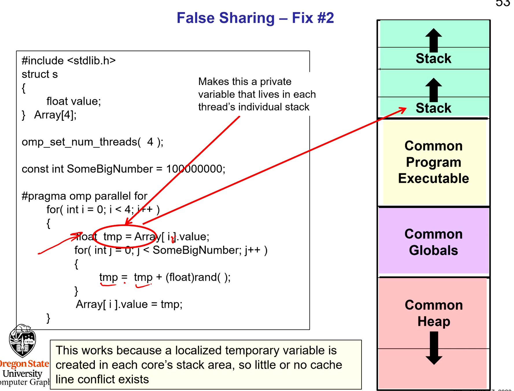
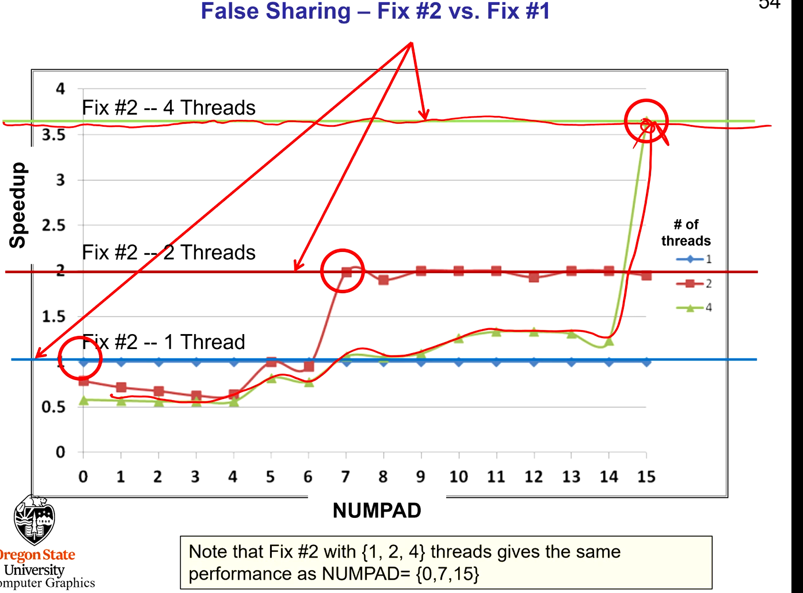
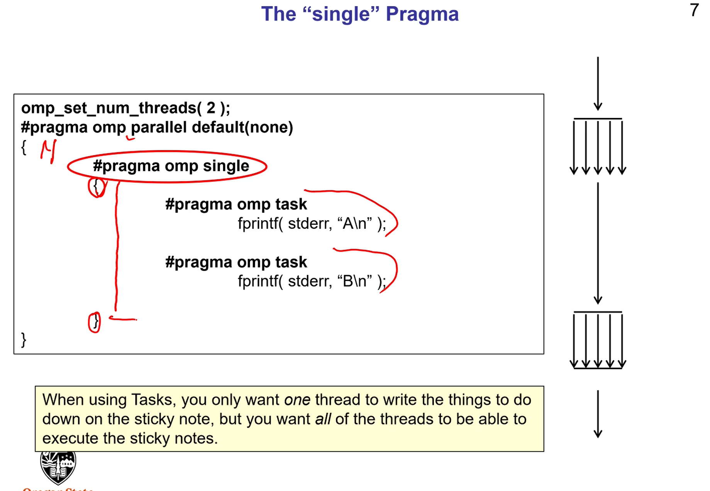
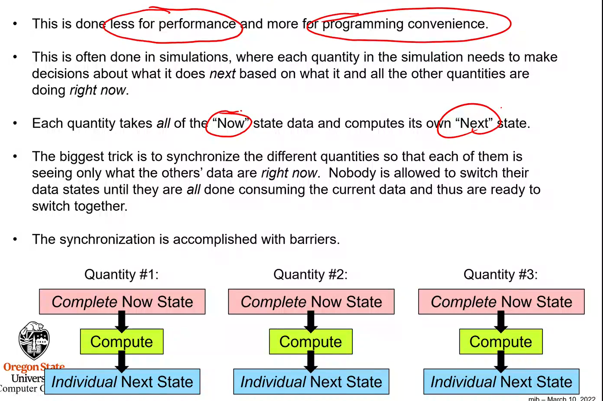

## CACHING ISSUES IN MULTICORE PERFORMANCE

- Path between CPU chip and off chip memory is slow
  - Wait for up to 200 clock cycles just to do a store to, or load from, memory.
- Cache was used to help with this issue
  - L1, L2, and even L3 cache
    - Closest cache is L1
    - Usually two L1 cache, instructions and data
- Cache hit
  - When CPU asks for a value from memory and it's already in cache that is a cache hit
  - Cache line is typically 64 bytes

### COHERENCE

- Spatial Coherence
  - If you need one memory value chances are you will need other values in that memory location around it soon. Will load memory that you haven't asked for that are around it
- Temporal Coherence
  - If you need one memory address's contents now, then you will probably also need its contents again soon
- If these assumptions are true, then you will generate a lot of cache hits. If not you will end up missing and re-loading cache a lot.
  - E.g. if you read an array sequentially you will have a lot of cache hits, if you jump around a lot you probably won't.



- Won't need to load a new cache line for 64 bytes, so from index 0 to index until index 16.
- If you read down the git ps 0 -> 5 -> 15 -> 20 you will need to load a new cacheline when you read from index 20, which is the 5 item you'll have read.

### Array of structures or Structures of Arrays



- If you grab x, y, and z together then the array of structures is better since will have to load from cache less often.
- If you grab x1, x2, and x3 together then the structure of arrays is better
- Neither structure is better, it depends on how you want to use the data
- Linked lists can be bad for cache behavior
  - When you new/malloc memory the nodes can be in different cache lines.
  - Mallocing everything together at once helps
  - Creating nodes in an array and link those arrays together

### Why can we get a decrease in performance with more threads as the data sets get larger



- We are violating temporal coherence
  - With 4 threads it is rushing through the arrays so quickly it has to start waiting for new values to come out of memory
- We can use temporal problem with pre-fetching (fetching the memory before we need it)

### CACHE ARCHITECTURES

- N-way set associative
  - A cache line from a particular block of memory can appear in a limited number of places in cache. Each 'limited space' is called a `set` of cache lines. A set contains `N` cache lines.



### HOW CORES CACHE LINES KEEP TRACK OF EACH OTHER

- Each core has its own separate L1 and L2 cache
  - L3 cache is usually shared

* Multiple cores can bring in and store the same cache line and hold it seperately

#### **L2 cache has 4 states (MESI)**

1. Modified
2. Exclusive
   - 1 Core is the only one reading from those values in cache
3. Shared
   - Multiple cores are areading from the same value in cache
4. Invalid



- When there is an invalid cache value for a core, in order to rectify the situation the modified value for one core is sent back into memory and the other core's cache line is re-loaded. This is slow which can decrease performance. This won't produce the wrong answer but it takes up hardware time, causing `false sharing`
  - False in that you thought you would get a performance improvement and you don't
- Very time consuming to bring the invalid cache line back up to date

### HOW TO FIX FALSE SHARING

1. Add padding to force structs onto their own cache line (64 bytes )
   - This can waste a lot of memory, however if it's close to a cache line then sometimes this happens


2. Don't write into memory that other threads share
   - Use local variables for threads that you save to so that they are not sharing cache lines (memory is on their own stack)
   - Load element onto a private variable from an array so each thread has its own copy.





- You can malloc onto a cache line
  - If the memory address whose bottom 6 bits are 000000, then you know that memory location begins on a cache line boundary.

## OPEN MP TASKS

```c++
#pragma omp parallel sections
{
    #pragma omp section
    {
        Task1
    }
    #pragma omp section
    {
        Task2
    }
}
```

- These are static and cannot be dynamically created in real time.

```c++
///Creates a barrier for a task
#pragma omp taskwait
```

- Tasks can be created at any time
- Good use cases are for linked lists or a tree



- The general idea is that one thread creates the work (post it notes for work to do, e.g. a job/task), that work is then set aside to execute later by the thread team. In this case the task is simply to print to the screen, but sometimes that task may take a long time to do.

- Tasks get spread among current 'thread team'
- Tasks can execute immediately or can be deferred. They are executed at 'some time'.
- Tasks can be moved between threads, if one thread has a lot of backlog of tasks another idle thread can steal some workload
- Tasks are more dynamic than sections. A task pardigm would still work if there was a variable number of children at each node.
- If you know ahead of time how many threads you will need then you can use sections instead

## FUNCTIONAL (TASK) DECOMPOSITION

- Data decomposition, take big data and break it into multiple pieces
- Functional decomposition breaks up a problem into different tasks that do different work

- Done less for performance and more for programming convenience.


