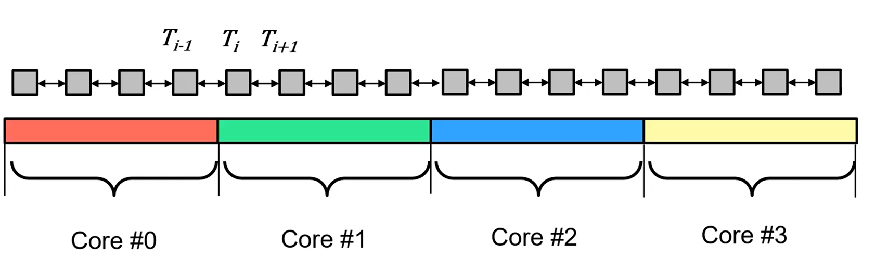
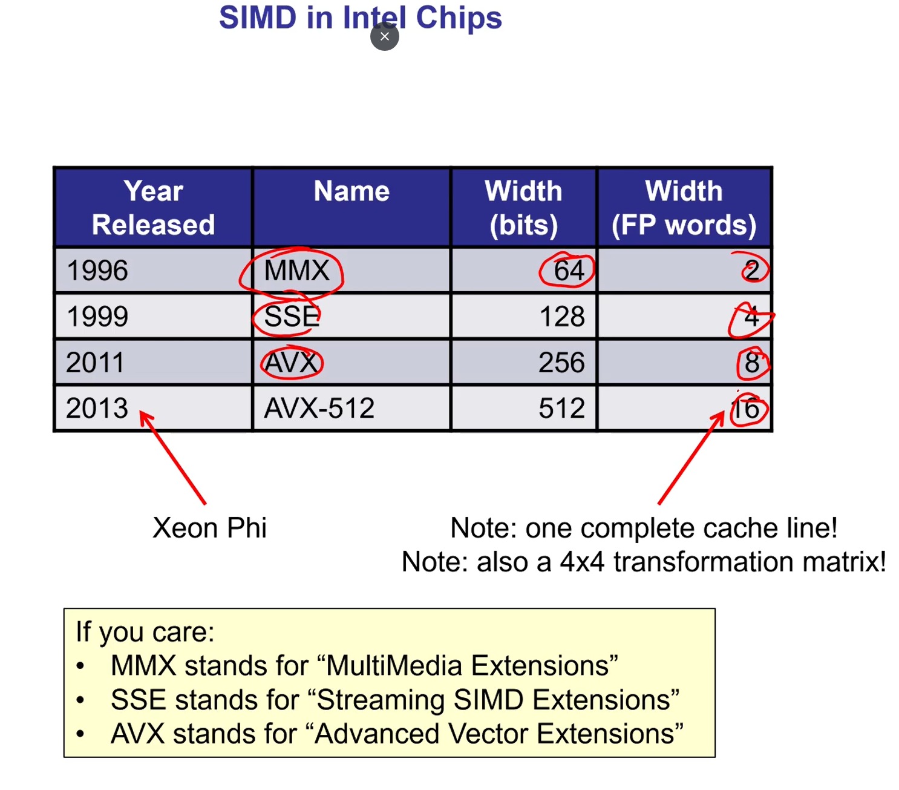
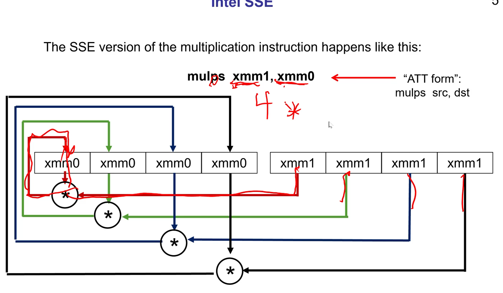
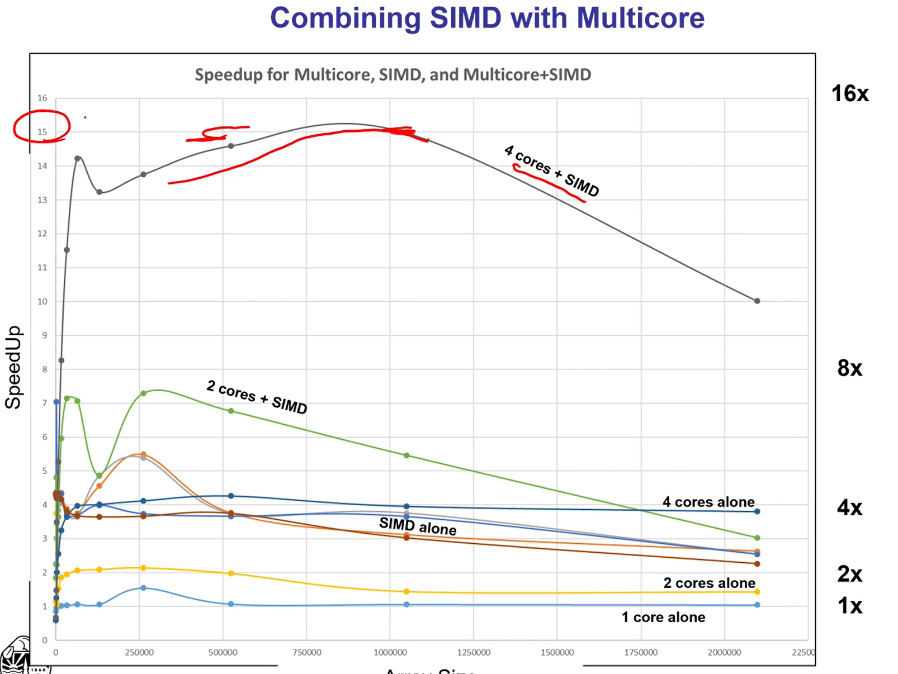

## DATA DECOMPOSITION

- Partitioning strategies
- SIMD (Single programe, multiple data)
- One array vs. local or global array was quicker for data decomposition.
  - One array does result in false sharing but was still faster.
- Compute-to-communicate ratio
  - More cores means that you will reduce the compute to communicate ratio



- More cores means more sharing, less cores means more work to do for each core. There is a sweet spot of splitting work vs minimizing sharing.

## SIMD (SINGLE INSTRUCTION MULTIPLE DATA)

- Built into computer hardware, each core has its own SIMD unit
- Registers that can multiply multiple values at the same time, in the same instruction (not using multiple cores)



- This is _not_ multicore but is parallelism

(width is number of floats)

### SSE (Streaming SIMD Extensions)



```c++
#pragma omp simd
```

- Does not work great now (using assembly instead)

### Reqiore,emts fpr For-loop to be vectoriezed

- No inter loop data dependencies

```c++
a[i] = a[i-1] + 1
//Can cross SSE boundaries. This is bad because one SIMD calculation depends on another that may have not been calculated yet
//a[i] is being computed the same time that a[i-1] is being computed, this is bad
```

- Total number of iterations must be known at runtime when loop starts
- Helps perforamnce if elements have contiguous memory addresses

### Combining SIMD with multicore

- Compilers have not caught up to using SIMD
  - Can use assembly language in the code to help
    - Cannot use -O3 using g++/gcc compiler (the optimizer)

* Intel intrinsics can help you avoid using assembly language to maximize SIMD (pragma omp is bad with SIMD right now)

* SIMD is an important way to get speed-ups on a CPU
* Assembly/Intel intrinsics is the best way to use it right now



### PREFETCHING

- With big data sizes sometimes the cache can't keep up
- Used to place a cache line in memory before it is to be used, thus hiding the latency of fetching from off-chip memory

  - Must Prefetch at the right time
    - If too early, the values could be evitcted from cache by another need, too late and the processor has to wait
  - Must Prefetch at the right distance
    - How far ahead the prefetch memory is than the memory we are right now.

- Prefetching increases SIMD performance
- Without prefetching while using SIMD, you are doing the calculations so quickly that the CPU has to wait for the cache a lot more to catch up
- No universal standard for pre-fetching. Based on compiler.
