## OPEN CL

                                     |

| -------- | ------------------------------------------------------------------------------------------------------------------------------------------------------------------------------------------------------------------------------------------------------------------------------------------------------------------ |
| `Kernel` | A kernel is essentially a function written in the OpenCL language that enables it to be compiled for execution on any device that supports OpenCL. The kernel is the only way the host can call a function that will run on a device. When the host invokes a kernel, many work items start running on the device. |

- OpenCL code is compiled in the driver.

- C/C++ callable API and C-ish programming language
- Can run on NVIDIA GPUs, AMD CPUs, Intel CPUs and more
- Can work with OpenGL

KHRONOS Group

- AMD, NVIDIA, Samsung, ect.
- OpenCL can run on a lot of platforms whereas CUDA is NVIDIA only.


- GPU is used as a co-processor

- Supports Vector Parallelism.

  - SIMD (2, 4, 8, or 16)

- Same thread rules as CUDA

## Querying the number of platforms

- Has to do a lot of querying because it runs on a lot of platforms


- First call gets the number of platforms (sets numPlatforms)
- Malloc memory and then set platforms

1. cpp Program header

```
#include "cl.h"
```

2. Allocate host memory buffers

```cpp
//Allocate on heap
float *hA = new float [NUM_ELEMENTS]
```

3. Create an OpenCL context

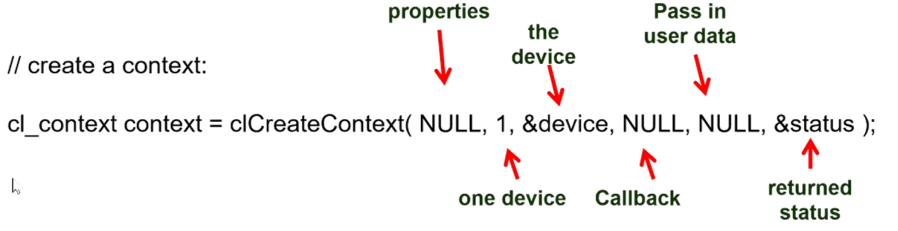

4. Create an Open CL Commandqueue

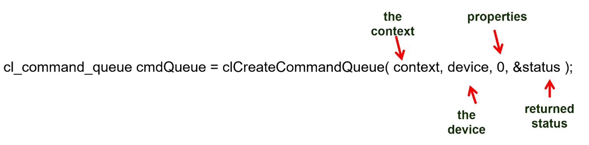

### Enqueuing works like a conveyer belt

- Think of it like a rabbit message queue. It can wait on the buffer even if device is not ready

5. Allocat the Device Memory Buffers

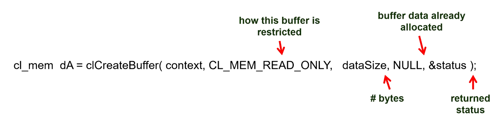

```
//With respect to the OpenCL DEvice
CL_MEM_READ_ONLY
CL_MEM_READ_ONLY
CL_MEM_WRITE_ONLY
```

- Tells code where the arrays live on the OpenCL device memory (GPU)

6. Write the data from the host buffers to the device buffers

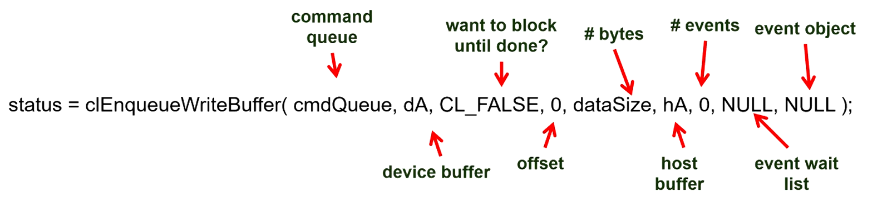

7. Read the Kernel code from a File into a character array.

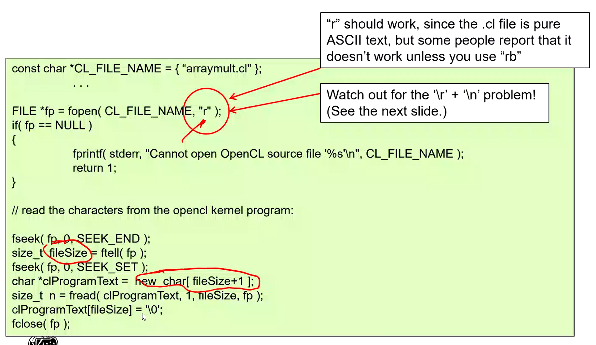

8. Compile and Link the Kernel Code

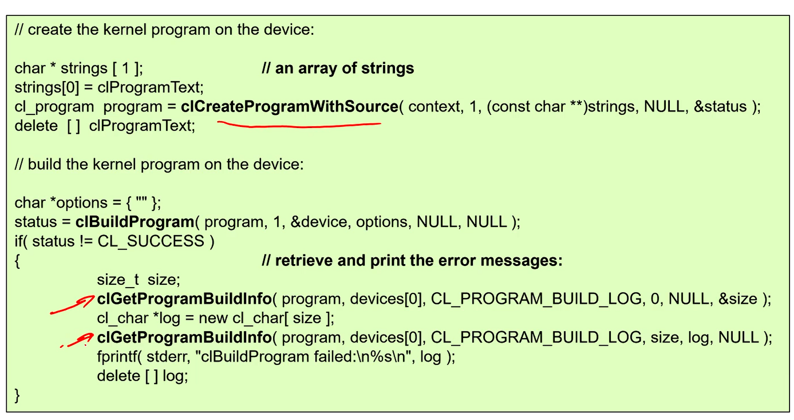

9. Create the Kernel Object

```cpp
//ArrayMult is the function entry point for the real kernel
cl_kernel kernel = clCreateKernel(program, "ArrayMult", &status);
```

10. Setup the Arguments to the Kernel Object

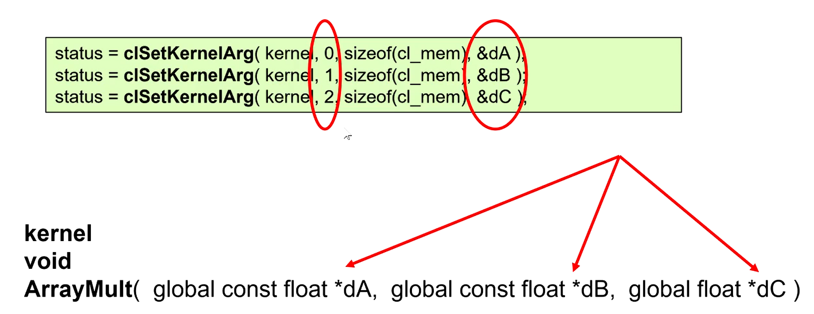

### The .cl file

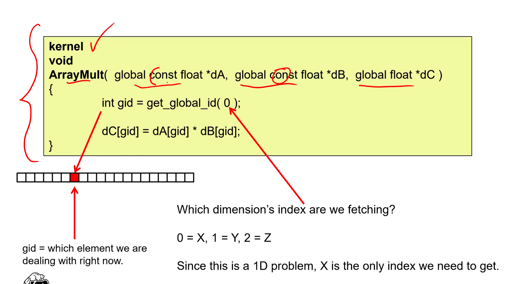

11. Enqueue the Kernel object for execution

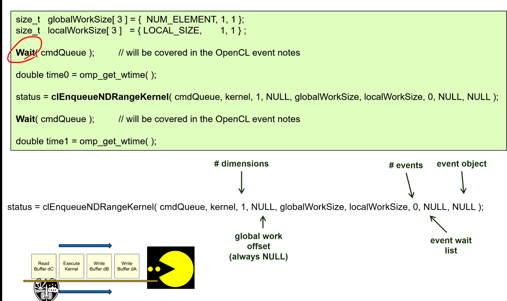

- globalWorkSize like chevorns in CUDA

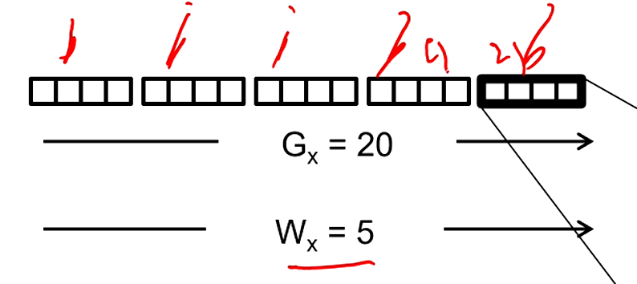

- Dividing a 1D array of size 20 into 5 parts

  - GlobalWorkSize is 20
  - Number of work groups is 5
  - WorkGroupSize is 4

  #WorkGroups = GlobalIndexSpaceSize/WorkGroupSize


12. Read the results buffer backf rom the device to the host

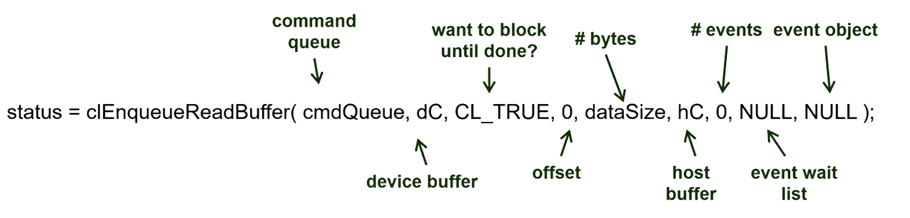

13. Clean Everything Up (free up memory)

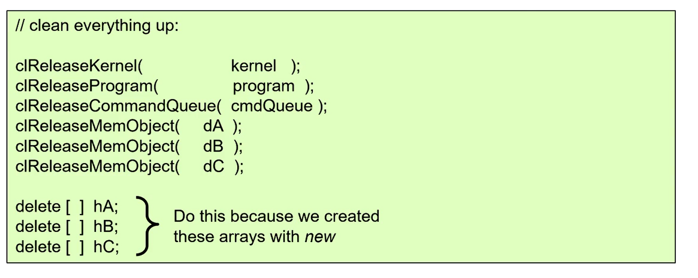

## Good workgroup size

- 32 threads per warp
  - If you use less than 32 then some of the threads on the warp are idle
  - 32 / 64 / 128 are good size
    - More than 32 means that you can swap one warp out for another.

## OPEN CL Events

- An object that communicates the status of OpenCL commands

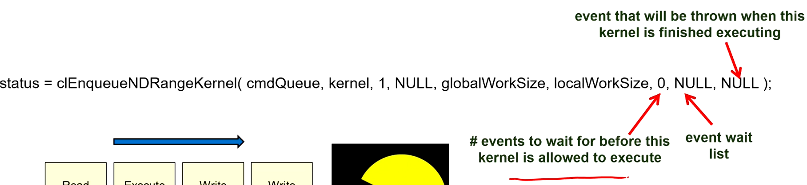

### Create events

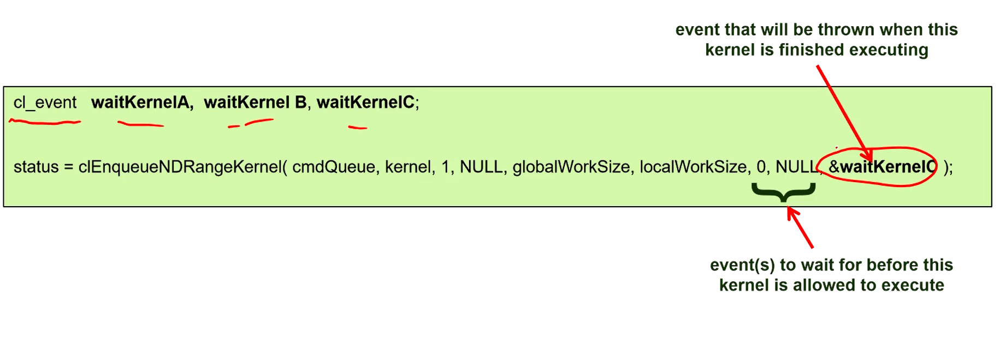

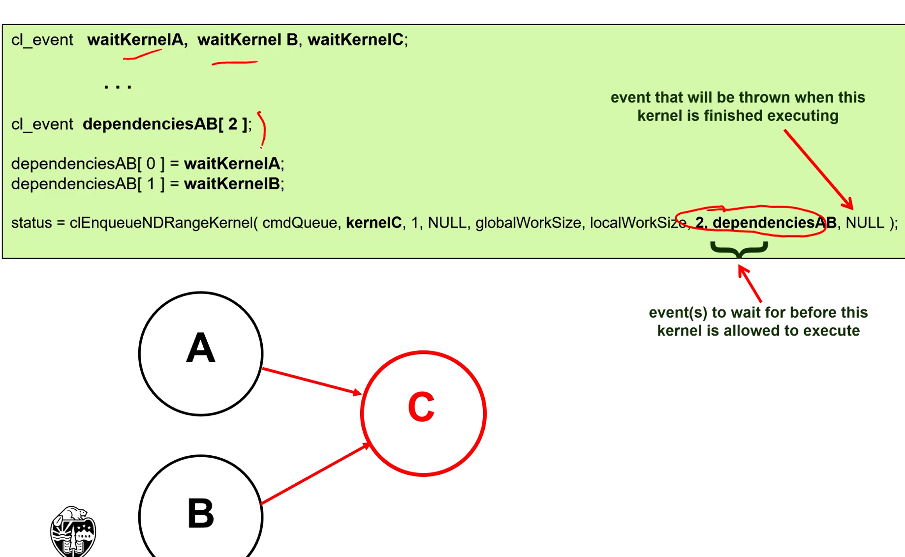

- C waits until event A and B are thrown.
- Can give address of event if just waiting on 1 event

### Barriers on command queue

```cpp
//Does not complete until all commands enqueued before it have completed. Does not throw own event
status = clEnqueueBarrier(cmdQueue);

cl_event waitMarker;
// Does not complete until all commands enqueued before it have completed (Same as barrier). Can throw an event to be waited for
status = clEnqueueMarker(cmdQueue, &waitMarker);

//blocks until the specified events are thrown
status = clWaitForEvents(2, dependencies);
```
