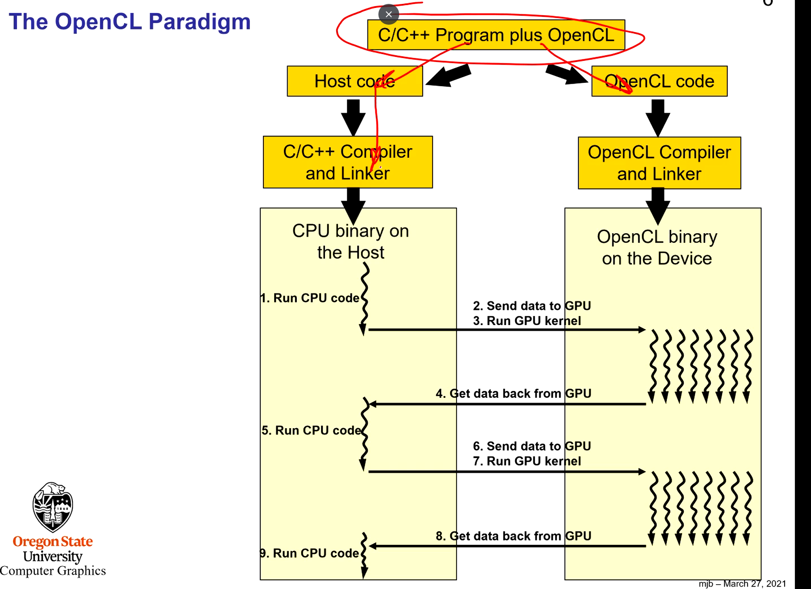
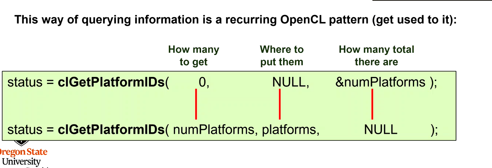

## OPEN CL

- C/C++ callable API and C-ish programming language
- Can run on NVIDIA GPUs, AMD CPUs, Intel CPUs and more
- Can work with OpenGL

KHRONOS Group

- AMD, NVIDIA, Samsung, ect.
- OpenCL can run on a lot of platforms whereas CUDA is NVIDIA only.

- GPU is used as a co-processor

- Supports Vector Parallelism.

  - SIMD (2, 4, 8, or 16)

- Same thread rules as CUDA

## Querying the number of platforms

- Has to do a lot of querying because it runs on a lot of platforms

- First call gets the number of platforms (sets numPlatforms)
- Malloc memory and then set platforms
