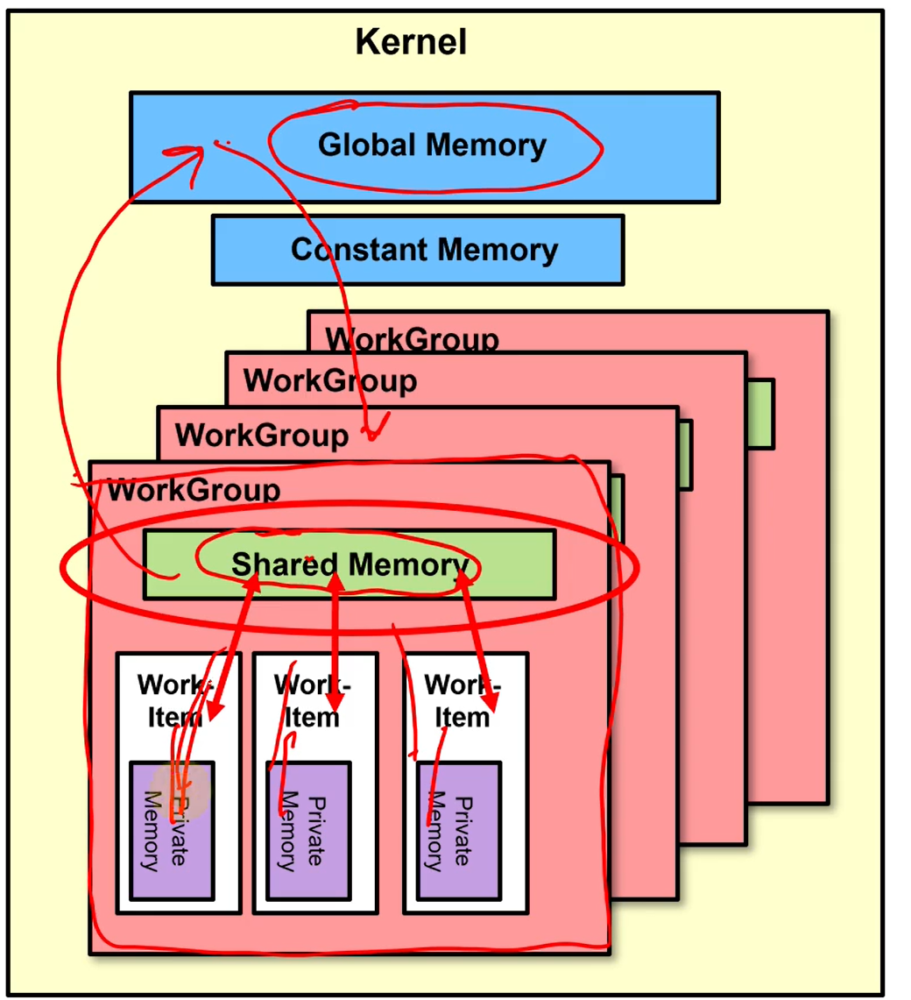
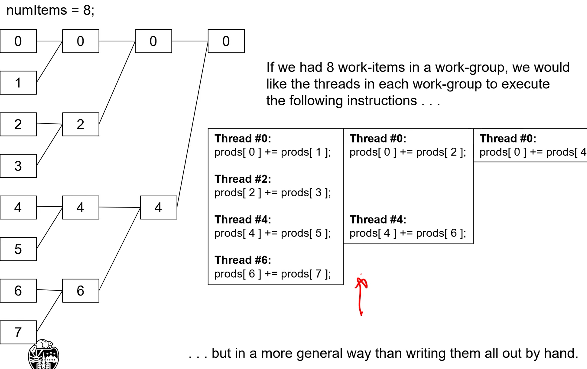
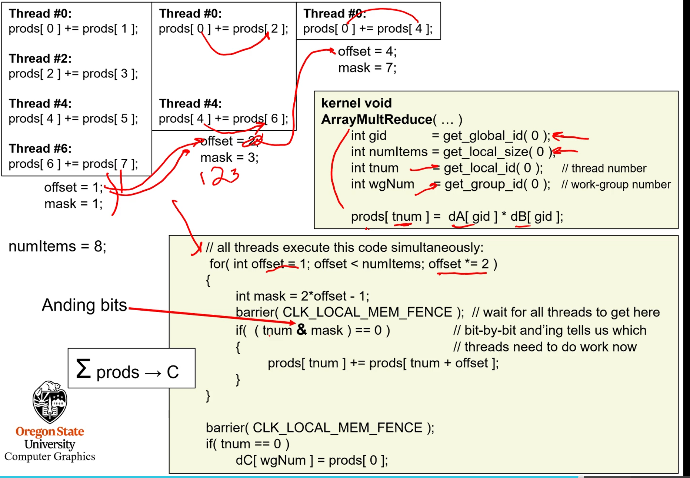

## OPEN CL REDUCTION

- WorkGroups don't have access to memory for other work groups
  - However, work items in each work group does have access to the same shared memory
    - Work groups can add up all values from each work item and then return it to global. In global, we can add up all the values from the work groups.





- Determine if thread still has work using a bitmask



- Still have to add up the work groups on the host.

```cpp
float sum = 0.;
for(int i = 0; i < numWorkGroups; i++)
{
    sum += hC[i];
})
```

## OpenCL (compute)/OpenGL (graphics) Vertex Buffer Interoperability

* OPenCL or OpenGL can use the buffer, but not both
