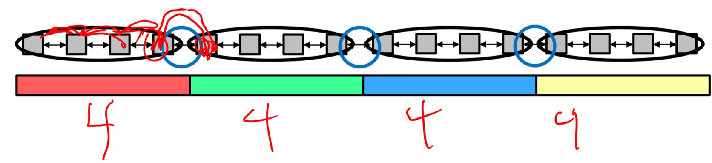
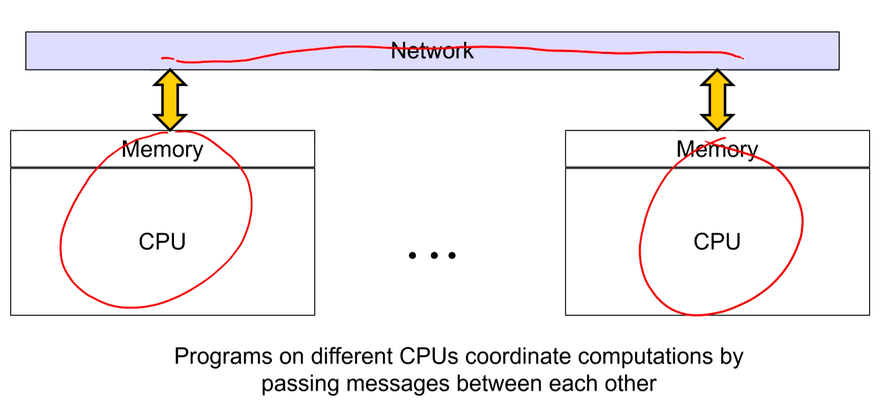
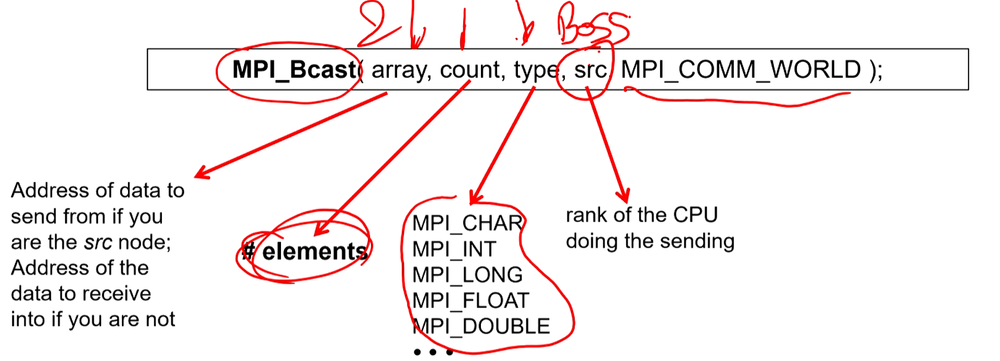

# COMPUTE-TO-COMMUNICATE-RATIO

`IntraCore` computing
`Intercore` communication

* Compute : Communicate ratio = N : 2, where N is Number of compute cells per core. 
* In above image, ratio is 4 : 2

* Too little Compute : Communicate and you are spending all your time sharing data values across threads and doing too little computing
* Too much Compute : Communicate and you are not spreading out your problem among enough threads to get good parallelism

* In 2D, the compute : communicate ratio is N : 4, and in 3d it's N : 6

## Message passing interface (MPI): Parallelism on Distributed CPUs

SPMD Model (Single Program Multiple Data) 

* `Rank` which processor number you are
    * one of the processors is the boss 

`Communicator` Is a collection of CPUs that are capable of sending messages to each other

* Scheduling is non-deterministic 
    * Don't know which ranked processor is run first 

* `MPI_Bcast()` - Allows you to broadcast data to all processing nodes. You have to define which processor is doing the sending (you probably want the boss node to do this)
    * Sending and receiving happens with the same function call

* Send message from one node to another node
    * `MPI_Send()`
    * `MPI_Recv()`
    * Send() moves into a transmission buffer until the receiver is ready to receive. 
        * Send() block until transfer is far enough along that the sending data can be deleted. 

* Broadcast
* Scatter/Gather
    * `MPI_Scatter()`
        * Sending piece and receiving piece (helps with coordination)
    * Take data and break it inot equal portions and send it to each CPU
    * `MPI_Gather()`
        * Sending piece and receiving piece (helps with coordination)

* Compute/Communicate ratio is more important for MPI since you are sending data across a network, not just sending data between cores
