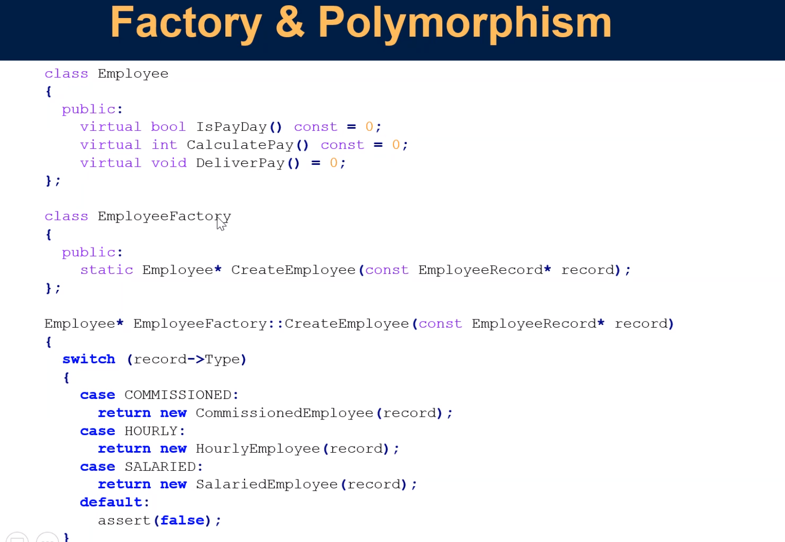

<small>[Return Home](../../README.md)</small>

## Technical Debt

- We have time to do things right

## Coding standards

### Purpose

- Make source code:
  - More readable
  - More maintainable
  - More consistent with itself and across SEL
- Help you avoid hazards of coding languages

Coding standards WI-2231: http://hopper2.ad.selinc.com/qsiqms/qs4reldc.nsf/a7b630aaa0b9f2ff88257d9c000341ee/d3cbfee8c6e970cf882584b70080ada8?OpenDocument&Highlight=0,2231

- General standards
- Language specific standards

### Meaningful names

- Name reveals the intent
  - Why it exists
  - How it is used
- Class names -> Noun or noun phrases
- Method names -> Verb or verb phrases

### Functions should be small

- Smaller the function, the harder it is to do more than one thing
- Functions should be doing one thing
- Funcitons should do one thing, they should do it well, they should do it only.

## Problem with switch statements

- Can use polymorephism instead

- When you expand functionality, you want to do that by adding new modules rather than modify existing modules.
  - Prevents you from breaking things

### Function arguments

- Functions should take 0, 1 or 2 arguments
- More arguments, the harder to test (more test cases)

### Flag arguments

- Generally should be avoided.
  - What does `Disconnect(false)` mean?
- Usually indicates you should have two functions (one where the value is true and one where the value is false)

### Output arguments

- Avoid output arguments
  - Side effects
- If a function is going to change the state of something, it should be a member of the object that it is changing

### Side effects

- Breaks the 'one thing' rule
- Often creates unseen coupling

- I'm now limited when I can call Validatepassword because initialize session is tightly coupled with calling this method

## Successive refinement

- Nobody writes perfect ocde the first time
- Create drafts
