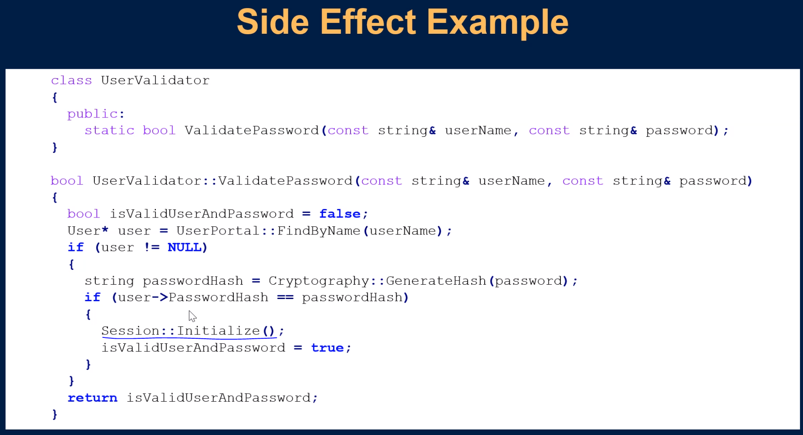
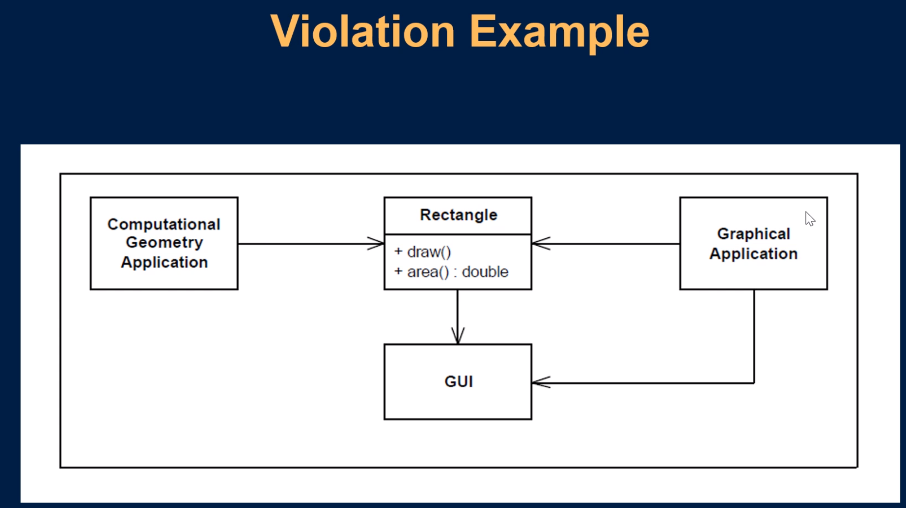
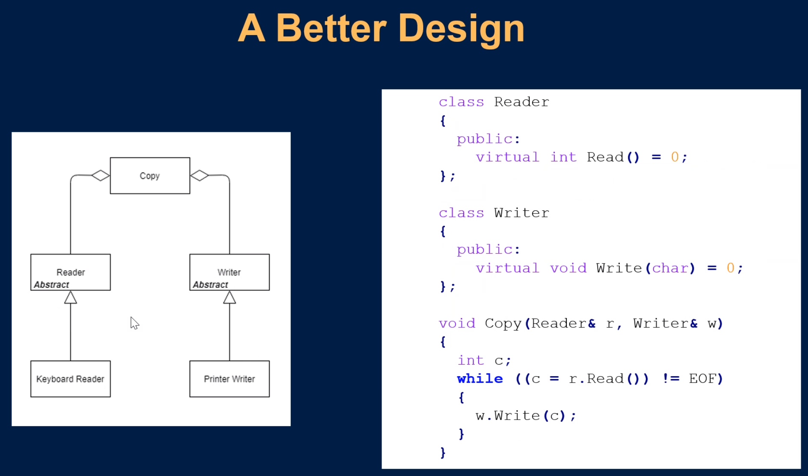

<small>[Return Home](../../README.md)</small>

## Technical Debt

- We have time to do things right

## Coding standards

### Purpose

- Make source code:
  - More readable
  - More maintainable
  - More consistent with itself and across SEL
- Help you avoid hazards of coding languages

Coding standards WI-2231: http://hopper2.ad.selinc.com/qsiqms/qs4reldc.nsf/a7b630aaa0b9f2ff88257d9c000341ee/d3cbfee8c6e970cf882584b70080ada8?OpenDocument&Highlight=0,2231

- General standards
- Language specific standards

### Meaningful names

- Name reveals the intent
  - Why it exists
  - How it is used
- Class names -> Noun or noun phrases
- Method names -> Verb or verb phrases

### Functions should be small

- Smaller the function, the harder it is to do more than one thing
- Functions should be doing one thing
- Funcitons should do one thing, they should do it well, they should do it only.

## Problem with switch statements

- Can use polymorephism instead

- When you expand functionality, you want to do that by adding new modules rather than modify existing modules.
  - Prevents you from breaking things

### Function arguments

- Functions should take 0, 1 or 2 arguments
- More arguments, the harder to test (more test cases)

### Flag arguments

- Generally should be avoided.
  - What does `Disconnect(false)` mean?
- Usually indicates you should have two functions (one where the value is true and one where the value is false)

### Output arguments

- Avoid output arguments
  - Side effects
- If a function is going to change the state of something, it should be a member of the object that it is changing

### Side effects

- Breaks the 'one thing' rule
- Often creates unseen coupling

- I'm now limited when I can call Validatepassword because initialize session is tightly coupled with calling this method

## Successive refinement

- Nobody writes perfect ocde the first time
- Create drafts

## Coding Comments

- If not maintained they can mislead or be lies
- Only the code can truly tell you waht it does
- Comment about the 'why' not the 'what' (why it's there, not what it is doing)

* Best case scenario is that the code gives you all the information it needs

## Error Handling

- Develop a strategy as part of your software design
- Decide how errors will be prevented, generated, handled and/or propagated
- Be consistent

### Exceptions vs Error Codes

- Exceptions are generally recommended over error codes.
- Error codes can be safer for well-reviewed, critical code

- Downside of exceptions
  - Exceptions can be likened to goto statements, creating jumps in execution
  - Can create additional exit points in functions
  - Can often be invisible in code
  - Exception handling can be hard to review
- Benefits of exceptions
  - Cannot be ignored
  - Can include arbitrary data (custom exception)
  - Can make debugging easier
  - Can be more easily delegated
  - Error codes add complexity to a function declaration
  - Global/class error code fields can be neglected

## Defensive programming

- Protect code from invalid input from 'outside'
- Establish boundaries
  - Trust nothing from outside the boundary
  - Everything in the boundary is safe
- Validate input data at the boundary

## Debug Asserts vs Exceptions

- Asserts are used as debugging aid to detect coding errors
- Use them to document assumptions and verify at runtime

## Third-party usage example

- More options = more complexity, by doing it the second way we only expose one part of the map third party library.

## Exploring Third-Party Code

- Write "learning" unit tests against third-party code to explore your understanding of the code.
- These tests can then be run on future releases to find behavior changes

## Code that doesn't exist yet

- Develop against code that doesn't exist
  - Component/subsystem developed by another team
- Define a boundary interface you wish you had
- Once the real code becomes available, write an adapter to bridge the gap between your interface and the real interface

## Classes

- Should be small
- Single responsibility (SRP) (to a particular user of that class)
- If we cannot have a concise name for a class, it's likely too large
- System should be made of many small classes rather than a few large ones

## Cohesion

- Degree to which the elements inside a module belong together
- High cohesion results in
  - Modules with reduced complexity
  - Easier to reuse
  - Easier to maintain
- The more instance variables a method manipulates, the more cohesive that method is to its class

## Coupling

- A measure of how closely connected two mothods or modules are
- Loose coupling reduces risk that changes in one module with affect others
- Loose coupling results in:
  - Modules that are easier to reuse
  - Easier to unit test
  - Can be easily swapped out for other implementations

## Unit Tests

- No code is clean if it doesn't have tests
- Tells you the code is functioning as you expect it to
- Test code is as important as production code
- Keeps code flexibile, maintainable, reusable
- With tests, you do not fear making changes to the code
- Without tests, every change is a potential bug
- Tests must be kept clean

## Clean Tests

- Arrange-Act-Assert
- Each test should cover a single concept
- A clean test is easy to read

- Name convention for tests
  - MethodName_StateUnderTest_ExpectedBehavior

## Test Driven Development Steps

1. Add a test
2. Run all tests. The new test should fail for expected reasons.
3. Write the simplest production code to make the test pass.
4. All tests should now pass
5. Refactor as needed, running tests after each refactor to ensure that functionality is preserved
6. Repeat

## Design patterns

- General, reusable solutions to a commonly occurring problem
- Formalized best practices that can be used to solve common problems when designing an app or system

### Four elements of Design patterns

- `Pattern name` descibes a design pattern
- The `problem` describes when to apply the pattern
- The `solution` describes the elements that make up the design
- The `consequences` are results of trade-offs of applying the pattern.

## Solid Design Principles

- Tells us how to arround our functions and data strutures into classes and how these classes should be interconnected
- Creation of software that is
  - Tolerant of change
  - Easy to understand

## SRP: Single responsibility principle

- A module should be responsible to only one actor
- If a class has more than one responsibility, then responsibilities become coupled

* Changes to one responsibility impairs or inhibits the class ability of another

## OCP: Open-Closed principle

- Open for extension but closed for modification
- Open for extension
  - Behavior of module can be extended
- Closed for modification
  - Source code of the module is locked
- Abstraction is key

- When you try to extend this module you will need to modify the `DrawAllShapes` method

- Using polymorphism and inheritance to make sure that you don't need to modify any existing code when adding a new shape.

## LSP: The Liskov substitution principle

- Derived classes must be substituable for their base class

- All clients (derived classes) must conform to what is expected of the clients' base class
- In this case if a rectangle is the base class of a square then this test will fail (when you set the height to two the area will be 4 for a square, not 10)

## ISP: The interface Segregation Principle

- Clients should not be forced to depend on interfaces that they do not use

  

* A basic printer won't use all of these methods

  

## Dependency Inversion Principle

- Depend on abstractions

  

  
