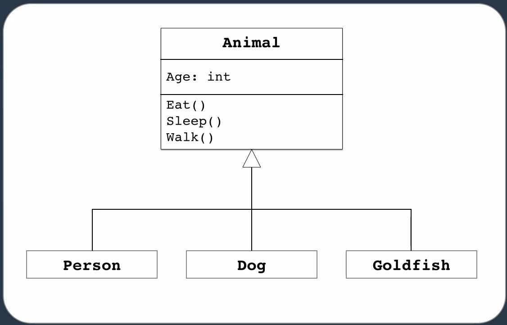

<small>[Return Home](../../README.md)</small> | <small>[Return to C# Main](index.md)</small>

### Strings

- String format
  - Uses indexes

```csharp
string name = string.Format("{0} {1}", firstName, lastName);
```

- String join

```csharp
var numbers = new int[3] { 1, 2, 3 };
string list = string.Join(",", numbers);
```

- Verbatim string
  - \ does not escape in a verbatim string

```csharp
string path = @"C:\projects\folder1";
```

### Enums

- Converting a string to an Enum type.

```csharp
public enum ShippingMethod
{
	Express = 1,
	Regular = 2,
}

var methodName = "Express";
var convertedType = (ShippingMethod)Enum.Parse(typeof(ShippingMethod), methodName);
```

### Stack/Heap


### CLASSES

- Data (fields)
- Behaviour (methods/functions)
- Object is an instance of a class

#### Object initialization syntax

```csharp
var person = new Person
                    {
                        FirstName = "Zach",
                        LastName = "Tind"
                    }
```

- You are not using () so you are not using the constructors of the class, you are using an object initializer. This reduces the need to make a lot of constructors.

### METHODS

- Overloading: Having method with same name but different signatures.

#### Params modifier

```csharp
public class Calculator
{
    public int Add(params int[] numbers) {}
}

var result = calculator.Add(new int[]{ 1, 2, 3, 4,});
var result = calculator.Add(1,2,3,4);
```

- With params modifier we can pass an array or pass any number of int parameters.

#### Ref modifier

```csharp
public void DoAWeirdthing(ref int a)
{
    a += 2;
}

var a = 1;
weirdo.DoAWeirdthing(ref a);
```

- If you pass a value type by reference then it will be updated in the calling method.
- This is not good practice, don't use this.

#### Out modifier

```csharp
public void MyMethod(out int result)
{
    result = 1;
}

var a;
myClass.DoAWMyMethodeirdthing(out a);
```

- Out modifier can return a value to the caller. Allows you to return multiple values to the caller.

### FIELDS

```csharp
public class Customer
{
    readonly List<Order> Orders = new List<Order>();
}
```

- Read-Only: Can only be set once, in constructor or directly.

### Access Modifiers

1. Public
2. Private
3. Protected
4. Internal

- Controls access to class or its members.

OOP (Object oriented programming)

- **Encapsulation/Information hiding**
- Inheritance
- Polymorphism

- Encapsulation
  - Classes should have their own responsibility that other classes should need to know about.
  - Fields should be private, define getters/setters as public

### INDEXERS

- A way to access elements in a class that represents a list of values

```csharp
public class HttpCookie
{
    public string this[string key]
    {
        get {..}
        set {..}
    }
}

var cookie = new HttpCookie();
cookie["name"] = "Zach";

```

### Inheritence

- Allows a class to inherit code form the other
  - Code re-use
  - Polymorphic behaviour
- Is-a relationship
  - Dog is a mammal

* Problems with inheritence
  - Large hierarchies
  - Tightly coupling
    

### Composition

- A relationship between two classes that allows one to contain the other
- Has-a relationship
  - Car has an engine
- Less coupling than inheritence
  

### Access Modifiers

- Black box
  - Want to design objects like a black box
  - Does a lot of things but the complexity is abstracted away
  - Public interface should be simple

| Modifier             | Definition                                                                               |
| -------------------- | ---------------------------------------------------------------------------------------- |
| `Public`             | Accessible from everywhere                                                               |
| `Private`            | Only accessible from the class                                                           |
| `Protected`          | Accessible from the calss and derived classes (inherited). Shouldn't be used often       |
| `Internal`           | Accessible only form the same assembly usually only used for classes, not methods/props  |
| `Protected Internal` | Accessible only from same assembly or any derived classes. Very unlikely it will be used |

### Constructor Inheritence

- Base class constructors are not inherited
- Base class constructors are always executed first

### Conversion from derived class to base class (upcasting)

### Conversion from base class to derived class (downcasting)

```csharp
if (obj is car)
{
    Car car = (Car) obj;
}

Car car = obj as Car;
if(car != null)
{
    ...
}
```

### Value Types + Reference Types

- Value types are stored on the stack
  - Removed when they go out of scope
- Reference types are stored on the heap

`Boxing`

- Process of converting a value type instance to an object reference

```csharp
int number = 10;
object obj = number;

object obj = 10;
// This gets stored on the heap instead of the stack
```

`Unboxing`

```csharp
object obj = 10;
int number = (int)obj;
```

- Boxing/unboxing have a performance penalty.

### Method Overriding

```csharp
public class Shape
{
  public virtual void Draw()
  {
    // Default implementation
  }
}

public class Circle : Shape
{
  public override void Draw()
  {
    // New implementation
    base.Draw();  // Run base class method
  }
}
```

### Abstract Classes/Members

```csharp
public abstract class Shape
{
  public abstract void Draw();
}

public class Circle : Shape
{
  public override void Draw()
  {
    // Implementation for circle
  }
}
```

- If a member is abstract, the class must be abstract too.
  - Difference between this and virtual, is that the base class virtual method can have its own implmentation that you can run. Abstract methods have no implementation.
- Abstract classes cannot be instantiated
- Abstract methods must be implemented by the derived class

### Sealed

- Opposite of abstract classes
- Prevents derivation of classes or overriding of methods
- Rarely (if ever) used.

### Interfaces

- Similar to a class
- No implementation
- No access modifiers
- Help build loosely-coupled apps
- Defines capabilities that a class should provide
  - Methods defined by an interface when implemented must be public in that class

### Interfaces testability

- Interfaces help isolate classes during unit testing
  **Interfaces are a contract**

### Interfaces and Extensibility

`Dependency Injection`

- In the constructor we are specifying the dependencies for a class

### Using statement

- Stream writer (among others) uses a file resource, which is not managed by the CLR (common language runtime)
- We must dispose of the resource once we are done using it.

```csharp
        using (var streamWriter = new StreamWriter(_path, true))
        {
          streamWriter.WriteLine(message);
        }
```

- There is an exception handling happening behind the scenes in case the file handling goes wrong

### Interfaces are not for multiple inheritance

- Interfaces have nothing to do with inheritance
- There is no code that you are inheriting

# DELEGATES

- Object that knows how to call a method
- Reference to a pointer to a function
  - Defining the delegate shows what kind of signature it can have
- Helps make code extensible (extendable)

```csharp
      public delegate void PhotoFilterHandler(Photo photo);
```
* Use a delegate when the caller doesn't need to access other properties or methods on the object implementing the method. 

* Two generic delegates
  * Func, takes 1-15 arguments and has a return type
  * Action, takes 1-15 arguments (overloaded) and returns void;
```csharp
    Func<int, int> squareNumbers = number => number * number;
    Action<int> writeLine = number => Console.WriteLine(number);
```

# Lambda expression
* An anonymous method
  * No access modifier
  * No name
  * No return statement


