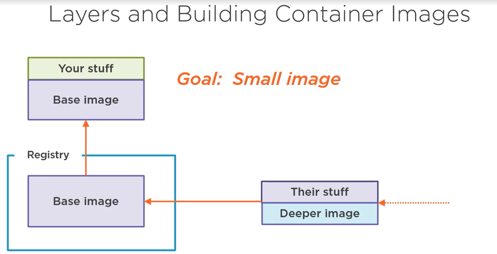

<small>[Return Home](../../README.md)</small>

# Docker Notes

Important links:

- [DockerDocs] - Documentation for Docker

Docker commands:

| Command                                                    | Description                                                                                                                                                     |
| ---------------------------------------------------------- | --------------------------------------------------------------------------------------------------------------------------------------------------------------- |
| docker system prune                                        | Removes all stopped containers                                                                                                                                  |
| docker logs `<container id>`                               | Does not re-run the container, which just output logs from when a container was started                                                                         |
| docker stop `<container id>`                               | Gives the container 10 seconds to stop, before killing operation                                                                                                |
| docker kill `<container id>`                               | Kills container immediately                                                                                                                                     |
| docker exec -it `<container id> <command>`                 | Executes a command in a running container<br />-it: Allows input text to the container, i allows you to gain stdin. <br /> -sh: Allows you to gain shell access |
| docker ps --all                                            | Shows all docker containers that exist on your system                                                                                                           |
| docker ps                                                  | Shows all currently running docker containers                                                                                                                   |
| docker run -it `<container id>` sh                         | Allows you to gain shell access to an already built docker container (not currently running like with exec)                                                     |
| docker stop $(docker ps -a -q)                             | Stops all docker containers                                                                                                                                     |
| docker rm $(docker ps -a -q)                               | Stop and remove all docker containers                                                                                                                           |
| docker image ls                                            | List all docker images                                                                                                                                          |
| docker image rm {id}                                       | Remove docker image                                                                                                                                             |
| docker volume prune                                        | Remove all docker volumes (can sometimes build up and cause space issues)                                                                                       |
| docker exec -it {image}                                    | Executes the container                                                                                                                                          |
| docker run -it --rm --entrypoint /bin/bash rabbitmq:latest | TODO: Add what this does                                                                                                                                        |
| docker network ls                                          | Lists docker network bridges                                                                                                                                    |
| docker network rm                                          | Removes docker network bridge                                                                                                                                   |

[dockerdocs]: https://docs.docker.com/get-docker/

# Docker instructions

- FROM `<command>`
  - Starting point (base image, temp container) for the image you are creating, e.g. alpine
- RUN `<command>`
  - Run a command on the base image. Sets up depedencies.
- CMD `<command>`
  - Setting primary command of the created container (what command it runs when container starts)

```sh
$ docker build .
```

- Takes a docker file, runs the commands (the three docker instructions listed previously) and generates an image out of it

```sh
$ docker build -t <name_of_docker_image_tag> .
```

- This tags the docker image, allowing you to refer to it by the tag name

### Port mapping

- By default a docker container cannot receive outside traffic to the port the app is running on, because it is listening to a port inside of the container
- To get around this you need to do what's called `port mapping`

```docker
docker run -p 8080 : 8080 <image id>
```

- The first port number here is the local host port and the second port is the port that traffic will be routed to inside of the container. These ports <u>don't</u> have to be identical.

> Redis: In memory datastore. Tiny database that sits inside of memory

#### Connecting two docker containers

- Docker's CLI (command line interface) has building Networking features but is rarely used
- `docker-compose`
  - automates a lot of the commands needed to work with Docker's CLI.
  - Used to start multiple Docker containers at the same time
  - Gets installed along with Docker
  - Run with a file `docker-compose.yml`
    - When two docker images are created in a `docker-compose` file they will automatically have access to each other without having to open up ports between the two. The only port declaration is between container and the local machine.

Docker compose command mapping:


Docker Compose commands:
|Command| Description|
|-------|------------|
|`docker-compose up -d` | Launch in background
|`docker-compose down` | Stop containers
|`docker-compose up`| Start containers
|`docker-compose up --build`| Builds or rebuilds containers

#### Automatic container restarts

- If a container exits with a status code of '0' it means that we meant to exit
  - Anything other than '0' means an error occurred.
  - This affects how Docker decides to restart a container

Restart policies in the docker-compose file:
|Policy|Description|
|---|---|
|`"no"` | Never attempt to restart this container if it stops or crashes. Note: This must be in quotes
| `always` | If this container stops for any reason always attempt to restart
|`on-failure`| Only restart if the container stops with an error code
|`unless-stopped`| Always restart unless we (the devs) forced stop
|`docker-compose ps`| Finds all running containers to a `docker-compose.yml` file (command must be run in file where `docker-compose.yml` file exists)

### Cleaning up docker disk space in WSL2

Follow this guide: https://marcroussy.com/2020/12/01/cleaning-up-docker-disk-space-in-wsl2/

## Pluralsight Tutorial


```shell
docker run --rm -it -p 3000:80 -p 2525:25 rnwood/smtp4dev
# -p <localhostport>:<containerport>
```

```
docker run --name seq -d --restart unless-stopped -e ACCEPT_EULA=Y -p 5341:80 datalust/seq:latest
```

- Tags
  - --name : gives the container a specific name (rather than random string)
  - -d : just returns the container image id (allows you to retain control of the command line)
  - --restart : restarts the container if it stops unless you specifically stop it
  - -e : Used to specify environment variables
  - -p : Port mapping
  - Finally you need to indicate the name of the container image you want to run

## Layers and Building Container images




### Local host in a container

```csharp
  .WriteTo.Seq("http:/localhost:5341");
```

- If you refer to localhost in a container it refers to a port in the container itself, not your machine. You need to use a different command to reference your machine's localhost

```csharp
 .WriteTo.Seq("http://host.docker.internal:5341");
```

- `host.docker.internal` references your machines localhost even if this is running in a container (Docker Desktop DNS name for your localhost), will not work in production

Basic docker file:
(Note: In VS right click project -> add -> add docker support)

```docker
 #Setup base image with aspnet runtime and exposed ports
FROM mcr.microsoft.com/dotnet/aspnet:5.0 AS base
WORKDIR /app
EXPOSE 80
EXPOSE 443

#Use full sdk as build container
FROM mcr.microsoft.com/dotnet/sdk:5.0 AS build
WORKDIR /src
COPY ["Globomantics.Core/Globomantics.Core.csproj", "Globomantics.Core/"]
#Restore packages and build project
RUN dotnet restore "Globomantics.Core/Globomantics.Core.csproj"
COPY . .
WORKDIR "/src/Globomantics.Core"
RUN dotnet build "Globomantics.Core.csproj" -c Release -o /app/build

# Alias build as publish and run dotnet publish (-o specifies the output folder)
FROM build AS publish
RUN dotnet publish "Globomantics.Core.csproj" -c Release -o /app/publish

# Copy published files into final image. Entry point is what commands to run when starting container
FROM base AS final
WORKDIR /app
COPY --from=publish /app/publish .
ENTRYPOINT ["dotnet", "Globomantics.Core.dll"]
```

## Docker Compose

- Container orchestration tool
- Allows us to define and share multi-container applications

`SSL termination` refers to the process of decrypting encrypted traffic (https) before passing it along to a web server.

You can edit the C:\Windows\System32\drivers\etc\hosts file (running as Admin) to configure your machine's DNS (maps a IP address to a specified name)

Docker desktop has already modified this file

```
# localhost name resolution is handled within DNS itself.
#	127.0.0.1       localhost
#	::1             localhost

127.0.0.1 id-local.globomantics.com

# Added by Docker Desktop
10.15.49.239 host.docker.internal
10.15.49.239 gateway.docker.internal
# To allow the same kube context to work on the host and the container:
127.0.0.1 kubernetes.docker.internal
```

- Here I have added a mapping id-local.globomantics.com to 127.0.0.1 (localhost)
- We can also see that docker desktop added the host.docker.internal maping

`Clean Solution` Command in VS: All containers are removed, after you start again the containers will all be rebuilt

SSL nginx Docker
https://gist.github.com/dahlsailrunner/679e6dec5fd769f30bce90447ae80081


## Data Persistence in Containers


- New data stored in a database hosted by a container will not be persistent when the container is recreated. Therefore we need to store data outside of the container in a file share.


## WSL Config

- https://docs.microsoft.com/en-us/windows/wsl/wsl-config#wsl-2-settings

```
[wsl2]
memory=4GB
processors=2
```

WSL Configuration

- Assign limits to WSL instances
- Defaults to 8GB or half available RAM (whichever is less)
- `C:\Users\<username>\.wslconfig`
