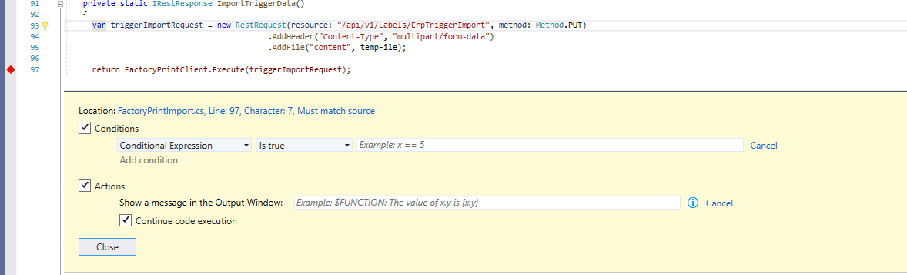
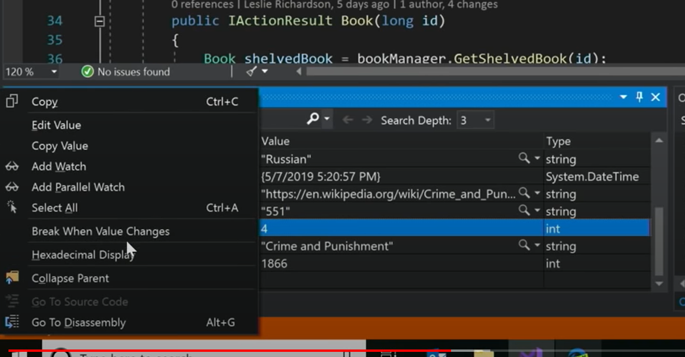

<small>[Return Home](./../../README.md)</small>


> Use a header for displaying an object in the debugger as a property:

```csharp
[DebuggerDisplay("{Title, nq}")]
public class Book {...}
```

* If you have a colleciton of books you want to inspect, instead of the debugger showing book objects abstractly, this will show you the property Title, with no quotations (nq)

### Tracepoints



* Can replace writelines, can break when a condition is true, actions allow you to output to the output window a value of a variable. 

### Data breakpoints

* You can create a break point for when a property value changes



