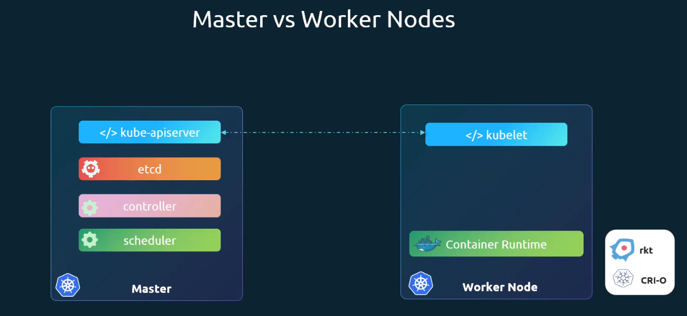
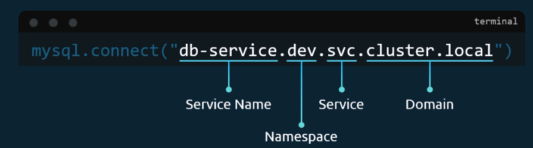

<small>[Return Home](../../../README.md)</small> | <small>[Return to Kubernetes](../index.md)</small>

## Kubernetes Certified Application Developer Course

`Cluster` - Set of nodes grouped together
`Master` - Node that is responsible for the orchestration of containers on the system.

| Component         | Description                                                                                               |
| ----------------- | --------------------------------------------------------------------------------------------------------- |
| API Server        | Frontend for the kubernetes cluster                                                                       |
| etcd              | Keystore used to store all data to manage the cluster.                                                    |
| Kubelet           | Agent that runs on each node on the cluster. Responsible for making sure each node is running as expected |
| Scheduler         | Distributes work accross nodes                                                                            |
| Controller        | Brain behind orchestration. Responds to when nodes goes down                                              |
| Container Runtime | Underlying software used to run containers (e.g. docker)                                                  |

  

`Kubectl` - Tool used to manage and deploy nodes on the cluster

`kubectl cluster-info`

`kubectl run <cluster>`

`kubectl get nodes`

## Replication Controller

- To prevent users from losing access to the application a replication controller allows you to run more than one pod for the app at a time
- Replication controller can span accross multiple nodes in a cluster. You may need more than one node if it runs out of resources
- Also known as `replicaSet`. This is a newer version of the `replication controller`

### Scale replicas

- Update replicaset definition file and run `kubectl apply -f replicaset-definition.yml`
- Scale directly by `kubectl scale --replicas=6 -f replicaset-definition.yml`
- Scale existing replicaset `kubectl scale --replicas=6 replicaset <replicaset-name>`

Example replicaset definition file:

```yml
apiVerion: apps/v1
kind: ReplicaSet
metaData:
  name: myapp-replicaset
  labels:
    app: myapp
    type: front-end
spec:
  template:
    metaData:
      name: myapp-pod
      labels:
        app: myapp
        type: front-end
      spec:
        containers:
          - name: nginx-container
            image: nginx
    replicas: 6
    selector:
      matchLabels:
        type: front-end
```

## Deployments

- Update application without taking the entire application down
- Rollback updates

Example definition file

```yml
apiVerion: apps/v1
kind: Deployment
metaData:
  name: myapp-deployment
  labels:
    app: myapp
    type: front-end
spec:
  template:
    metaData:
      name: myapp-pod
      labels:
        app: myapp
        type: front-end
      spec:
        containers:
          - name: nginx-container
            image: nginx
    replicas: 6
    selector:
      matchLabels:
        type: front-end
```

## Namespaces

- `default` namespace is created automatically when kubernetes is setup
- `kube-system` services made by kubernetes that is made at setup that should not be deleted/modified by the user
- `kube-public` resources available to usares are created at setup

- Can create a namespace for dev/prod environment (for example)

  - Can setup rules for how each namespace uses resources

  

When you want to see the pods in the non-default namespace you need ot use the `--namesapce=<namespace-name>` tag e.g. `kubectl get pods --namespace=kube-system`

To create a pod in a different namespace add the namespace tag in create command. E.g. `kubectl creat -f pod-definition.yml --namespace=dev`, it can also be added to the pod definition file under metaData

```yml
---
metaData:
  name: myapp-pod
  namespace: dev
  labels: ..
---
```

To create a namespace:

- Run the create command `kubectl create-f namespace-dev.yaml`
- `kubectl create namespace <name-of-namespace>`

To update the default namespace to a new namespace:
`kubectl config set-context $(kubectl config current-context) --namespace=dev`

To get pods for all namespaces:
`kubectl get pods --all-namespaces`

NOTE: `-n` can replace `--namespace`

## Services

- NodePort
- ClusterIP
- LoadBalancer

### Imperative commands

- used to get one-time tasks done quickly
  `--dry-run`: By default soon as the command is run, the resource will be created
  `--dry-run=client`: Will not create a resource, instead it will tell you whether the reserouce can be created and if the command is right.
  `-o yaml`: Will output the resource definition in YAML format on the screen

Commands to output to a file:

- `kubectl run nginx --image=nginx --dry-run=client -o yaml > nginx-pod.yaml`
- `kubectl create deployment --image=nginx nginx --dry-run -o yaml`

Commands to create ClusterIP service to expose a pod port

- `kubectl expose pod redis --port=6379 --name redis-service --dry-run=client -o yaml`
- `kubectl create service clusterip redis --tcp=6379:6379 --dry-run=client -o yaml`

NOTE: This will assume that the selector is `app-redis`. If your pod has a different label set this won't work. You cannot pass in selectors as an option.

Commands to create a NodePort

- `kubectl expose pod nginx --port=80 --name nginx-service --type=NodePort --dry-run=client -o yaml`
- Will auto use the pod's labels as selectors but you cannot specify the noe port.
  `kubectl create service nodeport nginx --tcp=80:80 --node-port=30080 --dry-run=client -o yaml`
- Will not use the pods' labels as selectors

Kubernetes conventions: https://kubernetes.io/docs/reference/kubectl/conventions/

### Formmatting output

`-o` flag allows us to output the details in different formats

| Command   | Description                                                 |
| --------- | ----------------------------------------------------------- |
| `-o json` | Output a JSON formatted API object                          |
| `-o name` | Print only the resource name and nothing else.              |
| `-o wide` | Output in plain-text format with any additional information |
| `-o yaml` | Output a YAML formatted API object                          |

Example: `kubectl create namespace test-123 --dry-run=client -o json`

Returns

```json
{
  "kind": "Namespace",
  "apiVersion": "v1",
  "metadata": {
    "name": "test-123",
    "creationTimestamp": null
  },
  "spec": {},
  "status": {}
}
```

Example: `kubectl create namespace test-123 --dry-run=client -o yaml`

```yaml
apiVersion: v1
kind: Namespace
metadata:
  creationTimestamp: null
  name: test-123
spec: {}
status: {}
```

Instead of using `kubectl describe pod <podname>` you can use `kubectl get pods -o wide` that will show details about all pods, including IP address and what node the pod is on.

`kubectl api-resources` - Lists all available resources, will gie you the short name for the resource you can use
`kubectl explain <resource>` - Will give information about the resource such as the apiVersion kind, ect.

If you want to see more detailed information about a field for the resource, for example the spec field in pod run:
`kubectl explain <resource>.<fieldName>` -> `kubectl explain pod.spec`

`kubectl explain <resource> --recursive` - To view the fields in the yaml file

To get information about a command itself use the `--help` flag
e.g. `kubectl run --help`

Create a docker image that overrides the entry point arguments
`docker run --name ubuntu-sleeper ubuntu-sleeper 10`

Pod definition file with args for the container

```yaml
apiVersion: v1
kind: Pod
metadata:
  name: ubuntu-sleeper-pod
spec:
  containers:
    - name: ubuntu-sleeper
      image: ubuntu-sleeper
      command: ["sleep", "5000"]
      ## Note there are two ways of making an array in yaml, below is the other way
      command:
        - "sleep"
        - "5000"
      args: ["--color", "pink"]
      env:
        - name: APP_COLOR
          value: pink
        - name: APP_CONFIG_MAP_COLOR
          valueFrom:
            configMapKeyRef:
              name: app-config
              key: APP_COLOR
        - name: APP_SECRET_COLOR
          valueFrom:
            secretKeyRef:

      ## Alternatively for configMap variables
      envFrom:
        - configMapRef:
          name: app-config

      ## Can also use the config map from volumes
      volumes:
      - name: app-config-volume
        configMap:
          name: app-config
```

- Args overrides the CMD instruction in the docker file
- Command overrides the Entrypoint field in the docker file

## Configmap

```yaml
APP_COLOR: blue
APP_MODE: prod
```

`kubectl create configmap <config-name> \ --from-literal=<key>=<value>`

Example: `kubectl create configmap app-config \ --from-literal=APP_COLOR=blue | --from-literal=APP_MOD=prod`

`kubectl create configmap app-config \ --from-file=app_config.properties`

```yaml
apiVerions: v1
kind: ConfigMap
metadata:
  name: app-config
data:
  APP_COLOR: blue
  APP_MOD: prod
```

Then run `kubectl create -f config-map.yaml`
To see what configmaps exist use `kubectl get configmaps`

- Can also use describe like normal
