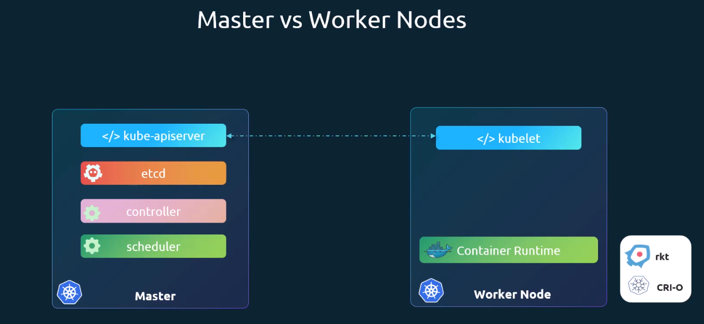
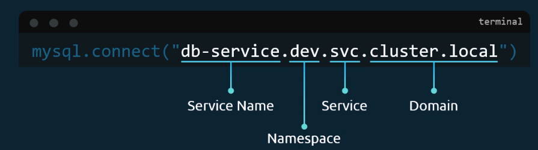
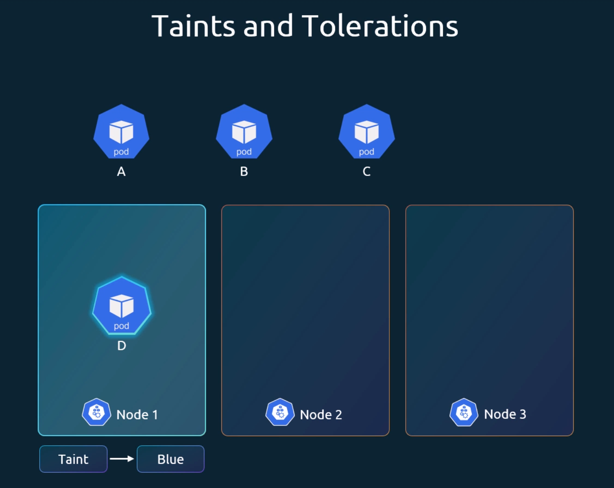
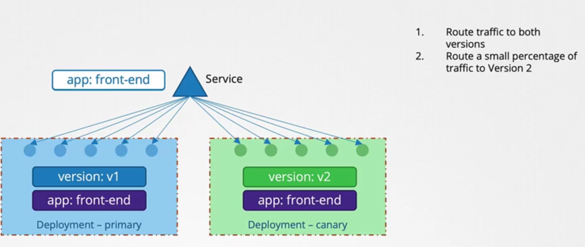
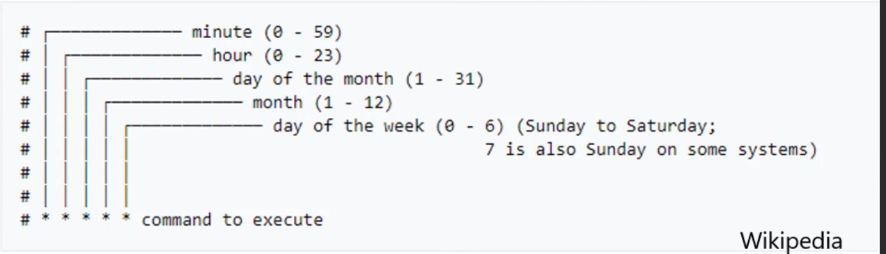

<small>[Return Home](../../../README.md)</small> | <small>[Return to Kubernetes](../index.md)</small>

## Kubernetes Certified Application Developer Course

`Cluster` - Set of nodes grouped together
`Master` - Node that is responsible for the orchestration of containers on the system.

| Component         | Description                                                                                               |
| ----------------- | --------------------------------------------------------------------------------------------------------- |
| API Server        | Frontend for the kubernetes cluster                                                                       |
| etcd              | Keystore used to store all data to manage the cluster.                                                    |
| Kubelet           | Agent that runs on each node on the cluster. Responsible for making sure each node is running as expected |
| Scheduler         | Distributes work accross nodes                                                                            |
| Controller        | Brain behind orchestration. Responds to when nodes goes down                                              |
| Container Runtime | Underlying software used to run containers (e.g. docker)                                                  |

  

`Kubectl` - Tool used to manage and deploy nodes on the cluster

`kubectl cluster-info`

`kubectl run <cluster>`

`kubectl get nodes`

## Replication Controller

- To prevent users from losing access to the application a replication controller allows you to run more than one pod for the app at a time
- Replication controller can span accross multiple nodes in a cluster. You may need more than one node if it runs out of resources
- Also known as `replicaSet`. This is a newer version of the `replication controller`

### Scale replicas

- Update replicaset definition file and run `kubectl apply -f replicaset-definition.yml`
- Scale directly by `kubectl scale --replicas=6 -f replicaset-definition.yml`
- Scale existing replicaset `kubectl scale --replicas=6 replicaset <replicaset-name>`

Example replicaset definition file:

```yml
apiVerion: apps/v1
kind: ReplicaSet
metaData:
  name: myapp-replicaset
  labels:
    app: myapp
    type: front-end
spec:
  template:
    metaData:
      name: myapp-pod
      labels:
        app: myapp
        type: front-end
      spec:
        containers:
          - name: nginx-container
            image: nginx
    replicas: 6
    selector:
      matchLabels:
        type: front-end
```

## Deployments

- Update application without taking the entire application down
- Rollback updates

Example definition file

```yml
apiVerion: apps/v1
kind: Deployment
metaData:
  name: myapp-deployment
  labels:
    app: myapp
    type: front-end
spec:
  template:
    metaData:
      name: myapp-pod
      labels:
        app: myapp
        type: front-end
      spec:
        containers:
          - name: nginx-container
            image: nginx
    replicas: 6
    selector:
      matchLabels:
        type: front-end
```

## Namespaces

- `default` namespace is created automatically when kubernetes is setup
- `kube-system` services made by kubernetes that is made at setup that should not be deleted/modified by the user
- `kube-public` resources available to usares are created at setup

- Can create a namespace for dev/prod environment (for example)
  - Can setup rules for how each namespace uses resources

  

When you want to see the pods in the non-default namespace you need ot use the `--namesapce=<namespace-name>` tag e.g. `kubectl get pods --namespace=kube-system`

To create a pod in a different namespace add the namespace tag in create command. E.g. `kubectl create -f pod-definition.yml --namespace=dev`, it can also be added to the pod definition file under metaData

```yml
---
metaData:
  name: myapp-pod
  namespace: dev
  labels: ..
---
```

To create a namespace:

- Run the create command `kubectl create-f namespace-dev.yaml`
- `kubectl create namespace <name-of-namespace>`

To update the default namespace to a new namespace:
`kubectl config set-context $(kubectl config current-context) --namespace=dev`

To get pods for all namespaces:
`kubectl get pods --all-namespaces`

NOTE: `-n` can replace `--namespace`

## Services

- NodePort
- ClusterIP
- LoadBalancer

### Imperative commands

- used to get one-time tasks done quickly
  `--dry-run`: By default soon as the command is run, the resource will be created
  `--dry-run=client`: Will not create a resource, instead it will tell you whether the reserouce can be created and if the command is right.
  `-o yaml`: Will output the resource definition in YAML format on the screen

Commands to output to a file:

- `kubectl run nginx --image=nginx --dry-run=client -o yaml > nginx-pod.yaml`
- `kubectl create deployment --image=nginx nginx --dry-run -o yaml`

Commands to create ClusterIP service to expose a pod port

- `kubectl expose pod redis --port=6379 --name redis-service --dry-run=client -o yaml`
- `kubectl create service clusterip redis --tcp=6379:6379 --dry-run=client -o yaml`

NOTE: This will assume that the selector is `app-redis`. If your pod has a different label set this won't work. You cannot pass in selectors as an option.

Commands to create a NodePort

- `kubectl expose pod nginx --port=80 --name nginx-service --type=NodePort --dry-run=client -o yaml`
- Will auto use the pod's labels as selectors but you cannot specify the noe port.
  `kubectl create service nodeport nginx --tcp=80:80 --node-port=30080 --dry-run=client -o yaml`
- Will not use the pods' labels as selectors

Kubernetes conventions: https://kubernetes.io/docs/reference/kubectl/conventions/

### Formmatting output

`-o` flag allows us to output the details in different formats

| Command   | Description                                                 |
| --------- | ----------------------------------------------------------- |
| `-o json` | Output a JSON formatted API object                          |
| `-o name` | Print only the resource name and nothing else.              |
| `-o wide` | Output in plain-text format with any additional information |
| `-o yaml` | Output a YAML formatted API object                          |

Example: `kubectl create namespace test-123 --dry-run=client -o json`

Returns

```json
{
  "kind": "Namespace",
  "apiVersion": "v1",
  "metadata": {
    "name": "test-123",
    "creationTimestamp": null
  },
  "spec": {},
  "status": {}
}
```

Example: `kubectl create namespace test-123 --dry-run=client -o yaml`

```yaml
apiVersion: v1
kind: Namespace
metadata:
  creationTimestamp: null
  name: test-123
spec: {}
status: {}
```

Instead of using `kubectl describe pod <podname>` you can use `kubectl get pods -o wide` that will show details about all pods, including IP address and what node the pod is on.

`kubectl api-resources` - Lists all available resources, will gie you the short name for the resource you can use
`kubectl explain <resource>` - Will give information about the resource such as the apiVersion kind, ect.

If you want to see more detailed information about a field for the resource, for example the spec field in pod run:
`kubectl explain <resource>.<fieldName>` -> `kubectl explain pod.spec`

`kubectl explain <resource> --recursive` - To view the fields in the yaml file

To get information about a command itself use the `--help` flag
e.g. `kubectl run --help`

Create a docker image that overrides the entry point arguments
`docker run --name ubuntu-sleeper ubuntu-sleeper 10`

Pod definition file with args for the container

```yaml
apiVersion: v1
kind: Pod
metadata:
  name: ubuntu-sleeper-pod
spec:
  containers:
    - name: ubuntu-sleeper
      image: ubuntu-sleeper
      command: ["sleep", "5000"]
      ## Note there are two ways of making an array in yaml, below is the other way
      command:
        - "sleep"
        - "5000"
      args: ["--color", "pink"]
      env:
        - name: APP_COLOR
          value: pink
        - name: APP_CONFIG_MAP_COLOR
          valueFrom:
            configMapKeyRef:
              name: app-config
              key: APP_COLOR
        - name: APP_SECRET_COLOR
          valueFrom:
            secretKeyRef:

      ## Alternatively for configMap variables
      envFrom:
        - configMapRef:
          name: app-config

      ## Can also use the config map from volumes
      volumes:
      - name: app-config-volume
        configMap:
          name: app-config
```

- Args overrides the CMD instruction in the docker file
- Command overrides the Entrypoint field in the docker file

## Configmap

```yaml
APP_COLOR: blue
APP_MODE: prod
```

`kubectl create configmap <config-name> --from-literal=<key>=<value>`

Example: `kubectl create configmap app-config --from-literal=APP_COLOR=blue --from-literal=APP_MOD=prod`

`kubectl create configmap app-config --from-file=app_config.properties`

```yaml
apiVerions: v1
kind: ConfigMap
metadata:
  name: app-config
data:
  APP_COLOR: blue
  APP_MOD: prod
```

Then run `kubectl create -f config-map.yaml`
To see what configmaps exist use `kubectl get configmaps`

- Can also use describe like normal

## SECRETS

- Imperative

`kubectl create secret generic <secret-name> --from-literal=<key>=<value>`

Example:
`kubectl create secret generic app-secret --from-literal=DB_Host=mysql`

`kubectl create secret generic <secret-nam> --from-file=<path-to-file>`

`kubectl describe secret <secret-name>`

- Declarative
  - Use secret definition file

  ```yaml
  apiVersion: v1
  kind: Secret
  metadata:
    name: app-secret
  data:
    DB_Host: msql
    DB_User: root
    DB_Password: paswrd
  ```

  - You must store the data in an encoded format

Example:

```yaml
apiVersion: v1
kind: Secret
metadata:
  name: app-secret
data:
  DB_Host: bXlzcWw=
  DB_User: cm9vdA==
  DB_Password: cGFzd3Jk
```

How to encode:
`echo -n 'msql' | base64`

How to decode:

`echo -n 'cm9vdA==' | base64 --decode`

to get the secrets with the hash values:
`kubectl get secret app-secret -o yaml`

```yaml
apiVersion: v1
kind: Pod
metadata:
  name: simple-webapp-color
  labels:
    name: simple-wabapp-color
spec:
  containers:
    - name: simple-webapp-color
      image: simple-webapp-color
      command: ["sleep", "5000"]
      ports:
        -containerPort: 8080
      env:
        - name: DB_Password
          valueFrom:
            secretKeyRef:
              name: app-secret
              key: DB_Password
      envFrom:
        - secretRef:
            name: app-secret # Name of the secret
```

## Security Contexts

```yaml
apiVersion: v1
kind: Pod
metadata:
  name: multi-pod
spec:
  securityContext:
    runAsUser: 1001
  containers:
    - image: ubuntu
      name: web
      command: ["sleep", "5000"]
      securityContext:
        runAsUser: 1002

    - image: ubuntu
      name: sidecar
      command: ["sleep", "5000"]
```

## Taints and Tolerations

- Taints and tolerations are made to set restrictions on what pods can be scheduled on a node
  - Tolerations are set on nodes
  - Taints are set on pods

  

- Pod D is tolerant to the taint (blue) on Node 1

Tainting a node:

`kubectl taint nodes node-name key=value:taint-effect`

- Types of taints
  - NoSchedule
    - Pod will not be scheduled on the node
  - PreferNoSchedule
    - System will try to avoid placing the pod on the node
  - NoExecute
    - No pods will be scheduled on the node and existing pods on the node (if any) will be evicted if they do not tolerate the taint

Tolerations

Taint: e.g. `kubectl taint nodes node1 app=blue:NoSchedule`

```yaml
apiVersion: v1
kind: Pod
metadata:
  name: myapp-pod
  spec:
    containers:
      - name: nginx-container
        image: nginx
    tolerations:
      - key: app
        operator: "Equal"
        value: blue
        effect: NoSchedule
```

To see the taint for a node:
`kubectl describe node <node-name> | grep Taint`

## Node Selectors

```yaml
apiVersion: v1
kind: Pod
metadata:
  name: myapp-pod
spec:
  containers:
    - image: data-processor
      name: data-processor
  nodeSelector:
    size: Large
```

How to label nodes: `kubectl label nodes <node-name> <label-key>=<label-value>`

e.g. `kubectl label nodes node-1 size=Large`

Node selector limitations:

- Can't do Large or Medium (or statement)
- Can't do not small (not statement)

## Node Affinity

```yaml
apiVersion: v1
kind: Pod
metadata:
  name: myapp-pod
spec:
  containers:
    - image: data-processor
      name: data-processor
  affinity:
    nodeAffinity:
      requiredDuringSchedulingIgnoredDuringExecution:
        nodeSelectorTerms:
          - matchExpressions:
              - key: size
                operator: In
                values:
                  - Large
                  - Medium
```

- Node can be placed in large or medium node

```yaml
- matchExpressions:
    - key: size
      operator: Exists
```

The type of node affinity defines the behavior of scheduling with respect to affinity and the lifecycle of the pod

Affinity Types:

- requiredDuringSchedulingIgnoredDuringExecution
  - During scheduling the affinity is required
    - If a matching node doesn't exist, the pod will not be scheduled
- preferredDuringSchedulingIgnoredDuringExecution
  - During scheduing, if no matching node exists then place it anywhere
    - If a matching node does exist, the pod will be scheduled on that node

Planned afinity: requiredDuringSchedulingRequiredDuringExecution

To see which nodes your pods are running on `k get pods -o wide`

## Multi-Container Pods

- When you need two services to work together
  - Main App + Web server
  - Share the same lifecycle
  - Same network (localhost)
  - Storage sharing

- Pod definition file, add another container to the container array

Types:

- Co-located containers
  - No guarantee one container starts before the other (no order of startup)

```yaml
spec:
  containers:
    - image: data-processor
      name: data-processor
    - image: web-app
      name: web-app
      ports:
        - containerPort: 8080
```

- Init containers
  - Initialization steps to be performed before main application can be run and stops running

```yaml
spec:
  containers:
    - image: web-app
      name: web-app
      ports:
        - containerPort: 8080
  initContainers:
    - name: db-checker
      image: busybox
      command: 'wait-for-db-to-start.sh'
    - name: api-checker
      name: busybox
      command: 'wait-for-another-api.sh'
```

- Side car container
  - Starts before main app starts, continues to run when main app starts, and ends after main app stops.

```yaml
spec:
  containers:
    - image: web-app
      name: web-app
      ports:
        - containerPort: 8080
  initContainers:
    - name: db-checker
      image: busybox
      command: "wait-for-db-to-start.sh"
      restartPolicy: Always
```

## Observability

- Lifecycle
  - Status -> Where the pod is in it's lifecycle
    - Pending
    - ContainerCreating (after pod is scheduled)
    - Running
  - Conditions
    - PodScheduled
    - Initialized
    - ContainersReady
    - Ready

### Readiness Probes

- /api/ready
  - Run an http test
- tcp test 3306
- custom script

```yaml
spec:
  containers:
    - image: web-app
      name: web-app
      ports:
        - containerPort: 8080
    readinessProbe:
      httpGet:
        path: /api/ready
        port: 8080
      initialDelaySeconds: 10
      periodSeconds: 5
      failureThreshold: 8
```

- Service will not be moved into a ready state until the test on the api is successful
- `initialDelaySeconds` is an optional field that will delay the prob until the specified wait time
- `periodSeconds` is an optional field that will set the probe cadence
- `failureThreshold` is an optional field that will set the number of attempts a prob can fail before the prob will stop. The default threshold is 3.

TCP

```yaml
readinessProbe:
  tcpSocket:
    port: 3306
```

Exec

```yaml
readinessProbe:
  command:
    - cat
    - /app/is_ready
```

### Liveness probes

- Similar to readiness probes
- If a pod crashes kubernetes will automatically try to restart the container. But what if the application is 'live' but stuck in an infinite loop? The app would still be assumed to be up.

```yaml
livenessProbe:
  httpGet:
    path: /api/healthy
    port: 8080

  tcpSocket:
    port: 3306

  livenessProbe:
    exec:
      command:
        - cat
        - /app/is_healthy
```

## Logging

`kubectl logs -f <pod-name>`

If there are multiple containers in the pod then you need to specify the container name

`kubectl logs -f <pod-name> <container-name>`

## Labels, Selectors and Annotations

Selectors

```yaml
apiVersion: v1
kind: Pod
metaData:
  name: simple-webapp
  labels:
    app: App1
    Function: Front-end
```

`kubectl get pods --selector app=App1`

ReplicaSet

```yaml
apiVersion: apps/v1
kind: ReplicaSet
metaData:
  name: simple-webapp
  labels:
    app: App1
    Function: Front-end
spec:
  replicas: 3
  selector:
    matchLabels:
      app: App1
  template:
    metadata:
      labels:
        app: App1
        function: Front-end
    spec:
      containers:
        - name: simple-webapp
          image: simple-webapp
```

Annotations

```yaml
apiVersion: apps/v1
kind: ReplicaSet
metaData:
  name: simple-webapp
  labels:
    app: App1
    Function: Front-end
annotations:
  buildversion: 1.34
```

## Selectors

Select all pods with certain labels - `kubectl get pods -l bu=finance,env=prod,tier=frontend`

- `--selector` also works instead of `-l`
  Get all pods, replicasets, deployments ect with label - `kubectl get all -A -l env=prod`
  Show labels for pods - `kubectl get pods --show-labels`

Count the number of pods match a selector - `kubectl get pods --selector bu=finance --no-headers | wc -l`

## Deployment Updates and Rollbacks

- Rollout creates a new replica-set. Creates a deployment revision.
- Allows you to revert to a previous deployment revision
- Deployment strategies
  - `Recreate`
    - Destroys all pods and brings all pods up afterwards. This will cause the application to be down temporarily
  - `Rolling update`
    - Brings down one pod and brings up a newer version of the pod one at a time. This is the default deployment strategy.

Undo a change - `kubectl rollout undo demployment myapp-deployment`

Create deployment - `kubectl create deployment nginx --image=nginx:1.16`

Check deployment status - `kubectl rollout status deployment nginx`

Check deployment history - `kubectl rollout history deployment nginx`

Use the revision flag to check the rollout history for that revision - `kubectl rollout history deployment nginx --revision=1`

Update image of a deployment - `kubectl set image deployment/<deployment-name> <container-name>=<new-image>:<new-tag>`

### Deployment strategy (Blue/Green)

- Deployment strategy where we have the old and new version deployed.
  - All traffic is run on old version.
  - Once all tests are passed then all traffic is moved to new version
  - Change label on service selector to new version when you are ready to use the new pods

```yaml
apiVersion: v1
kind: Service
metadata:
  name: my-service
spec:
  selector:
    version: v2 #Moved from v1
```

### Deployment strategy (Canary)

- Deploy new version and route only a small % of traffic to it.
- Run tests and then, when all tests passed, route all traffic to the new version

  

- Limited control over the split of traffic between the two deployments

```yaml
apiVersion: v1
kind: Service
metadata:
  name: my-service
spec:
  selector:
    app: front-end

    ---

# Deployment 1
spec:
  template:
    metadata:
      name: myapp-pod
      labels:
        version: v1
        app: front-end

    ---

# Deployment 2
spec:
  template:
    metadata:
      name: myapp-pod
      labels:
        version: v2
        app: front-end

    ---

```

- One way to make sure only a certain % of traffic is going to the new deployment is to scale the deployment up or down. For example if you have v1 and v2 and 4 nodes running in v1, then to route 20% traffic to v2 you would need to have 1 node running for v2.

To scale: `kubectl scale deployment/<deployment-name> --replicas=<number>`

## Jobs

- Set restart policy to Never

job-definition.yaml

```yaml
apiVersion: batch/v1
kind: Job
metadata:
  name: math-add-job
spec:
  completions: 3 # Number of times you should create a pod that ends in a completed status
  parallelism: 3 # By default pods are created sequentially. This makes it so all 3 pods are created all at once
  template:
    spec:
      containers:
        - name: math-add
          image: ubuntu
          command: ["expr", "3", "+", "2"]
      restartPolicy: Never
```

To see pod output: `kubectl logs <pod-name>`

### CronJobs

- A job that can be scheduled

```yaml
apiVersion: batch/v1
kind: CronJob
metadata:
  name: math-add-job
spec: # Cron job spec
  schedule: "*/1 * * * *"
  jobTemplate:
    spec: # Job spec
      completions: 3
      parallelism: 3
      template:
        spec: #Pod spec
          containers:
            - name: math-add
              image: ubuntu
              command: ["expr", "3", "+", "2"]
          restartPolicy: Never
```

  

## Network Policies

- Ingress
  - Incoming traffic from users
- Egress
  - Outgoing request to app server
- Direction in which the traffic originated (In/Out)

### Network security
- Each node, service and pod has an IP address
- Pods should be able to communicate with each other accross nodes without configuration
- All-allow rule
- Services allow communication between pods (expose ports for the pods)
- Can implement a network policy to limit traffic between pods
  - A policy can be something like "Only allow ingress traffic from API Pod on Port 3306"

Network policy:
```yaml
apiVersion: networking.k8s.io/v1
kind: NetworkPolicy
metadata:
  name: db-policy
spec:
  podSelector:
    matchLabels:
      role: db
  policyTypes:
  - Ingress
  - Egress
  ingress:
  - from:
    - podSelector:
        matchLabels:
          name: api-pod
      namespaceSelector:
        matchLabels:
          kubernetes.io/medatdata.name: prod # Limits what namespace traffic is allowed to reach the pod
    - ipBlock:
      cidr: 192.168.5.10/32 #Specify a range of IP addresses that can access the pod.
    ports:
    - protocol: TCP
      port: 3306 # What port traffic is allowed to go to
  egress:
  - to:
    - ipBlock:
      cidr: 192.168.5.10/32
    ports:
    - protocol: TCP
      port: 80

```
- If you only have the namespace selector, then all pods in that namespace can connect to the pod but no pods outside of the namespace can.
- Each from rule are individual rules. In this case, the `podSelector` and `ipBlock` are rules. You can think of this like an OR rule. Within the `podSelector` rule there are two rules, `podSelector` and `namespaceSelector`. These act like AND rules within this rule. 


Pod:
```yaml
labels:
  role: db
```