<small>[Return Home](../../../README.md)</small> | <small>[Return to Kubernetes](../index.md)</small>

# Kubernetes for Absolute Beginners

`Container`

## Docker

-
- Helps manage compatibility issues with libraries, dependencies, OS and hardware
- Helps onboard new devs with their new environments
- Ensures that the application runs the same way on different user systems

  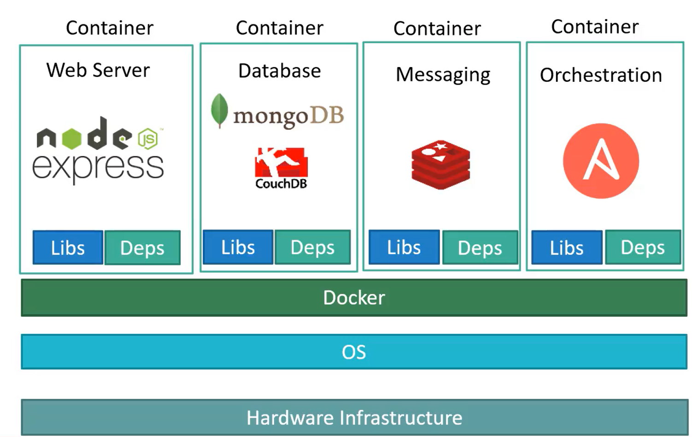

- Each developer can run containers using a simple `docker run` command
- Docker containers share the underlying kernel.
- Containers vs virtual machines
  - Containers
    - Hardware -> OS -> Docker -> Containers (Libraries + Depedencies/Applications)
    - Cannot have more than one OS since it shares the underlying OS kernel
  - Virtual machines
    - Hardware
    - OS
    - Hypervisor
    - Virtual Machine (OS/(Libraries + Depedencies/Applications))
      - Virtual machine has its own OS running on it which makes it a much bigger size.
      - Can have many different OS's

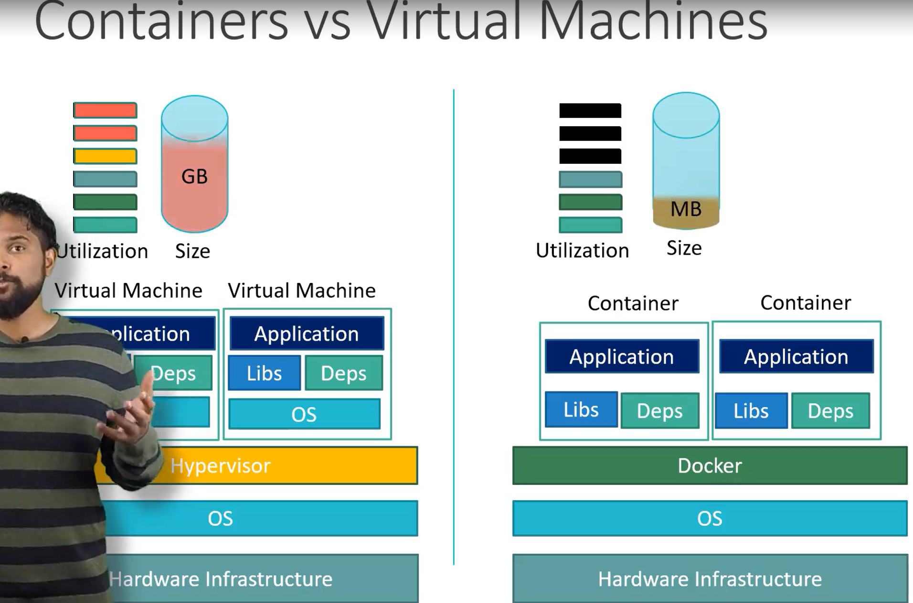

`images` - Package/Template used to create one or more containers

`containers` - Running instances of images that are isolated that have their own environments and set of processes.

## Container Orchestration

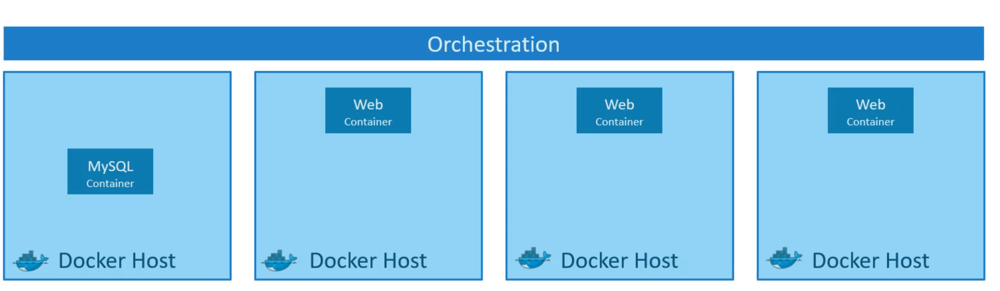

- Auto scale up and down containers based on the load

- Orechestration techs
  - Docker swarm
  - Kubernetes
  - MESOS

## Kubernetes

- Container orchestration technology

### Kubernetes architecture

`Node` - Physical or virtual machine in which kubernetes is installed. Also known as 'minions'.
`Cluster` - Set of nodes grouped together. If one node fails the application is still available from the other nodes. Shares load.
`Master` - A node with kubernetes installed. Watches over the nodes in the cluster and is responsible for orchestration of the containers on the cluster nodes.

### Master vs worker nodes

Worker node

- Container runtime engine
- Kubelet agent

Master node

- Kube-apiserver
- etcd
  - Key value store
- controller
- scheduler

### kubectl

- Kube Command line tool
- Gets cluster information

`kubectl run hello-minikube` - Deploys a node

`kubectl cluster-info`

`kubectl get <entity>`

- nodes, pods, replicasets
- Will give you info about the quantity of desired, current and ready entities

`kubectl describe <entity>`

- e.g. replicasets
- Will give you information about wht image was used to create a pod in a replicaset

`kubectl delete <entity> <entityname>`

- e.g. `kubectl delete pod pod-name`

#### Create a pod

`kubectl run nginx-pod --image=nginx`

### Editing a pod

- Extract pod definition to a file
  `kubectl get pod <pod-name> -o yaml > pod-definition.yaml`
- Edit an existing pod
  `kubectl edit pod <pod-name>`
  - Note, only certain properties of the pod are editable
    - spec.container(s).image
    - spec.initContainer(s).image
    - spec.activeDeadliensSeconds
    - spec.toleration
    - spec.terminationGracePeriodSeconds

### docker vs containerD

- kubernetes was originally designed to support docker containers
  - container runtime interface (CRI)
    - Allowed kubernetes to work with any container runtime as long as they employed the Open Container Initiative (OCI)
      - Docker doesn't implement OCI but kubernetes used dockershim to continue to support it
        - Eventually stopped supporting dockershim
      - ContainerD uses OCI and can be supported by kubernetes
- crictl
  - interacts with CRI compatible runtimes

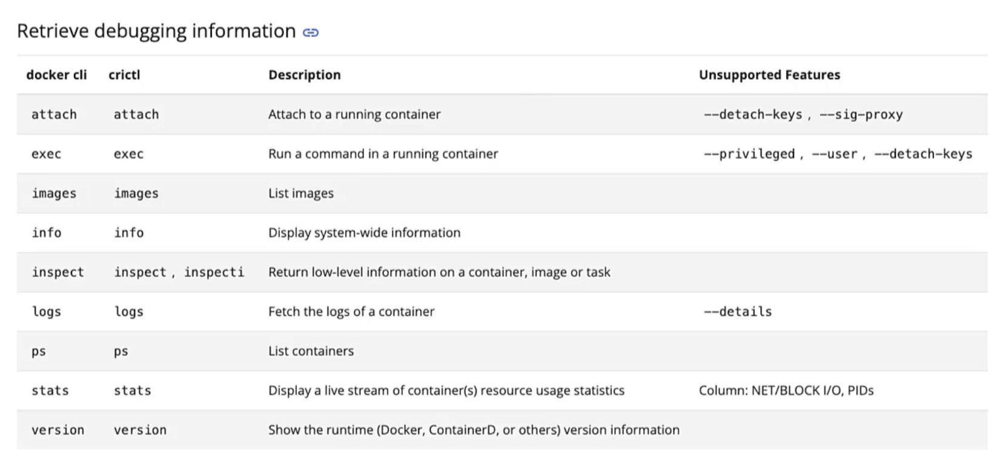

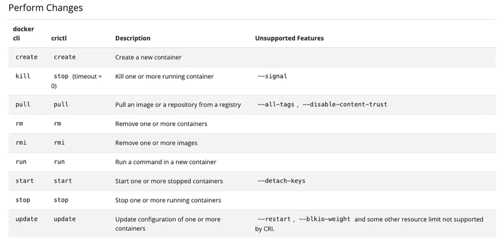

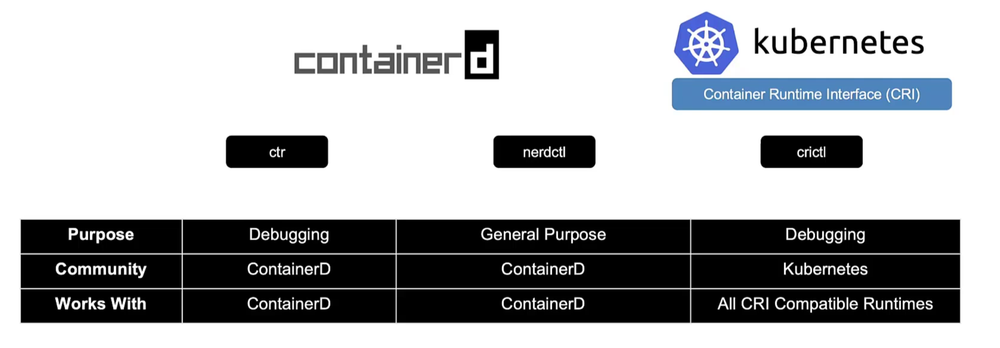

## Pods

- A single instance of an application. The smallest object you can create in kubernetes.
- Inside of a node
- 1-1 relationship with a container
- To increase load for your application, you can have multiple pods running in the same node
  - Can deploy a new node in the cluster if you run out resources on a node
  - Do not add additional containers in an existing pod
    Multi-container PODs
- Can have two different containers in the same pod if they are different application
- Share network and storage space

  - Kubernetes helps manage pods with containers and helper containers working together

  `kubectl run nginx --image nginx`

  - Deploys a pod
  - Downloads from a private or public hub with the container

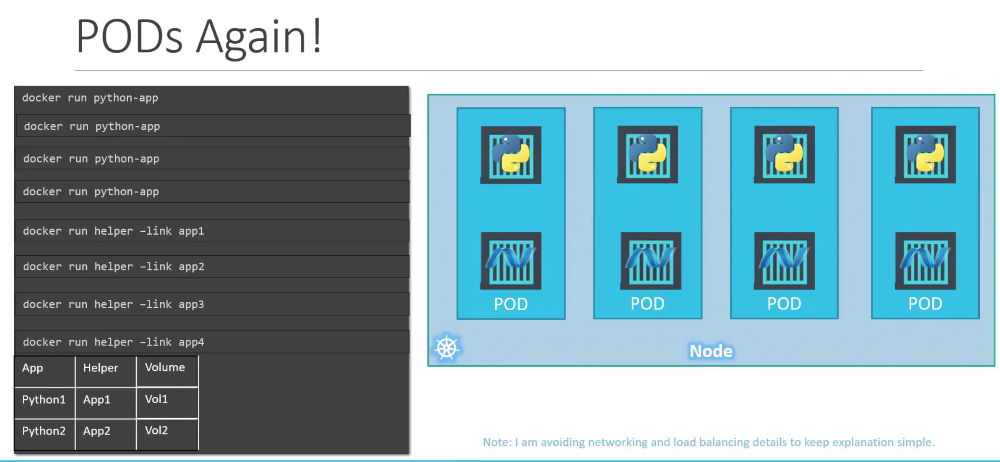

Using docker for minikube: `minikube start --driver=docker`

Minikube status: `minikube status`

Creating a pod: `kubectl run nginx --image=nginx`

Create a replicaset using a file: `kubectl create -f /root/replicaset-definition-1.yaml`

Deleting a pod: `kubectl delete pod <podname>`

- Deleting all pods in a namespace: `kubectl delete pods --all -n <namespace>`

- Example creates an nginx pod. Pulls from docker images

Create a deploying using imperative command: `kubectl create deployment nginx --image=nginx`

Get pod information: `kubectl describe pod <podname>`

Get additional pod information: `kubectl get pods -o wide`

- Gives information on what node the pod is running
- Gives IP address info (internal IP in the kubernetes cluster)

## Controllers

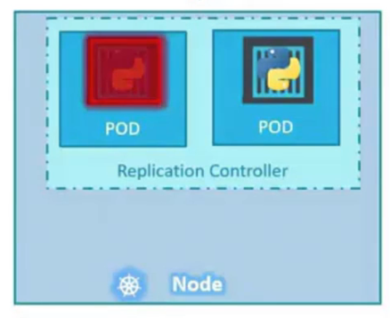

- Even if you have a single pod you can use a single pod

  - Will bring up a new pod if the single pod fails

- Used for load balancing and scaling
  - When the number of users increases it can deploy additional pods
  - Controller spans accross multiple nodes

`Replication controller` is being replaced by `Replica Set`

- Both of these technologies use load balancing and scaling

- We need to create a kubernetes definition file for a controller

```yaml
apiVerion: v1
kind: ReplicationController
metadata:
  name: myapp-rc
  labels:
    app: myapp
    type: front-end
spec: # replication controller
  template: # Pod template
    metadata:
      name: myapp-pod #pod name
      labels: # can have any key-value pairs that you want for labels
        app: myapp # will be able to filter label of pods
        type: front-end
      spec: #specification
        containers:
          - name: nginx-container
            image: nginx #Name of the docker image in the docker repository

  replicas: 3
```

To run this use: `kubectl create -f rc-definition.yml`

To view the replication controllers: `kubectl get replicationcontroller`

Unlike replica controllers, replica sets can monitor existing pods if they are already created. If they are not created, the replica set will create one. It will monitor the pods and create new ones if pods fail.

Scale of replica set:

- Update the replicas field to 6 then run `kubectl replace -f fileName.yml`

## Kubernetes Deployments

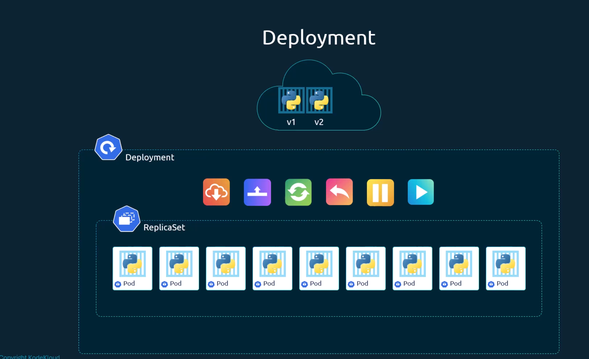

`kubectl get all`

- Will show deployments, replica-sets and pods

Create deployments command:
`kubectl create deployment httpd-frontend --image=httpd:2.4-alpine --replicas=3`

- Deployment strategy
  - Recreate: Takes down all pods and then brings them all back up
  - RollinUpdate: Take down pod and bring up the new version 1 by 1
    - Default deployment strategy

### Rollout status

`kubectl rollout status deployment/myapp-deployment`

- Rollout history
  `kubectl rollout history deployment/myapp-deployment`
  - To save history when you create a deployment use `--record` in the command line

### Update deployment

`kubectl apply -f deployment-definition.yml`
`kubectl set image deployment/<deployment-name> <container-name>=<new-image>`

### Rollback

`kubectl rollout undo deployment myapp-deployment`

## Networking

- IP address is assigned to a Pod
  

  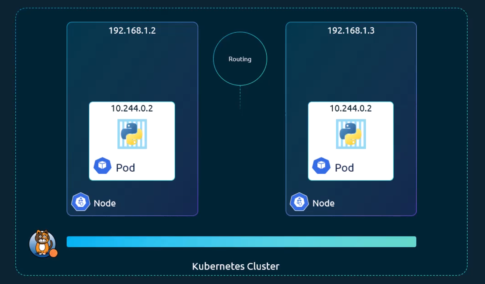

## Services

  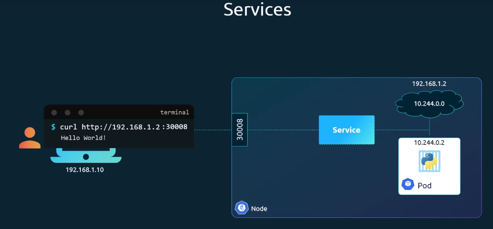

### Node port service

- Listens to a port on the node and forwards it to the pod
  

### ClusterIP

- Creates a virtual IP on the cluster

### LoadBalancer

- Helps distrubute load

## Microservices
