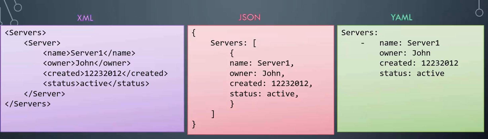
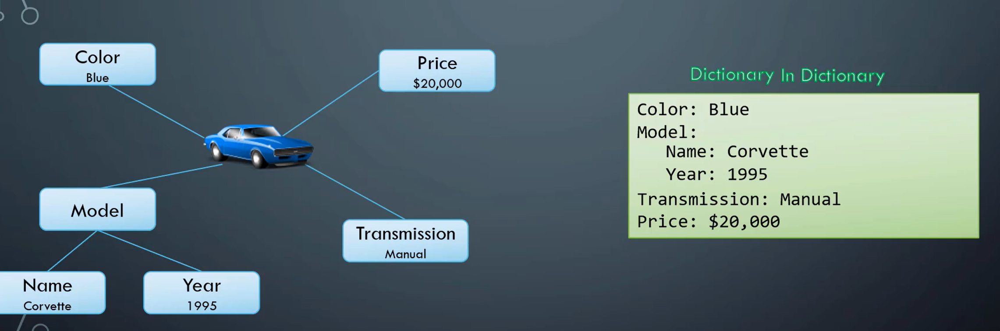

## YAML FILES



- Key value pairs

```yaml
Fruit: Apple
Vegetable: Carrot
```

- Array/Lists

```yaml
Fruits:
  - Orange
  - Apple
  - Banana
```

`-` indicates it's an element of an array

- Dictionary/Map

```yaml
Banana:
  Calories: 105
  Fat: 0.4g

Grapes:
  Calories: 62
  Fat: 0.3g
```

- You must have an equal number of blank spaces for the items in the list

- Key value/Dictionary/Lists

```yaml
Fruits:
  - Banana:
      Calories: 105
      Fat: 0.4 g
      Carbs: 27 g
  - Grape:
      Calories: 62
      Fat: 0.3 g
      Carbs: 16 g
```

- List of fruits containing dictionaries of the fruit properties, containing key/value pairs



- Order in lists matter, order in dictionaries don't matter


- Kubernetes
```yaml
apiVersion: v1 # Version of the Kubernetes API 
kind: Pod # Type of object we are trying to create
metadata: 
    name: myapp-pod #pod name
    labels: # can have any key-value pairs that you want for labels
        app: myapp # will be able to filter label of pods
        type: front-end
spec: #specification
    containers: 
        - name: nginx-container
          image: nginx #Name of the docker image in the docker repository
```
To run the ymal file: `kubectl create -f <yaml-file-name>.yml`
