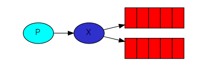
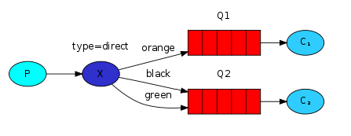

| Keyword    | Definition                                                               |
| ---------- | ------------------------------------------------------------------------ |
| `Producer` | user application that sends messages                                     |
| `Queue`    | A buffer that stores messages                                            |
| `Consumer` | A user application that receives messages                                |
| `Exchange` | Receives messages from producers and pushes those messages into queue(s) |

Code snippets to start a project for tutorial:

```bash
dotnet new console --name <ProjectName>
dotnet add package RabbitMQ.Client -s https://api.nuget.org/v3/index.json
dotnet restore
```

Using RabbitMQ with a dotnet backend with docker:

1. Add configuration to docker compose file

```docker
version: "4.3.2"

services:
  rabbitmq:
    image: rabbitmq:management
    container_name: rabbitmq
    ports:
      - 5673:5672  #TO:FROM
      - 15673:15672
    volumes:
      - rabbitmqdata:/var/lib/rabbitmq
    hostname: rabbitmq

volumes:
  rabbitmqdata:

```

- `management` allows you to bring up the rabbit dashboard using localhost:{port} (the one you forwarded to)
- The default in docker for rabbit is 15672 (http), 15672 is the default port for the RabbitMQ portal
- Volumes allow us to maintain messages if the rabbitMQ service goes down
  - Note: The contianer_name in services must match the volume name (they don't have to be rabbitmqdata)
- Hostname is associated with how rabbitMQ stores data internally (doesn't have to have the name rabbitmq)

2. The default username/password for the rabbitMQ dashboard is `guest`

3. You may need to add an exchange and queue to start transferring messages using the RabbitMQ dashboard.
   - In the exchange tab, add an exchange using the string value that you specified in your project for the exchange name
   - Do the same thing as above for adding a queue
4. You should be able to see queued messages sent into the exchange/queue that you created

## OVERVIEW

- Producers (program(s) that produce messages) and consumers (program(s) that wait to receive messages)
- `Queue` - Name of a 'post box' that lives in RabbitMQ. Multiple producers and consumers can use a single queue.

Basic setup: https://www.rabbitmq.com/tutorials/tutorial-one-dotnet.html

1. Create the connection

```csharp
var factory = new ConnectionFactory() { HostName = "localhost" };
using (var connection = factory.CreateConnection())
```

- The connection abstracts the socket connection and takes care of protocol version negotiation and authentication.

2. Create a channel

```csharp
using (var channel = connection.CreateModel())
{
    ...
}
```

3. Declare a queue

```csharp
 channel.QueueDeclare(queue: "hello",
                        durable: false,
                        exclusive: false,
                        autoDelete: false,
                        arguments: null);
```

- Declaring a queue is idempotent (not changed if it already exists) so it will only be created if it doesn't exist.

4. Publish or consume

Publishing:

```csharp
   string message = "Hello World!";
            var body = Encoding.UTF8.GetBytes(message);

            channel.BasicPublish(exchange: "",
                                 routingKey: "hello",
                                 basicProperties: null,
                                 body: body);
            Console.WriteLine(" [x] Sent {0}", message);
```

Receiving:

```csharp

 var consumer = new EventingBasicConsumer(channel);
            consumer.Received += (model, ea) =>
            {
                var body = ea.Body.ToArray();
                var message = Encoding.UTF8.GetString(body);
                Console.WriteLine(" [x] Received {0}", message);
            };
            channel.BasicConsume(queue: "hello",
                                 autoAck: true,
                                 consumer: consumer);

            Console.WriteLine(" Press [enter] to exit.");
            Console.ReadLine();
```

## Queues

`channel.QueueDeclare(...)`
| Flag | Definition |
| ---------- | ------------------------------------------------------------------------ |
| `Durable` | The queue will survive a broker restart |
| `Exclusive` | used by only one connection and the queue will be deleted when that connection closes |
| `Auto-delete` | queue that has had at least one consumer is deleted when last consumer unsubscribes |
| `Arguments ` | optional; used by plugins and broker-specific features such as message TTL, queue length limit, etc |

## Work Queues

- Distribute time-consuming tasks among multiple workers
  - Avoid doing a resource-intensive task immediately and having to wait for it to complete. Instead, the task is scheduled to be done later. We encapsulate a 'task' as a message and send it to a queue.

* `Round-robin dispatching`

  - By default, RabbitMQ will send each message to the next consumer, in sequence, on average every consumer will get the same number of messages.
  - If you have multiple workers (consumers) you can easily parallelise work (multiple workers processing messages at the same time)

* Message acknowledgement

  - Manual messages ack is turned on by default. If the consumer dies without processing the messages that it was given those messages will be lost if there is no ack.
  - If you have turned on message ack, by default a 30 minute timeout is enforced on every consumer delivery ack (this timeout can be changed)
  - You need to use `BasicAck` from the channel to setup acks by your worker.

  To check message queue in rabbitmq ctl:

  ```shell
  docker exec -it rabbitmq rabbitmqctl list_queues name messages_ready messages_unacknowledged
  ```

  NOTE: If you don't want to run docker exec every time, you can enter the Rabbit shell using:

  ```shell
  docker exec -it rabbitmq sh
  ```

* Then just run the rabbitmqctl program

## Message Durability

- Even with Acks turned on if the server turns off you can lose the tasks
- To make sure this does not happen:

  - Make sure the queue and messages are marked as durable and set messages as persistant.
    - This makes sure it will survive a RabbitMQ node restart

  ```csharp
  channel.QueueDeclare(queue: "hello",
                     durable: true,
                     exclusive: false,
                     autoDelete: false,
                     arguments: null);

  ....
  var properties = channel.CreateBasicProperties();
  properties.Persistent = true;
  ```

* Marking the channel properties as persistant tells RabbitMQ to save the message to disk.
  - Note: This doesn't fully guarentee a message won't be lost

## Fair Dispatch

- In a situation where a worker gets a heavy message and another gets a light message, by default RabbitMQ will not level load, it will dispatch every n-th message to the n-th consumer.
- You can set the prefetchCount = 1 to make sure that RabbitMQ will not give a worker more than one message at a time. It will not dispatch a message until the previous message sent to the worker has been processed and ACKd

```csharp
channel.BasicQos(0, 1, false);
```

## Publish/Subscribe

- Publish/suscribe pattern is when a message is delivered to multiple consumers.



- Producer sends messages to an exchange
- The exchange pushes the messages into one more queues (or discards the message) based on the exchange type

### Exchange Types

- `Fanout` - Broadcasts all the messages it receives to all the queues it knows.

## Routing

- Subscribe to only a subset of messages
- A binding is a relationship between an exchange and a queue. E.g. The queue is 'interested' in messages from this exchange.
- Bindings chan take a `routingKey` param (binding key).

```csharp
channel.QueueBind(queue: queueName,
                  exchange: "direct_logs",
                  routingKey: "black");
```

- The meaning of a binding key depends on the exchange type, with a `fanout` exchange this is ignored since it sends messages to all queues it has a binding with.



- A `direct` exchange allows filtering of messages
  - The message goes to the queues whose `binding key` matches the `routing key` of the message.
  - A queue can have multiple binding keys with the exchange and also to have the same binding key bound to multiple queues
