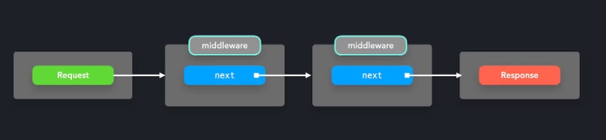

https://www.patterns.dev/posts/mediator-pattern

# Mediator/Middleware pattern

- A mediator pattern makes it possible for components to interact with each other through a central point: the mediator.
  - Instead of directly talking with each other, the mediator receives the requests, and sends them forward. In JS, the mediator is often just an object literal or function.
- Allows us to simplify many-to-many relationships between objects, by letting communication flow through one central point.

```js
class ChatRoom {
  logMessage(user, message) {
    const time = new Date();
    const sender = user.getName();

    console.log(`${time} [${sender}]: ${message}`);
  }
}

class User {
  constructor(name, chatroom) {
    this.name = name;
    this.chatroom = chatroom;
  }

  getName() {
    return this.name;
  }

  send(message) {
    this.chatroom.logMessage(this, message);
  }
}
```

In express.js, we can add headers to requests if users route to a certain value

```js
const app = require("express")();

app.use(
  "/",
  (req, res, next) => {
    req.headers["test-header"] = 1234;
    next();
  },
  (req, res, next) => {
    console.log(`Request has test header: ${!!req.headers["test-header"]}`);
    next();
  }
);
```


