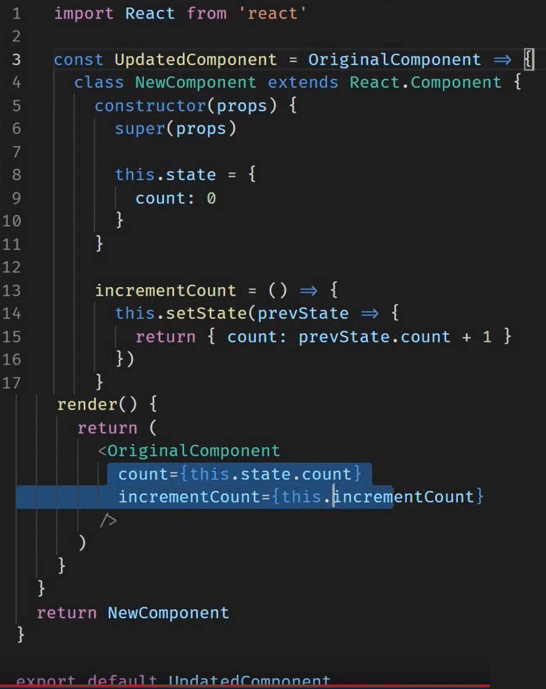
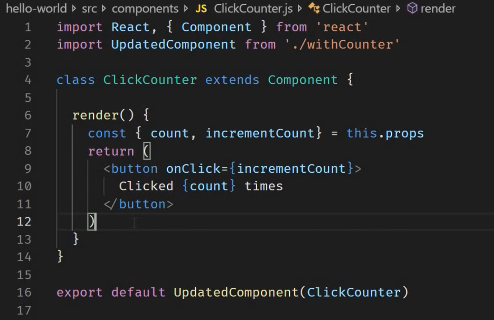

<small>[Return Home](./../../README.md)</small>

# React

## React Hooks

- Can only be used inside of Functional Components or other hooks
- Conventional naming is useXYZ()

```javascript
    onChange={event => {
      const newTitle = event.target.value;
      setInputState(
        prevState =>
          ({
            ...prevState,
             title: newTitle
          }));
```

- Because of an issue with closure, where we have two nested annonymous functions, we have to set our event to a constant here, otherwise it will not appropriately grab the correct event

### Use Effect

```javascript
    useEffect(() => {
      ...do stuff
    }, [])
```

- If the second argument in useEffect is [] it will basically work like componentDidMount() and only render once after the initial render() is called. The second argument controls when/how often this will run.

```javascript
useEffect(() => {
  console.log("RENDER INGREDIENTS", [userIngredients]);
});
```

- Second argument is a dependency on when the first argument method will run. In this case, when a prop called 'userIngredients' changes, then this will run again.

## HOC (Higher Order Components)
* A pattern where a function takes a component as an argument and returns a new component
```javascript
const enhancedComponent = higherOrderComponent(originalComponent)

const IronMan = withSuit(TonyStark)
```
### HOC

<br/>

### Component using HOC


* One common mistake is that when you pass props into a component using an HOC, the props are passed into the HOC and not the component itself. To fix this make sure to spread your props from the HOC into the original component like this:

```javascript
<OriginalComponent
  count={this.state.count}
  incrementCount={this.incrementCount}
  {...this.props}
/>
```
Forwarding the props like this will forward the props to the original component

* You can also add arguments into an HOC to give it arguments to differentiate between components using the same HOC
```javascript
UpdatedComponent(ClickCounter, 10)
```
The HOC can now consume the second parameter which can consumed by the HOC in a unique way for that component

## Render Callback

* Function `foo` takes a callback function as a parameter. When we call `foo` it <u>turns around and "calls back" to the passed in function</u>.
```javascript 
const foo = (hello) => {
  return hello('foo');
};

foo((name) => {
  return `hello from ${name}`;
});

// hello from foo
```

* In react, a render callback returns a portion of the rendered markup. 


## Function as a Child Component (FaaCC)
Web references: 
* [Faccs are an antipattern](https://americanexpress.io/faccs-are-an-antipattern/)
* [Functions as Child Components](https://medium.com/merrickchristensen/function-as-child-components-5f3920a9ace9)
* [React Patterns Render Callback](https://reactpatterns.com/#render-callback)

>Lets you pass a ender function to a component as the `children` prop. 
It exploits the fact you can change what you can pass as children to a component. By default, `children` is a type of `ReactNodeList` (an array of JSX elements). It is what we get when placing JSX within other tags.

When using FaCC, instead of passing JSX markup, you assign `children` as a function.
```html
<Foo>
  {(name) => <div>`hello from ${name}`</div>}
</Foo>
```
* The `Foo` component looks something like this:
```javascript
const Foo = ({ children }) => {
  return children('foo');
};
```

Example:
```javascript
class WindowWidth extends React.Component {

....
....
  
  render() {
    const { width } = this.state;
    return this.props.children(width);
  }
}
```
```html
<WindowWidth>
  {width => <div>window is {width}</div>}
</WindowWidth>
```
