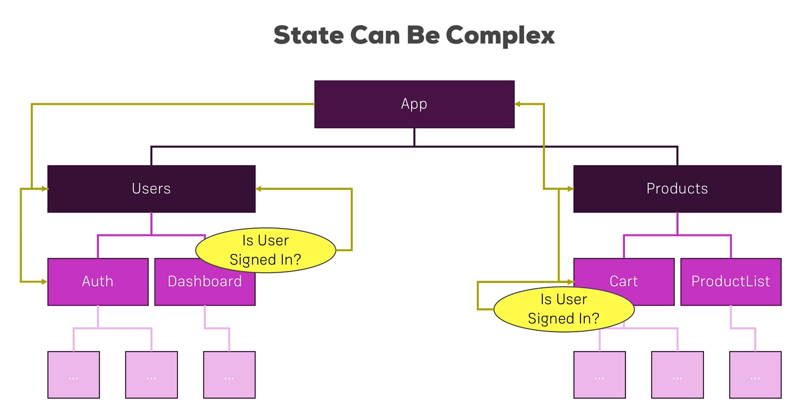

<small>[Return Home](./../../README.md)</small>

- Redux helps us handle this easily

- Central store

  - Stores entire app state

- Actions
  - Despatched from javascript code with a type (typeof: addIngredient)
  - Information package (possibly with a payload)
    - addIngredients
- Reducers
  - Action reaches the reducer
  - Receive action and updates states
  - No side-effects, async code or http requests
  - Input in, output out
  - Updates Central store
- Subscription
  - Store triggers all subscriptions when store is updated
  - Passes updated state as Props to components

