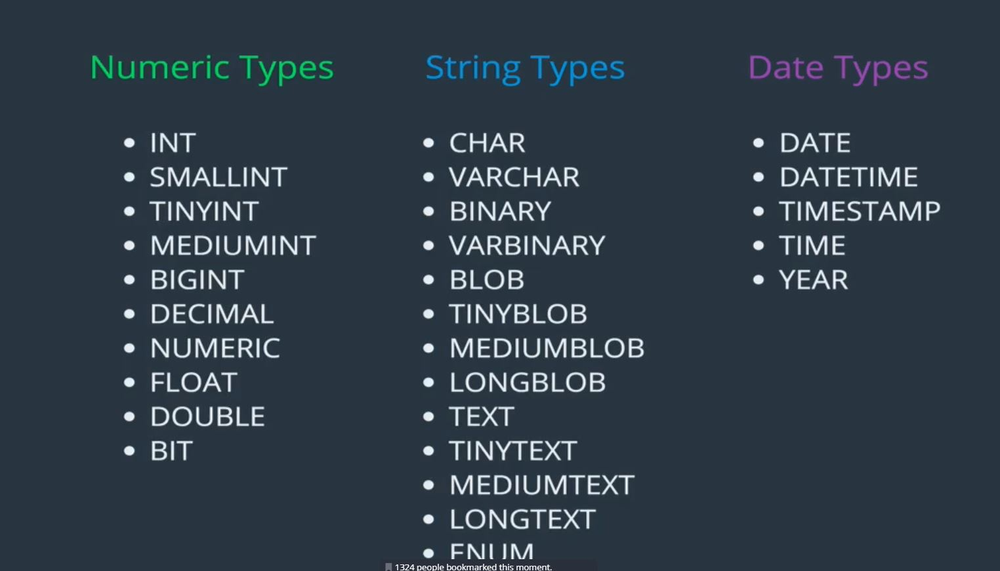

<small>[Return Home](./../../README.md)</small>

# SQL

What is a database? => A structured set of computerized data with an accessible interface

<ol>
<li>A collection of data</li>
<li>A method for accessing and manipulating the data</li>
</ol>

App => Database management system => Database

- A Database management system is what allows your app to interface with the Database
- PostgreSQL, MySQL are both `database management systems`.

`SQL` - Structrued Querey language

- The language we use to 'talk' to our databases.

- When you work with `MySQL` you are primaily writing `SQL`.
  - PostreSQL and MySQL are very similar.

#### Groom SQL commands

- `mysql-ctl start` - Start MySQL server
- `mysql-ctl stop` - Stop MySQL server
- `mysql-ctl cli` - Start MySQL shell
- `exit` - Leave the MySQL shell

#### SQL Commands

| Command                         | Description                                                                         |
| ------------------------------- | ----------------------------------------------------------------------------------- |
| SHOW DATABASES                  | Shows all databases on the server                                                   |
| CREATE DATABASE `<name>`        | Creates a new database.                                                             |
| DROP DATABSE `<name>`           | Deletes a database                                                                  |
| USE `<database name>`           | Tells the server which database you want to use at any given time                   |
| SELECT database()               | Tells you the currently used database                                               |
| SHOW TABLES                     | Show tables in your databse                                                         |
| SHOW COLUMNS FROM `<tablename>` | shows the columns of a table                                                        |
| DESC `<tablename>`              | works similarly to SHOW COLUMNS FROM command                                        |
| CREATE/DROP TABLE `<tablename>` | Create or delete a table. Creating a table requires you to add column name and type |
| SELECT \* FROM `<tablesname>`   | Select all data in a table                                                          |
| SHOW WARNINGS                   | If you get warnings this will show you the warning details                          |

#### Tables

- A collection of related data held in a structured format within a database.
- Made up of headers (represent the variables) and rows (the actual data)
- Data columns must contain matching datatypes

```sql
CREATE TABLE tablename
(
    column_name data_type,
    column_name data_type
);

CREATE TABLE pastries
(
    name VARCHAR(50),
    quantity INT,
);
```

#### Types



- INT

  - A whole number
  - Max of 4.29 x 10^9 (32 bit right?) for unsigned and +/- 2.15 x 10^9 for signed

- VARCHAR
  - Variable-length string (as opposed to CHAR which has fixed length)
  - 1 - 255 characters (8 bit / 1 byte)
  - Must specify a maximum length e.g. `VARCHAR(100)`

### INSERT Data

```sql
INSERT INTO cats(name, age)
VALUES ('Jetson', 7),
       ('Marlo', 1),
       ('Berto', 1);
```

- The order you specify on the first line doesn't matter, but the values line must correspond to the order on the previous line.

view data in a table:

```sql
SELECT * FROM `<tablename>`;
```

### Ternary relationship (reference several relationships inside a single table)

- Relationship between more than two things
  - Supplier, order, customer (example)
  - Does a customer order a part from multiple suppliers or do they order multiple parts from one supplier?

### N-Ary relationship

- An order must have a supplier, customer, part and warehouse
-


### Aggregate relationships

- Sometimes relationships can be related to other relationships
- Easier to explain the cardinality (relationship between one table and another) than a ternary or N-ary relationship.


## Store Procedure

- Let's you call a predefined set of queries

## Triggers

- Called every time some action happens. Usually will run a store procedure.

```sql
CREATE TRIGGER ins_update_summary AFTER INSERT ON data
FOR EACH ROW
BEGIN
call update_summary;
END;
```

- call update_summary is the store procedure
- The downside of this is it will be run every row that is updated, so if 30 rows are updated in a query it will run 30 times

  - Often times you can just run some logic to do the update after the other query has been run, rather than making a trigger

  ## Tips/Tricks

  - If you have defined a table type that you want to use in Microsoft sql server you can use this type of code:

```sql
USE [TableName]
GO

DECLARE @ids [context].[udtt_BigList]
INSERT INTO @ids VALUES (30534)

DECLARE @return_value int

EXEC @return_value = [context].[usp_GetStoreProc]
     @storeProcVariableIds = @ids

SELECT 'Return Value' = @return_value

GO

```

- This allows you to run a store proc that requires you to pass through a table type variable as a param.
- You can also use this to do a join on a non-store proc query
