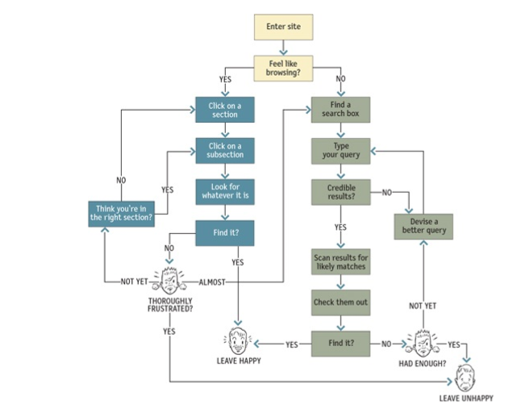

<small>[Return Home](./../../README.md)</small>

* People won't use your Web site if they can't find their way around it

* The user decides whether to 'ask' or 'browse' first

* No sense of direction
* No sense of location

### Navigation

* Helps us find what we're looking for
* Tells us where we are
* Gives us something to hold on to, makes us feel grounded
* Tells us what's here
* Tells us how to use the site
* Gives us confidence in the people who built it

### Web Navigation Conventions

* Persistant navigation: Set of nav elements that appear on every page
* Site ID/logo
* A way to search
    * Be careful about giving people too many options to limit the scope of the search

* It's important to have navigation for all potential levels of the site before you design the rest of the site
### Page name
* Every page needs a name
* Name needs to be in the right place
* Name needs to be prominent
* Name needs to match what I clicked

* Designers love subtle cues, because sublety is one of the traits of sophisticated design, but web suers are generally in such a hurry that they routinely miss subtle cues. 

### Breadcrumbs

* Should be used in conjunction with other navigation, not as the only navigation
* Put them at the top
* use '>' between levels
* Small type, they are an accessory
* Don't use them instead of the page name

### Trunk test
* A user should be able to answer these questions without hesitation:
    * What site is this
    * What page am I on
    * What are the major sections of the site
    * What are my options at this level
    * Where am I in the scheme of things
    * How can I search

