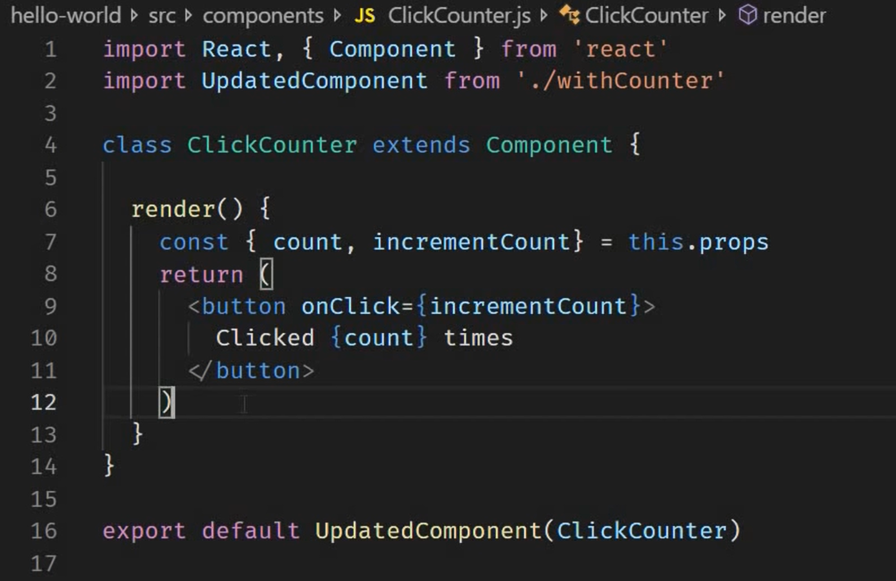

# React

## React Hooks

- Can only be used inside of Functional Components or other hooks
- Conventional naming is useXYZ()

```javascript
    onChange={event => {
      const newTitle = event.target.value;
      setInputState(
        prevState =>
          ({
            ...prevState,
             title: newTitle
          }));
```

- Because of an issue with closure, where we have two nested annonymous functions, we have to set our event to a constant here, otherwise it will not appropriately grab the correct event

### Use Effect

```javascript
    useEffect(() => {
      ...do stuff
    }, [])
```

- If the second argument in useEffect is [] it will basically work like componentDidMount() and only render once after the initial render() is called. The second argument controls when/how often this will run.

```javascript
useEffect(() => {
  console.log("RENDER INGREDIENTS", [userIngredients]);
});
```

- Second argument is a dependency on when the first argument method will run. In this case, when a prop called 'userIngredients' changes, then this will run again.

## HOC (Higher Order Components)
* A pattern where a function takes a component as an argument and returns a new component
```javascript
const enhancedComponent = higherOrderComponent(originalComponent)

const IronMan = withSuit(TonyStark)
```
### HOC

<br/>

### Component using HOC
